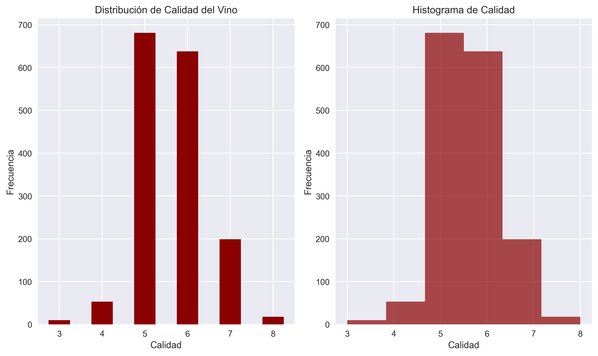
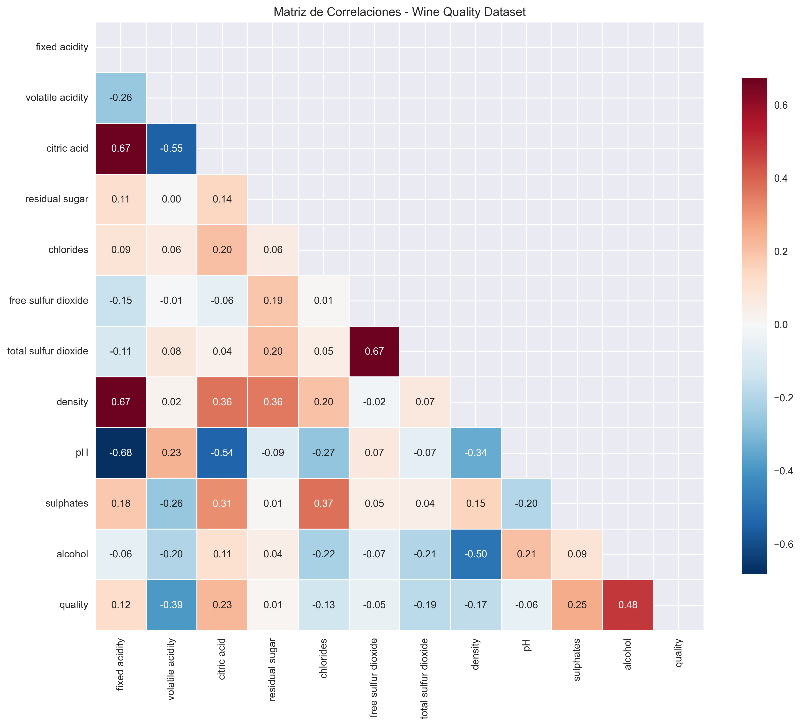
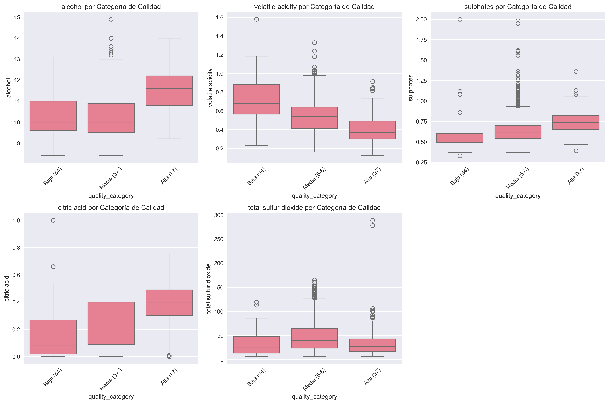
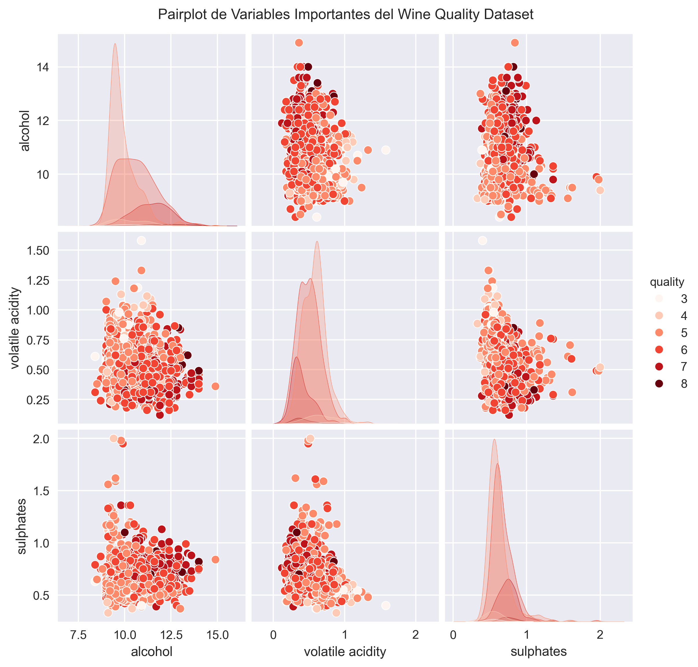

# Análisis exploratorio del Dataset Wine Quality: descubriendo patrones fisicoquímicos que definen la calidad del vino

<a href="../../exploraciones-extra/Practica_01_Wine_Quality_Analysis.ipynb" download="Practica_01_Wine_Quality_Analysis.ipynb">

📓 **Descargar Jupyter Notebook Completo**

</a>

{{ reading_time() }}
---
- **Autor**: Valentín Rodríguez
- **Fecha**: Octubre 2025
- **Unidad Temática**: UT1: EDA & Fuentes (Dataset Alternativo)
- **Entorno**: Python + Pandas + Matplotlib + Seaborn
- **Dataset**: Wine Quality Dataset (1,599 muestras, 12 variables)

---

## 📋 Descripción General

Esta práctica representa una **versión alternativa** del análisis exploratorio inicial, utilizando el **Wine Quality Dataset** en lugar del tradicional Iris dataset. El objetivo es demostrar versatilidad en el análisis de datos aplicando las mismas metodologías a diferentes dominios y tipos de datos.

## 🎯 Objetivos Principales

- **Aplicar EDA** al dataset Wine Quality manteniendo la misma estructura metodológica
- **Identificar patrones** en las características fisicoquímicas del vino
- **Analizar correlaciones** entre variables y calidad del vino
- **Explorar distribuciones** y detectar outliers en datos reales
- **Demostrar adaptabilidad** de técnicas EDA a diferentes dominios

## 🔧 Tecnologías y Herramientas

- **Python** con bibliotecas especializadas:
  - `pandas` y `numpy`: Manipulación y análisis de datos
  - `matplotlib` y `seaborn`: Visualización avanzada
  - `warnings`: Manejo de alertas

## 📊 Dataset y Metodología

**Dataset:** Wine Quality Dataset (UCI Machine Learning Repository)

- **Dimensiones:** 1,599 muestras × 12 variables
- **Variables fisicoquímicas:** 11 atributos medibles
- **Variable objetivo:** Quality (0-10)
- **Fuente:** [UCI ML Repository](https://archive.ics.uci.edu/ml/datasets/wine+quality)

### Variables Principales Analizadas

| Variable | Tipo | Descripción |
|----------|------|-------------|
| `fixed acidity` | Numérica | Acidez fija (g/dm³) |
| `volatile acidity` | Numérica | Acidez volátil (g/dm³) |
| `citric acid` | Numérica | Ácido cítrico (g/dm³) |
| `residual sugar` | Numérica | Azúcar residual (g/dm³) |
| `chlorides` | Numérica | Cloruros (g/dm³) |
| `free sulfur dioxide` | Numérica | Dióxido de azufre libre (mg/dm³) |
| `total sulfur dioxide` | Numérica | Dióxido de azufre total (mg/dm³) |
| `density` | Numérica | Densidad (g/cm³) |
| `pH` | Numérica | pH del vino |
| `sulphates` | Numérica | Sulfatos (g/dm³) |
| `alcohol` | Numérica | Contenido de alcohol (% vol) |
| `quality` | Target | Calidad del vino (0-10) |

## 🔍 Análisis Exploratorio de Datos

### Distribución de Calidad del Vino


**Características observadas:**

- **Distribución sesgada**: Mayor concentración en calidades 5-6
- **Rango limitado**: Calidades entre 3-8 (no se encuentran extremos)
- **Patrón normal**: Distribución aproximadamente normal con sesgo hacia calidades medias

### Análisis de Correlaciones


**Insights principales:**

- **Alcohol**: Correlación positiva más fuerte con calidad (0.476)
- **Acidez volátil**: Correlación negativa significativa (-0.391)
- **Sulfatos**: Influencia positiva moderada (0.251)
- **Densidad**: Correlación negativa con alcohol (-0.685)

### Distribuciones por Categorías de Calidad


**Patrones identificados:**

- **Vinos de alta calidad**: Mayor contenido de alcohol y sulfatos
- **Vinos de baja calidad**: Mayor acidez volátil y densidad
- **Variabilidad**: Diferencias significativas entre categorías

### Análisis Multivariado


**Relaciones complejas observadas:**

- **Alcohol vs Calidad**: Relación positiva clara
- **Acidez volátil vs Calidad**: Relación negativa evidente
- **Sulfatos vs Alcohol**: Correlación positiva moderada

## 📈 Insights y Conclusiones

### 1. **Variables Más Influyentes**
- **Alcohol**: Factor determinante en la calidad del vino
- **Acidez volátil**: Indicador negativo de calidad
- **Sulfatos**: Contribuyen positivamente a la calidad

### 2. **Patrones de Distribución**
- **Normalidad**: La mayoría de variables siguen distribuciones aproximadamente normales
- **Outliers**: Presencia de valores extremos en variables como azúcar residual
- **Correlaciones**: Relaciones complejas entre variables fisicoquímicas

### 3. **Categorización de Calidad**
- **Baja calidad (≤4)**: Características químicas desfavorables
- **Calidad media (5-6)**: Mayoría de las muestras
- **Alta calidad (≥7)**: Composición química óptima

### 4. **Aplicabilidad Metodológica**
- **Técnicas EDA**: Aplicables a diferentes dominios
- **Visualizaciones**: Adaptables a nuevos tipos de datos
- **Análisis estadístico**: Consistente entre datasets

## 🛠️ Implementación Técnica

### Pipeline de Análisis

```python
# Carga y exploración inicial
wine_df = pd.read_csv('winequality-red.csv', sep=';')
print(f"Dimensiones: {wine_df.shape}")

# Análisis de distribuciones
wine_df.hist(bins=20, figsize=(15, 10))

# Matriz de correlaciones
correlation_matrix = wine_df.corr()
sns.heatmap(correlation_matrix, annot=True, cmap='RdBu_r')

# Categorización de calidad
wine_df['quality_category'] = wine_df['quality'].apply(categorize_quality)
```

### Visualizaciones Implementadas

- **Histogramas**: Distribuciones de variables fisicoquímicas
- **Heatmaps**: Matriz de correlaciones con máscara triangular
- **Boxplots**: Análisis por categorías de calidad
- **Pairplots**: Relaciones multivariadas entre variables clave

## 📚 Aprendizajes Adquiridos

1. **Adaptabilidad**: Las técnicas EDA son universales y aplicables a diferentes dominios
2. **Correlaciones**: Identificación de relaciones complejas entre variables
3. **Categorización**: Estrategias para manejar variables objetivo discretas
4. **Visualización**: Adaptación de gráficos a diferentes tipos de datos
5. **Insights de dominio**: Comprensión de factores que influyen en la calidad del vino

## 🔗 Recursos y Referencias

- **UCI ML Repository**: [Wine Quality Dataset](https://archive.ics.uci.edu/ml/datasets/wine+quality)
- **Pandas Documentation**: Data Manipulation
- **Seaborn Gallery**: Statistical Data Visualization
- **Matplotlib Tutorials**: Advanced Plotting

---

*Este análisis demuestra la versatilidad de las técnicas de EDA aplicadas a un dominio completamente diferente, manteniendo la misma rigurosidad metodológica y profundidad de análisis.*
