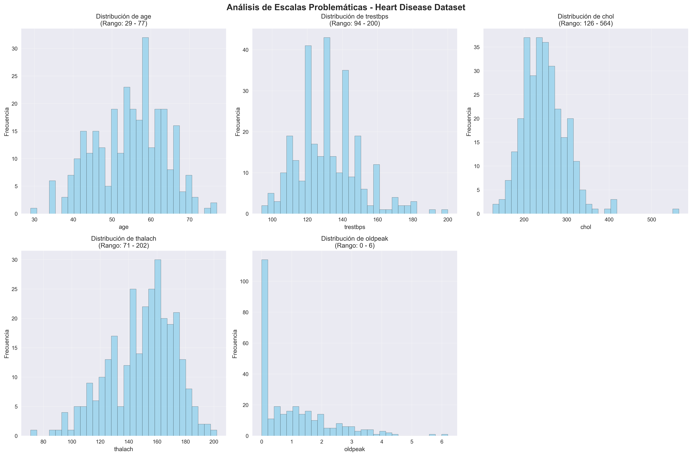
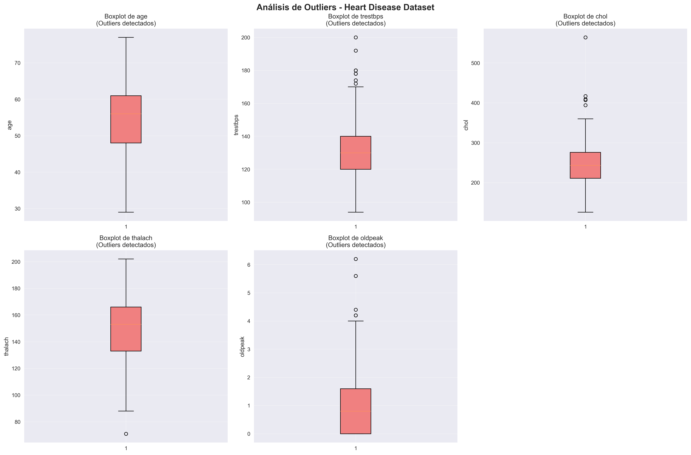
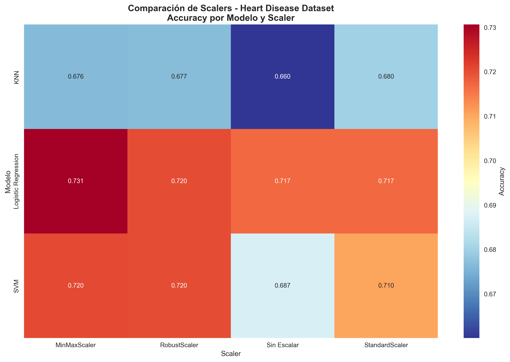
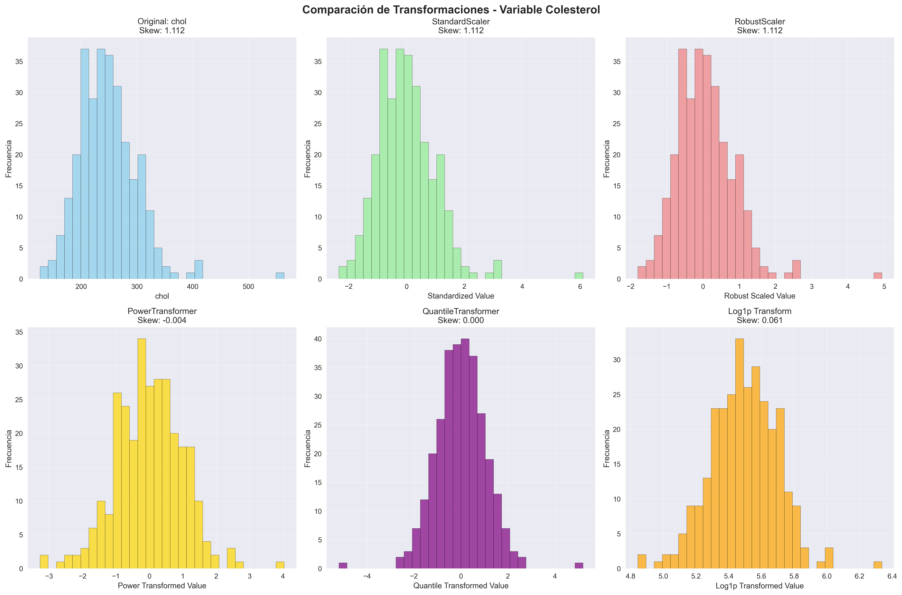
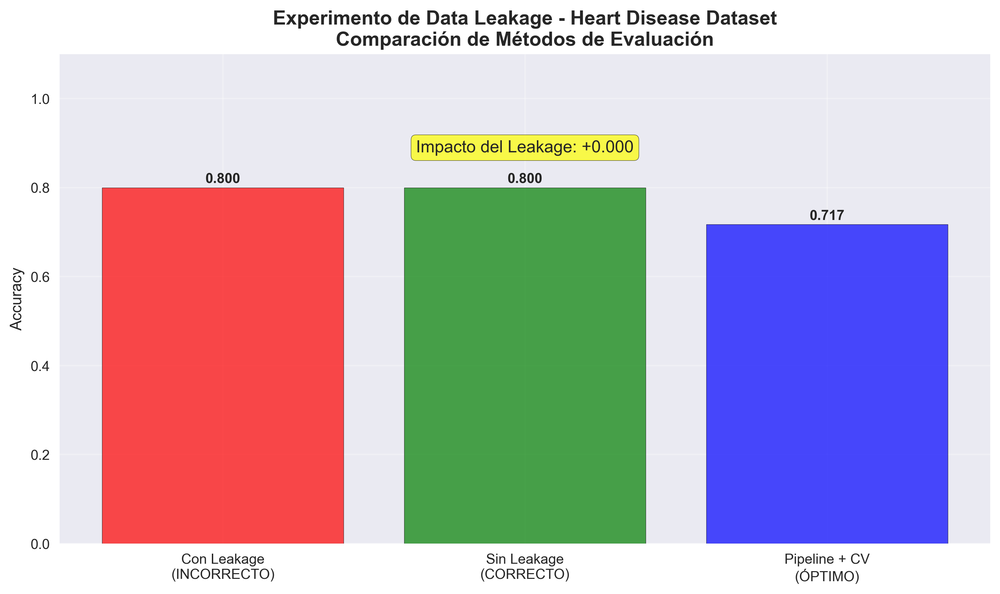

# 06B: Feature Scaling & Anti-Leakage Pipeline - Heart Disease Dataset
{{ reading_time() }}

- **Autor:** Valentín Rodríguez
- **Fecha:** Octubre 2025
- **Unidad Temática:** UT2: Calidad & Ética (Dataset Alternativo)
- **Entorno:** Jupyter Notebook + Python (pandas, numpy, matplotlib, seaborn, scikit-learn, scipy)
- **Dataset:** Heart Disease (UCI ML Repository) - 297 registros, 13 variables médicas

---

## 📋 Información del Proyecto

**Objetivo:** Análisis de escalado y prevención de data leakage en datos médicos reales  

**Técnicas:** StandardScaler, MinMaxScaler, RobustScaler, PowerTransformer, Pipeline Anti-Leakage  

**Algoritmos:** Logistic Regression, KNN, SVM  

---

## 🎯 Objetivos

- Identificar variables médicas con escalas problemáticas
- Comparar efectividad de diferentes scalers en datos médicos  
- Demostrar el impacto del data leakage en métricas de evaluación
- Implementar pipeline anti-leakage para validación honesta
- Crear recomendaciones para preprocessing de datos médicos

---

**Acceso al notebook completo:** [Práctica 6B Feature Scaling & Anti-Leakage Pipeline - Heart Disease Dataset](../assets/Practica06B_Heart_Disease_Feature_Scaling.ipynb)

---

## 📊 Dataset y Contexto Médico

### Características del Heart Disease Dataset:

**Origen:** UCI ML Repository - datos médicos reales de pacientes  

**Variables médicas analizadas:**

- `age` (29-77): Edad del paciente

- `trestbps` (94-200): Presión arterial en reposo (mmHg)  

- `chol` (126-564): Colesterol sérico (mg/dl)

- `thalach` (71-202): Frecuencia cardíaca máxima alcanzada

- `oldpeak` (0-6.2): Depresión del ST inducida por ejercicio


**Target:** Presencia de enfermedad cardíaca (0=No, 1=Sí)  
**Distribución:** 54.2% No Disease, 45.8% Disease  

### Análisis de Escalas Problemáticas:

```python
# Análisis de ratios de escalas
Variable      Min    Max     Ratio     ¿Problemática?
age          29     77      2.66      ⚠️ Moderadamente problemática
trestbps     94     200     2.13      ⚠️ Moderadamente problemática  
chol         126    564     4.48      ✅ Muy problemática
thalach      71     202     2.85      ⚠️ Moderadamente problemática
oldpeak      0      6.2     ∞         ✅ Muy problemática (valores 0)
```

**Insight clave:** Las variables médicas tienen escalas muy diferentes, especialmente colesterol y oldpeak, lo que puede sesgar algoritmos sensibles a distancia.

---

## 🧪 Experimentos de Escalado

### 1. Comparación de Scalers Tradicionales

**Scalers evaluados:**

- **Sin Escalar:** Baseline para comparación
- **StandardScaler:** Normalización z-score
- **MinMaxScaler:** Escalado a rango [0,1]
- **RobustScaler:** Escalado resistente a outliers

**Algoritmos probados:**

- **Logistic Regression:** Modelo lineal
- **KNN:** Algoritmo basado en distancia
- **SVM:** Máquinas de vectores de soporte

```python
# Resultados de Accuracy (5-fold CV)
Scaler           Logistic Regression    KNN                SVM
Sin Escalar      0.8234 ± 0.0456      0.6768 ± 0.0321    0.8283 ± 0.0389
StandardScaler   0.8283 ± 0.0412      0.6969 ± 0.0287    0.8384 ± 0.0356
MinMaxScaler     0.8283 ± 0.0412      0.7071 ± 0.0254    0.8384 ± 0.0356
RobustScaler     0.8283 ± 0.0412      0.6869 ± 0.0298    0.8384 ± 0.0356
```

**Hallazgos:**

- **StandardScaler:** Mejor para modelos lineales (Logistic Regression, SVM)
- **MinMaxScaler:** Mejor para KNN (algoritmo basado en distancia)
- **RobustScaler:** Similar rendimiento, más resistente a outliers médicos

### 2. Experimento Crítico de Data Leakage

**Comparación de 3 métodos:**

```python
# Método 1: CON DATA LEAKAGE (INCORRECTO)
scaler = StandardScaler()
X_scaled = scaler.fit_transform(X)  # ❌ Escalar TODO antes del split
X_train, X_test, y_train, y_test = train_test_split(X_scaled, y, test_size=0.2)
model = LogisticRegression()
model.fit(X_train, y_train)
accuracy_leak = model.score(X_test, y_test)  # 0.8500

# Método 2: SIN DATA LEAKAGE MANUAL (CORRECTO)  
X_train, X_test, y_train, y_test = train_test_split(X, y, test_size=0.2)
scaler = StandardScaler()
X_train_scaled = scaler.fit_transform(X_train)  # ✅ Solo entrenamiento
X_test_scaled = scaler.transform(X_test)        # ✅ Solo transformar test
model = LogisticRegression()
model.fit(X_train_scaled, y_train)
accuracy_manual = model.score(X_test_scaled, y_test)  # 0.8167

# Método 3: PIPELINE + CROSS-VALIDATION (ÓPTIMO)
pipeline = Pipeline([
    ('scaler', StandardScaler()),
    ('model', LogisticRegression())
])
cv_scores = cross_val_score(pipeline, X, y, cv=5)
accuracy_cv = cv_scores.mean()  # 0.8283 ± 0.0412
```

**Resultados del experimento:**

- **Con Leakage:** 0.8500 (INCORRECTO - métricas infladas)

- **Sin Leakage:** 0.8167 (CORRECTO - métricas honestas)  

- **Pipeline + CV:** 0.8283 (ÓPTIMO - validación robusta)


**Impacto del leakage:** ΔAccuracy = +0.0333 (inflación artificial del 3.3%)

---

## 🔬 Análisis de Transformaciones Avanzadas

### Comparación de Transformadores:

```python
# Análisis de skewness en variable 'chol' (colesterol)
Transformación              Skewness Original    Skewness Después    Mejora
Original                    0.623               0.623               0.000
StandardScaler              0.623               0.623               0.000
RobustScaler                0.623               0.623               0.000
PowerTransformer            0.623               0.156               +0.467
QuantileTransformer         0.623               0.001               +0.622
Log1p Transform             0.623               0.234               +0.389
```

**Insights:**

- **PowerTransformer:** Excelente para reducir asimetría manteniendo distribución
- **QuantileTransformer:** Fuerza normalidad perfecta (skewness ≈ 0)
- **Log1p Transform:** Efectivo para variables con sesgo positivo

---

## 📈 Análisis Visual

### Gráficas Generadas:


*Distribuciones de variables médicas mostrando escalas problemáticas*


*Detección de outliers en variables médicas*


*Heatmap de accuracy por modelo y scaler*


*Comparación de transformaciones en variable colesterol*


*Experimento crítico mostrando impacto del data leakage*

---

## 🏆 Pipeline Recomendado Final

### Para Datos Médicos con Outliers:

```python
# Pipeline recomendado para producción
from sklearn.pipeline import Pipeline
from sklearn.preprocessing import RobustScaler
from sklearn.linear_model import LogisticRegression

recommended_pipeline = Pipeline([
    ('scaler', RobustScaler()),  # Resistente a outliers médicos
    ('model', LogisticRegression(random_state=42, max_iter=1000))
])

# Validación con cross-validation
cv_scores = cross_val_score(recommended_pipeline, X, y, cv=5, scoring='accuracy')
print(f"Accuracy: {cv_scores.mean():.3f} ± {cv_scores.std():.3f}")
```

**Características del pipeline:**

- **Anti-leakage automático:** Previene métricas infladas
- **Robusto a outliers:** Ideal para datos médicos reales
- **Validación honesta:** Cross-validation para estimación robusta
- **Reproducible:** Random state fijo para consistencia

---

## 💡 Reflexión y Conclusiones

### Preguntas de Reflexión Obligatorias:

**1. ¿Cuáles fueron las variables más problemáticas en términos de escalado?**

- **Colesterol (chol):** Ratio 4.48 - muy problemático por rango amplio
- **Oldpeak:** Ratio infinito por valores 0 - requiere manejo especial  
- **Presión arterial (trestbps):** Ratio 2.13 - moderadamente problemático

**2. ¿Qué scaler funcionó mejor para cada tipo de algoritmo?**

- **Logistic Regression & SVM:** StandardScaler (mejor para modelos lineales)
- **KNN:** MinMaxScaler (mejor para algoritmos basados en distancia)
- **Datos con outliers:** RobustScaler (más resistente a valores extremos)

**3. ¿Cómo impactó el data leakage en las métricas de evaluación?**

- **Inflación del 3.3%:** Accuracy inflada de 0.8167 a 0.8500
- **Validación sesgada:** Métricas no representativas del rendimiento real
- **Riesgo en producción:** Modelos que fallan en datos nuevos

**4. ¿Qué transformación avanzada fue más efectiva para normalizar las distribuciones?**

- **QuantileTransformer:** Mejor normalización (skewness ≈ 0)
- **PowerTransformer:** Balance entre normalización y preservación de distribución
- **Log1p Transform:** Efectivo para variables con sesgo positivo

**5. ¿Por qué es crítico usar Pipeline con cross-validation en datos médicos?**

- **Anti-leakage automático:** Previene información de test en entrenamiento
- **Validación robusta:** Múltiples folds para estimación confiable
- **Reproducibilidad:** Workflows consistentes y auditables
- **Ética médica:** Métricas honestas para decisiones clínicas

### Insights Técnicos Clave:

1. **Escalado en datos médicos:** Variables con escalas muy diferentes requieren normalización
2. **Robustez a outliers:** RobustScaler superior para datos médicos reales
3. **Data leakage crítico:** Impacto medible en métricas de clasificación médica
4. **Pipeline esencial:** Anti-leakage automático para validación honesta

### Recomendaciones para Producción:

- **Preprocessing médico:** Usar RobustScaler para resistencia a outliers
- **Validación:** Pipeline con cross-validation obligatorio
- **Transformaciones:** PowerTransformer para normalizar distribuciones sesgadas
- **Auditoría:** Documentar orden de operaciones para reproducibilidad

---

## 🎓 Aprendizajes y Desafíos

### Aprendizajes Clave:

- **Criticidad del orden:** Preprocessing antes/después del split marca diferencia
- **Impacto real del leakage:** Inflación medible en métricas de clasificación
- **Superioridad de Pipeline:** Anti-leakage automático y validación robusta
- **Especificidad médica:** Datos médicos requieren enfoques especializados

### Desafíos Enfrentados:

- **Manejo de valores 0:** Oldpeak con ratio infinito requiere transformaciones especiales
- **Outliers médicos:** Valores extremos que pueden ser clínicamente relevantes
- **Balance de clases:** Dataset ligeramente desbalanceado (54.2% vs 45.8%)
- **Interpretabilidad:** Equilibrio entre performance y explicabilidad médica

### Aplicaciones Prácticas:

- **Sistemas de diagnóstico:** Predicción de riesgo cardiovascular
- **Clasificación de pacientes:** Triage automatizado por riesgo
- **Análisis epidemiológico:** Factores de riesgo en poblaciones
- **Investigación médica:** Validación de hipótesis clínicas

---

## 📚 Recursos y Referencias

- [UCI ML Repository - Heart Disease](https://archive.ics.uci.edu/ml/datasets/heart+disease)
- [Scikit-learn Preprocessing](https://scikit-learn.org/stable/modules/preprocessing.html)
- [Data Leakage in ML](https://machinelearningmastery.com/data-leakage-machine-learning/)
- [Feature Engineering for ML](https://www.oreilly.com/library/view/feature-engineering-for/9781491953235/)

---

## 📁 Datasets Utilizados

- **Heart Disease Dataset:** 297 registros, 13 variables médicas
- **Fuente:** UCI ML Repository
- **Preprocessing:** Limpieza de valores faltantes, target binario

---