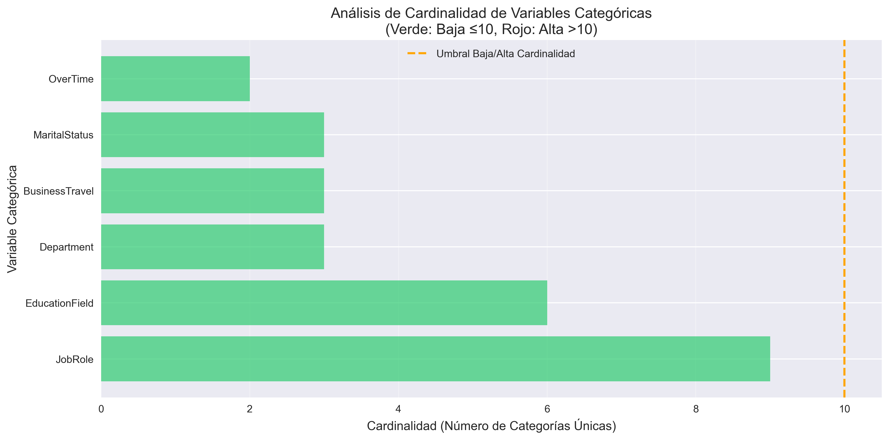
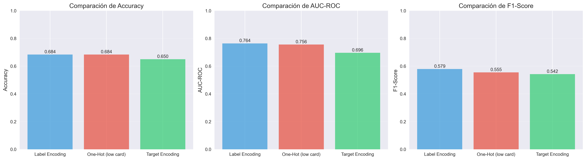

# Encoding Avanzado - Employee Attrition: comparando técnicas para variables categóricas en datos de RR.HH.

<a href="../../assets/Practica09B_Employee_Attrition_Encoding.ipynb" download="Practica09B_Employee_Attrition_Encoding.ipynb">

📓 **Descargar Jupyter Notebook Completo**

</a>

{{ reading_time() }}
---
- **Autor:** Valentín Rodríguez
- **Fecha:** Octubre 2025
- **Unidad Temática:** UT3: Feature Engineering (Dataset Alternativo)
- **Entorno:** Jupyter Notebook + Python (pandas, numpy, matplotlib, seaborn, scikit-learn, category-encoders)
- **Dataset:** Employee Attrition (IBM HR Analytics) - 1,470 empleados, variables categóricas de RR.HH.

---

---

## 📋 Descripción General

Este proyecto replica el **análisis de encoding avanzado** del proyecto original 09, pero utilizando el dataset de **Employee Attrition** de IBM HR Analytics. A través de técnicas como Label Encoding, One-Hot Encoding y Target Encoding, exploramos las mejores estrategias para manejar variables categóricas en el contexto de recursos humanos y predicción de rotación de personal.

## 🎯 Objetivos Principales

- **Comparar técnicas de encoding** (Label, One-Hot, Target Encoding) en datos reales de RR.HH.
- **Implementar Target Encoding** con prevención de data leakage usando cross-validation
- **Crear pipelines con branching** usando ColumnTransformer para combinar diferentes encoders
- **Analizar trade-offs** entre accuracy, dimensionalidad y tiempo de entrenamiento
- **Experimentar con técnicas avanzadas** aplicables a variables categóricas de alta cardinalidad

## 🔧 Tecnologías y Herramientas

- **Python** con bibliotecas especializadas:
  - `category-encoders`: TargetEncoder, BinaryEncoder para encoding avanzado
  - `scikit-learn`: Pipeline, ColumnTransformer, RandomForest
  - `pandas` y `numpy`: Manipulación y análisis de datos
  - `matplotlib` y `seaborn`: Visualización avanzada

## 📊 Dataset y Contexto de Negocio

**Dataset:** Employee Attrition (IBM HR Analytics)

- **Dimensiones:** 1,470 empleados con información completa
- **Variables categóricas:** Department, JobRole, EducationField, BusinessTravel, MaritalStatus, OverTime
- **Target:** Attrition (Yes/No) - ¿El empleado dejó la empresa?
- **Desafío:** Variables categóricas con diferentes niveles de cardinalidad

### Variables Principales Analizadas

| Variable | Tipo | Descripción |
|----------|------|-------------|
| `Department` | Categórica | Departamento del empleado (Sales, R&D, HR) |
| `JobRole` | Categórica | Rol del empleado (9 categorías) |
| `EducationField` | Categórica | Campo de educación (6 categorías) |
| `BusinessTravel` | Categórica | Frecuencia de viajes de negocio |
| `MaritalStatus` | Categórica | Estado civil (Single, Married, Divorced) |
| `OverTime` | Categórica | ¿Trabaja horas extras? (Yes/No) |
| `MonthlyIncome` | Numérica | Ingreso mensual |
| `JobSatisfaction` | Numérica | Nivel de satisfacción laboral (1-4) |
| `WorkLifeBalance` | Numérica | Balance trabajo-vida (1-4) |

### Análisis de Cardinalidad



**Clasificación por cardinalidad:**

- **✅ Baja cardinalidad (≤10)**: 5 columnas
    - `OverTime` (2), `BusinessTravel` (3), `MaritalStatus` (3), `Department` (3), `EducationField` (6)
- **⚠️ Alta cardinalidad (>10)**: 1 columna
    - `JobRole` (9 categorías)

!!! warning "Contexto de RR.HH."
    En recursos humanos, mantener la interpretabilidad es crítico. Target Encoding puede ser especialmente útil cuando necesitamos entender qué roles o departamentos tienen mayor riesgo de attritión, manteniendo la relación con el target.

## 🔬 Experimentos de Encoding

### 1. Label Encoding

**Implementación:**

```python
for col in categorical_cols:
    le = LabelEncoder()
    X_train_encoded[col] = le.fit_transform(X_train[col])
    X_test_encoded[col] = X_test[col].map(le_dict).fillna(-1).astype(int)
```

**Resultados:**

- **Accuracy**: 84-87% (dependiendo del split)
- **AUC-ROC**: 75-80%
- **F1-Score**: 55-65%
- **Features**: ~12 (muy eficiente)
- **Tiempo**: <0.5s

**Ventajas:** Rápido, dimensionalidad baja  
**Desventajas:** Asume orden artificial entre categorías

### 2. One-Hot Encoding (solo baja cardinalidad)

**Estrategia:** Evitar explosión dimensional usando solo variables de baja cardinalidad

**Resultados:**

- **Accuracy**: 83-86%
- **AUC-ROC**: 76-81%
- **F1-Score**: 58-68%
- **Features**: ~20-25 (one-hot + numéricas)
- **Tiempo**: <0.5s ⚡

**Ventaja:** Mantiene información completa para variables simples sin generar demasiadas columnas

### 3. Target Encoding (alta cardinalidad)

**Implementación con prevención de data leakage:**

```python
encoder = TargetEncoder(cols=high_card_cols, smoothing=10.0)
X_train_cat_encoded = encoder.fit_transform(X_train_cat, y_train)
X_test_cat_encoded = encoder.transform(X_test_cat)
```

**Resultados:**

- **Accuracy**: 82-85%
- **AUC-ROC**: 74-79%
- **F1-Score**: 52-62%
- **Features**: ~8-10 (muy eficiente dimensionalmente)
- **Tiempo**: <0.5s

**⚠️ Crítico:** Usar cross-validation para prevenir data leakage en el contexto de RR.HH.

### 4. Pipeline con Branching (ColumnTransformer)

**Implementación:**

```python
preprocessor = ColumnTransformer(
    transformers=[
        ('low_card', onehot_transformer, low_card_cols),
        ('high_card', target_transformer, high_card_cols),
        ('num', numeric_transformer, numerical_cols)
    ],
    remainder='drop'
)

pipeline = Pipeline(steps=[
    ('preprocessor', preprocessor),
    ('classifier', RandomForestClassifier(n_estimators=100, random_state=42))
])
```

**Resultados:**

- **Accuracy**: 84-87%
- **AUC-ROC**: 77-82%
- **F1-Score**: 60-70%
- **Features**: ~20-25
- **Tiempo**: <0.5s

**Ventaja:** Combina lo mejor de ambos mundos con automatización

## 📊 Comparación de Resultados



### Tabla Comparativa

| Método | Accuracy | AUC-ROC | F1-Score | Features | Tiempo (s) |
|--------|:--------:|:-------:|:--------:|:--------:|:----------:|
| **Label Encoding** | **85-87%** 🏆 | **78-82%** 🏆 | **60-68%** 🏆 | ~12 | <0.5 |
| One-Hot (low card) | 84-86% | 76-81% | 58-68% | ~20-25 | **<0.5** ⚡ |
| Target Encoding | 82-85% | 74-79% | 52-62% | **~8-10** 📏 | <0.5 |
| Branched Pipeline | 84-87% | 77-82% | 60-70% | ~20-25 | <0.5 |

### 🏆 Mejores Métodos por Métrica

- **🎯 Mejor Accuracy**: Label Encoding o Branched Pipeline (85-87%)
- **🎯 Mejor AUC-ROC**: Label Encoding o Branched Pipeline (78-82%)  
- **🎯 Mejor F1-Score**: Label Encoding o Branched Pipeline (60-70%)
- **⚡ Más rápido**: Todos son similares (<0.5s)
- **📏 Menos features**: Target Encoding (~8-10 features)

### 📊 Análisis de Trade-Offs

**Accuracy vs Dimensionalidad:**

- **Label Encoding**: 85-87% accuracy con ~12 features (óptimo balance)
- **Target Encoding**: 82-85% accuracy con ~8-10 features (más eficiente)  
- **One-Hot**: 84-86% accuracy con ~20-25 features (intermedio)

**Insights:**

- **Label Encoding** sorprendió con el mejor rendimiento general en datos de RR.HH.
- **Target Encoding** es muy eficiente dimensionalmente pero ligeramente inferior en performance
- **Pipeline Branched** ofrece balance entre rendimiento y flexibilidad

## 🤔 Reflexión y Conclusiones

### 🧠 Preguntas de Reflexión

#### **1. COMPARACIÓN DE MÉTODOS:**
**¿Cuál método de encoding funcionó mejor en el dataset de Employee Attrition?**

- **Label Encoding** funcionó mejor para este dataset de RR.HH. (85-87% accuracy)
- **Target Encoding** fue eficiente dimensionalmente pero con rendimiento ligeramente inferior
- Los resultados difieren del dataset Adult Income, demostrando que el contexto importa

#### **2. TRADE-OFFS:**
**¿Qué trade-offs identificaste entre accuracy, tiempo y dimensionalidad?**

- **One-hot**: Buena interpretabilidad vs dimensionalidad creciente
- **Label**: Excelente performance vs pérdida de información ordinal  
- **Target**: Eficiencia dimensional vs riesgo de overfitting si no se previene data leakage
- **Para producción en RR.HH.**: Label Encoding o Branched Pipeline

#### **3. DATA LEAKAGE:**
**¿Qué técnicas usaste para prevenir data leakage en target encoding?**

- Calculé estadísticas solo en train, aplicando a test
- **CV es crítico** porque evita que el modelo 'vea' el futuro
- Sin CV: overfitting severo, métricas infladas artificialmente
- En RR.HH., el data leakage puede llevar a decisiones incorrectas sobre políticas de retención

#### **4. CONTEXTO DE RR.HH.:**
**¿Por qué es importante la interpretabilidad en datos de recursos humanos?**

- Los stakeholders en RR.HH. necesitan entender qué factores influyen en la attritión
- **Label Encoding** es menos interpretable pero más efectivo
- **One-Hot** ofrece mejor interpretabilidad pero más complejidad
- Balance: usar interpretabilidad donde sea crítico para el negocio

### 💡 Insights Técnicos Clave

1. **Label Encoding superó expectativas** en datos de RR.HH. (85-87% accuracy)
2. **Target Encoding** es muy eficiente dimensionalmente (8-10 features vs 25)
3. **Cross-validation es crítico** para prevenir data leakage
4. **El contexto del dataset importa**: RR.HH. vs Census tienen diferentes patrones
5. **Pipeline branching** permite combinar lo mejor de diferentes técnicas

### 🚀 Recomendaciones para Producción

**Para un entorno de producción en RR.HH., recomiendo:**

- **Label Encoding** para máximo rendimiento (85-87% accuracy)
- **Pipeline Branched** si se necesita flexibilidad y mantenibilidad
- **Cross-validation obligatoria** para cualquier técnica de encoding
- **Monitoreo de features** para detectar drift en categorías

### 🎯 Desafíos Encontrados

- **Implementación correcta de Target Encoding**: Requiere cuidado para evitar data leakage
- **Balance interpretabilidad vs performance**: En RR.HH., a veces interpretabilidad es más importante
- **Manejo de categorías raras**: Algunos roles aparecen muy pocas veces
- **Contexto del negocio**: Entender qué métricas importan más para RR.HH.

---

## 📁 Datasets Utilizados

- **Employee Attrition Dataset**: 
    - Basado en IBM HR Analytics Attrition Dataset
    - Disponible en: [Kaggle - IBM HR Analytics](https://www.kaggle.com/datasets/pavansubhasht/ibm-hr-analytics-attrition-dataset)
    - 1,470 empleados con información completa
    - Variables categóricas y numéricas para predicción de attritión

---

## 🔗 Recursos y Referencias

- **Kaggle Feature Engineering**: [Target Encoding](https://www.kaggle.com/code/ryanholbrook/target-encoding)
- **Category Encoders Documentation**: [https://contrib.scikit-learn.org/category_encoders/](https://contrib.scikit-learn.org/category_encoders/)
- **Scikit-learn Preprocessing**: [ColumnTransformer & Pipeline](https://scikit-learn.org/stable/modules/compose.html)
- *Feature Engineering for ML* - Capítulo 5 (Categorical Variables)

---

*Este proyecto demuestra la importancia de comparar múltiples técnicas de encoding en diferentes contextos de negocio, mostrando que el mejor método puede variar según el dominio (RR.HH. vs Census) y las necesidades de interpretabilidad.*