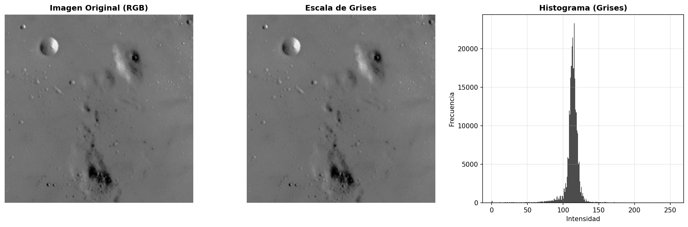
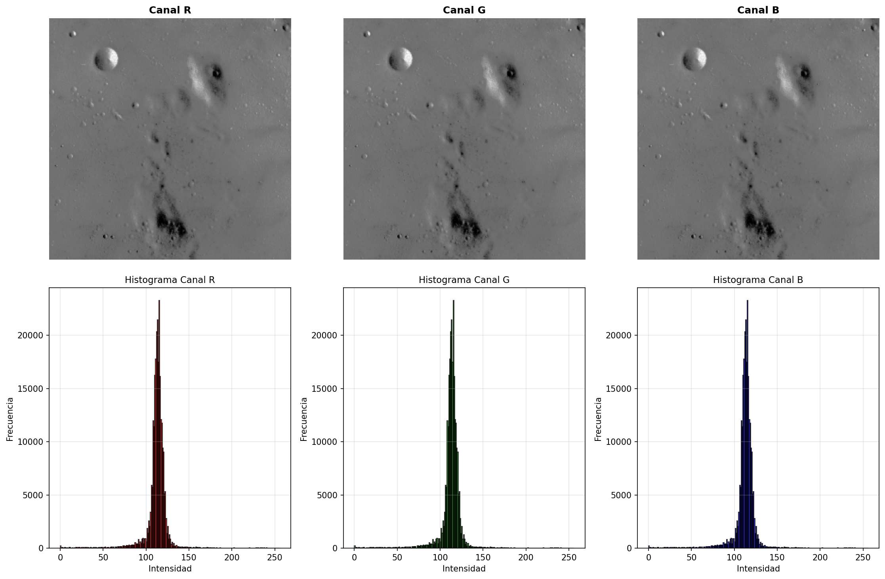
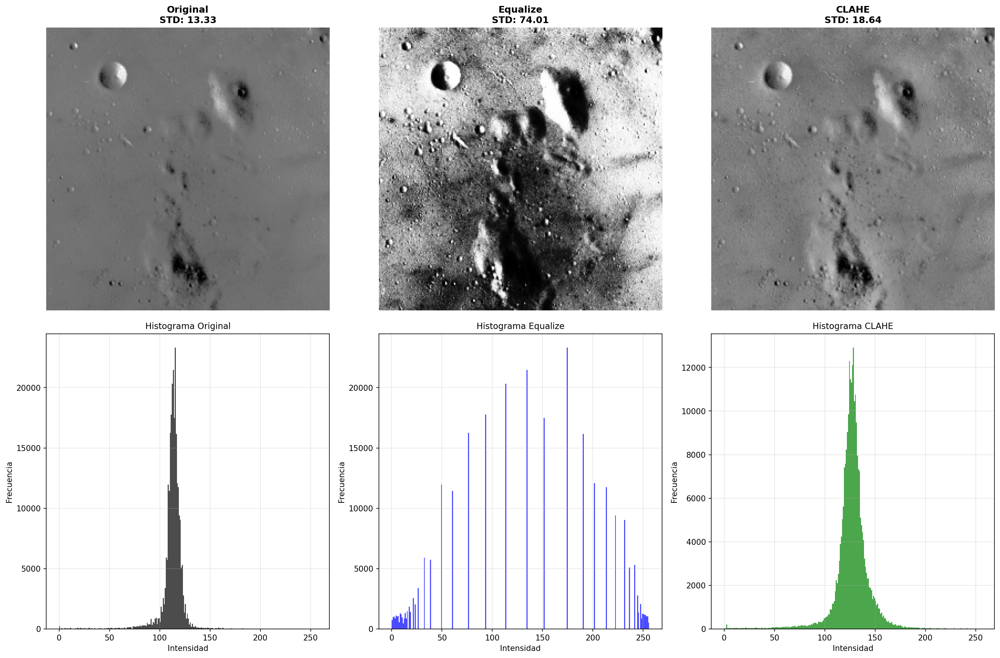
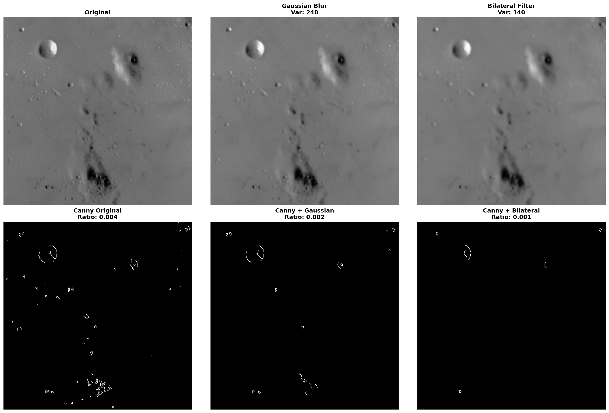
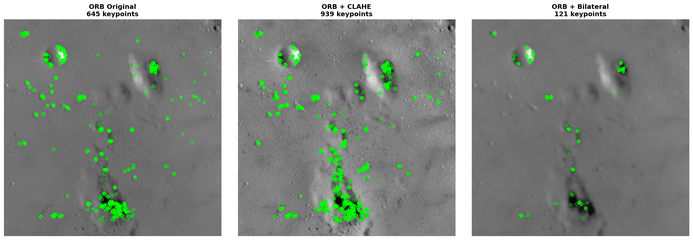
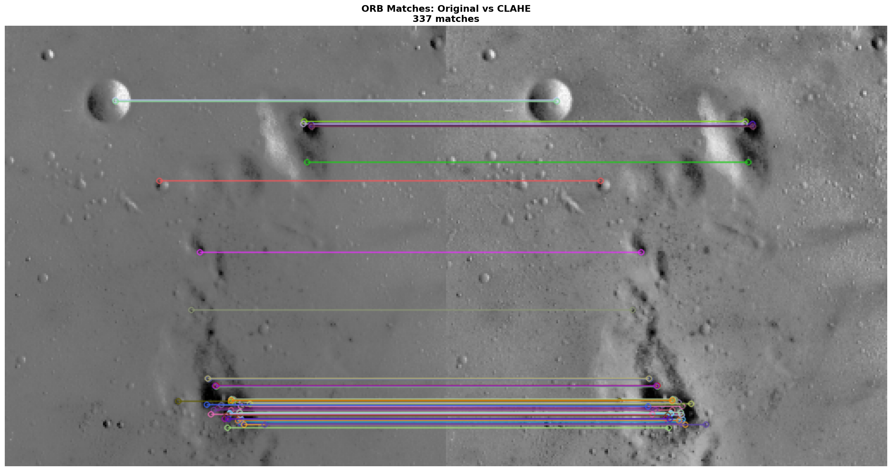
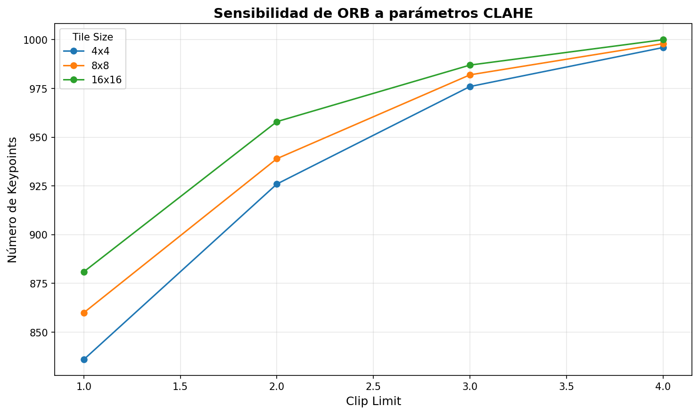
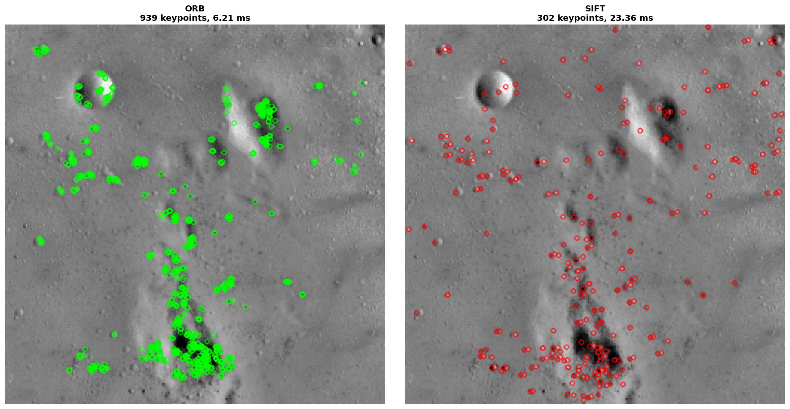
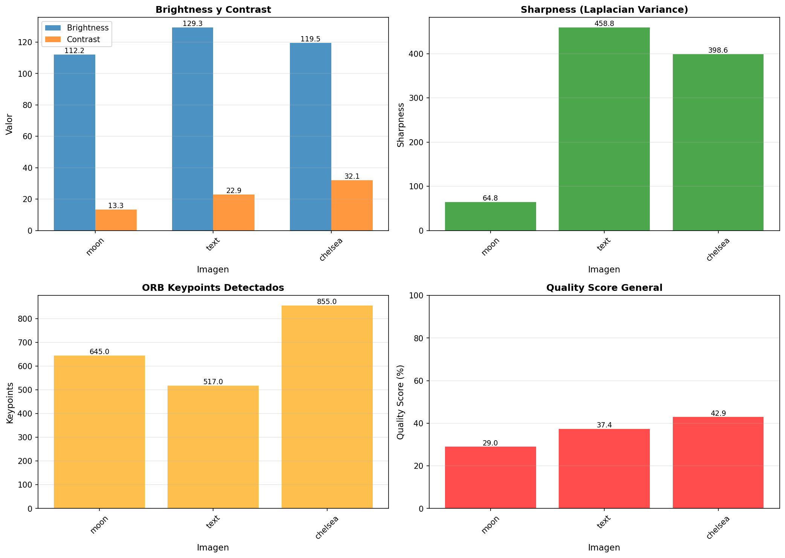

# Preprocesamiento avanzado de imágenes: análisis con dataset alternativo

<a href="../../assets/Practica_13b_Image_Preprocessing_Alternative.ipynb" download="Practica_13b_Image_Preprocessing_Alternative.ipynb">

📓 **Descargar Jupyter Notebook Completo**

</a>

{{ reading_time() }}
---
- **Autor**: Valentín Rodríguez
- **Fecha**: Noviembre 2025
- **Unidad Temática**: UT4: Datos Especiales (Dataset Alternativo)
- **Entorno**: Python + OpenCV + scikit-image + NumPy + Matplotlib + Pandas
- **Dataset**: Imágenes de naturaleza, texturas y arquitectura (moon, text, chelsea, brick, grass, hubble_deep_field)

---

## 📋 Descripción General

Esta práctica representa una **versión alternativa** del análisis de preprocesamiento de imágenes, utilizando un **dataset diferente** de scikit-image (moon, text, chelsea, etc.) en lugar del pack clásico original. El objetivo es demostrar la versatilidad y aplicabilidad universal de las técnicas de visión por computadora aplicando la misma metodología a diferentes tipos de imágenes.

## 🎯 Objetivos Principales

- **Aplicar pipeline completo** de preprocesamiento a un dataset alternativo
- **Validar metodología** de contraste, suavizado y detección de features en diferentes contextos
- **Comparar resultados** entre diferentes tipos de imágenes (naturaleza, texturas, arquitectura)
- **Demostrar universalidad** de técnicas de visión por computadora independientemente del tipo de imagen

## 🔧 Tecnologías y Herramientas

- **Python** con bibliotecas especializadas:
  - `opencv-python` y `opencv-contrib-python`: Procesamiento de imágenes y detección de features
  - `scikit-image`: Operaciones avanzadas de procesamiento
  - `numpy` y `pandas`: Análisis de datos y métricas
  - `matplotlib`: Visualización de resultados

## 📊 Dataset y Metodología

**Dataset:** Imágenes alternativas de scikit-image

- **Dimensiones:** 6 imágenes diferentes (moon, text, chelsea, brick, grass, hubble_deep_field)
- **Tipos:** Naturaleza, texturas, arquitectura, astronomía
- **Fuente:** scikit-image data module

### Imágenes Analizadas

| Imagen | Tipo | Características |
|--------|------|-----------------|
| moon.png | Naturaleza | Imagen de la luna con texturas granulares |
| text.png | Textura | Patrón de texto sintético |
| chelsea.png | Naturaleza | Gato con detalles finos |
| brick.png | Textura | Patrón de ladrillos |
| grass.png | Naturaleza | Textura de césped |
| hubble_deep_field.png | Astronomía | Campo profundo del Hubble |

## 🔍 Análisis de Preprocesamiento Implementado

### 1. Representación y diagnóstico inicial

- Lectura de imágenes en formato BGR/RGB/Grises
- Cálculo de estadísticas básicas (rango, media, desviación estándar)
- Análisis de histogramas para diagnóstico de iluminación y contraste


*Imagen base (RGB y escala de grises) y distribución de intensidades en escala de grises - Análisis inicial de dimensiones, rango tonal y contraste*


*Canales RGB individuales y sus histogramas - Distribución de intensidades por canal para detectar dominancias cromáticas*

### 2. Espacios de color y realce de contraste

- Ecualización global de histograma en escala de grises
- CLAHE (Contrast Limited Adaptive Histogram Equalization) en espacio LAB
- Comparación cuantitativa de mejoras de contraste


*Comparación de técnicas de realce de contraste: ecualización global vs CLAHE adaptativo*

### 3. Suavizado y detección de bordes

- Filtros gaussiano y bilateral para reducción de ruido
- Detección de bordes con Canny
- Métricas de varianza del gradiente y ratio de bordes


*Impacto de diferentes filtros de suavizado en la detección de bordes con Canny*

### 4. Detección y descripción de features (ORB)

- Detección de keypoints con ORB en diferentes versiones preprocesadas
- Análisis de densidad de keypoints según transformaciones aplicadas
- Matching entre imágenes original y procesadas


*Densidad de puntos de interés según preprocesamiento aplicado*


*Repetibilidad de features tras realzar contraste local con CLAHE*

### 5. Análisis de sensibilidad y benchmark

- Barrido de parámetros CLAHE (clip limit, tile size)
- Comparación de rendimiento ORB vs SIFT
- Análisis de sensibilidad a diferentes configuraciones


*Barrido de parámetros para equilibrar keypoints y calidad de imagen*


*Comparativa de tiempo y keypoints entre descriptores binarios (ORB) y flotantes (SIFT)*

### 6. Dashboard de control de calidad (QA)

- Métricas de calidad por imagen (brightness, contrast, sharpness)
- Conteo de keypoints ORB
- Score de calidad general


*KPIs por imagen y métricas de calidad para monitorear el dataset alternativo*

## 📈 Insights y Conclusiones

### 1. **Impacto del Tipo de Imagen**

- **Imágenes de naturaleza (moon, chelsea)**: Responden bien a CLAHE, mejorando contraste sin sobreexponer
- **Texturas (text, brick, grass)**: Requieren ajustes finos en parámetros CLAHE para preservar patrones
- **Astronomía (hubble)**: Benefician de técnicas de contraste adaptativo para revelar detalles sutiles

### 2. **Efectividad de CLAHE**

- **Mejora de contraste**: CLAHE supera a ecualización global en imágenes con iluminación desigual
- **Preservación de detalles**: El límite de clip evita sobreexposición en zonas brillantes
- **Ajuste de parámetros**: Tile size y clip limit deben ajustarse según características de la imagen

### 3. **Filtros de Suavizado**

- **Bilateral filter**: Balance óptimo entre reducción de ruido y preservación de bordes
- **Gaussian blur**: Efectivo para ruido general pero puede borrar detalles finos
- **Impacto en detección de bordes**: Bilateral produce menos falsos positivos en Canny

### 4. **Detección de Features**

- **ORB**: Más rápido, adecuado para aplicaciones en tiempo real
- **SIFT**: Más keypoints pero computacionalmente más costoso
- **Impacto del preprocesamiento**: CLAHE aumenta significativamente la densidad de keypoints

### 5. **Aplicabilidad Metodológica**

- **Técnicas universales**: El pipeline funciona en diferentes tipos de imágenes
- **Ajuste de parámetros**: Necesario según características específicas del dataset
- **Métricas de QA**: Permiten monitorear calidad y detectar problemas sistemáticos

## 🔄 Comparación con la Práctica Original

### Similitudes Metodológicas

1. **Pipeline idéntico**: Misma secuencia de operaciones (diagnóstico → contraste → suavizado → features)
2. **Técnicas aplicadas**: CLAHE, filtros bilaterales, ORB/SIFT funcionan igual
3. **Métricas de evaluación**: Mismas métricas de contraste, sharpness y keypoints

### Diferencias Observadas

- **Características de imágenes**: Moon tiene texturas granulares diferentes a camera
- **Respuesta a CLAHE**: Imágenes con iluminación más desigual muestran mejoras más dramáticas
- **Densidad de keypoints**: Varía según tipo de imagen y preprocesamiento aplicado

## 🛠️ Implementación Técnica

### Pipeline de Análisis

```python
# 1. Diagnóstico inicial
img_bgr = cv2.imread(str(img_path))
img_gray = cv2.cvtColor(img_bgr, cv2.COLOR_BGR2GRAY)
stats = calculate_stats(img_gray)

# 2. Realce de contraste
clahe = cv2.createCLAHE(clipLimit=2.0, tileGridSize=(8, 8))
img_clahe = apply_clahe(img_bgr, clahe)

# 3. Suavizado
bilateral = cv2.bilateralFilter(img_gray, d=9, sigmaColor=75, sigmaSpace=75)

# 4. Detección de features
orb = cv2.ORB_create(nfeatures=1000)
kp, des = orb.detectAndCompute(img_clahe, None)

# 5. Métricas QA
metrics = calculate_qa_metrics(img_gray, kp)
```

### Visualizaciones Implementadas

- **Histogramas**: Diagnóstico de rango tonal y distribución de intensidades
- **Comparativas**: Original vs procesado para evaluar mejoras
- **Keypoints**: Visualización de puntos de interés detectados
- **Dashboards**: Métricas agregadas para control de calidad

## 📚 Aprendizajes Adquiridos

1. **Universalidad**: Las técnicas de preprocesamiento son aplicables a cualquier tipo de imagen
2. **Ajuste de parámetros**: Necesario según características específicas del dataset
3. **CLAHE efectivo**: Mejora contraste preservando detalles locales
4. **Bilateral filter**: Balance óptimo para aplicaciones de visión por computadora
5. **Métricas de QA**: Fundamentales para monitorear calidad en pipelines de producción

## 🔗 Recursos y Referencias

- **OpenCV Documentation**: Feature Detection (SIFT y ORB)
- **scikit-image Documentation**: Image Processing Tutorials
- **CLAHE Algorithm**: Contrast Limited Adaptive Histogram Equalization
- **ORB Paper**: "ORB: An efficient alternative to SIFT or SURF"

---

*Este análisis demuestra la versatilidad y aplicabilidad universal de las técnicas de preprocesamiento de imágenes, aplicando la misma metodología rigurosa a un dataset diferente (naturaleza, texturas, astronomía vs imágenes clásicas), validando la robustez del pipeline implementado.*