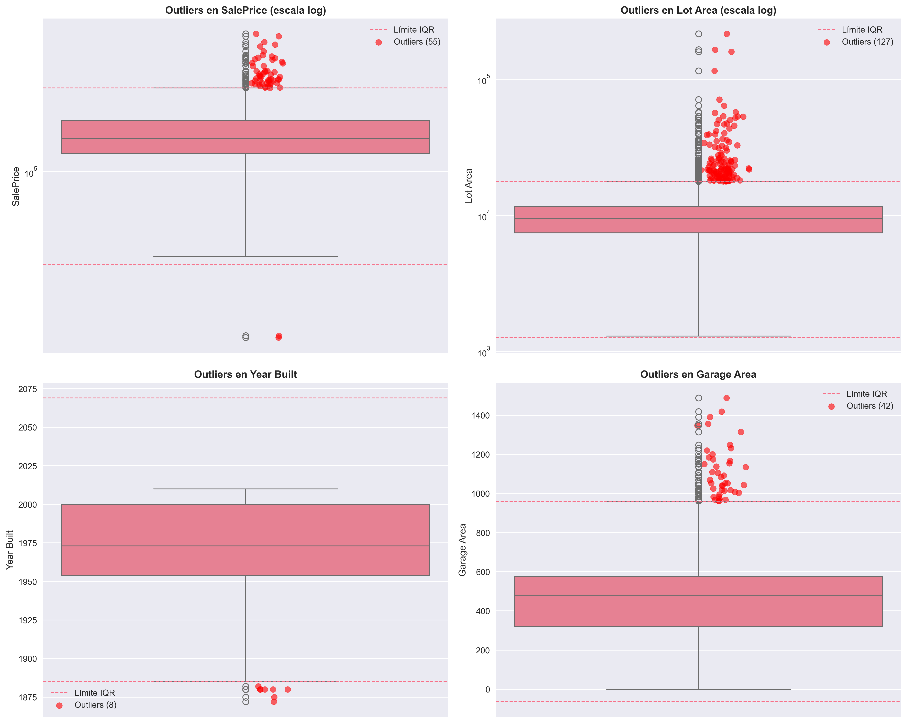
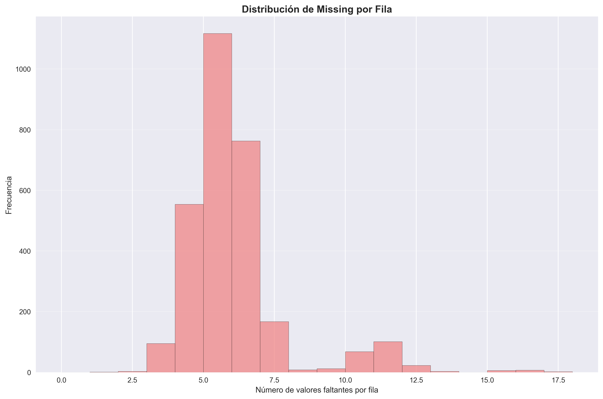
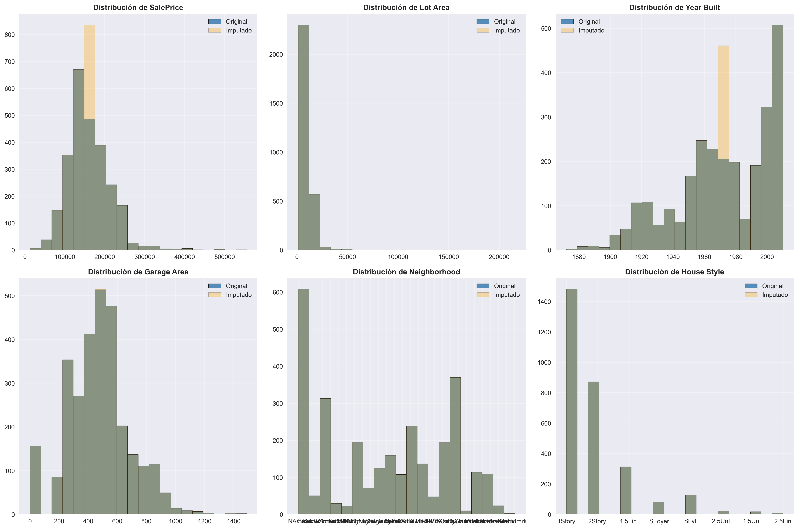

# Detectando el misterio de los datos faltantes: análisis forense del dataset Ames Housing
{{ reading_time() }}
---
## 📋 **Metadatos del Proyecto**

- **Autores**: Joaquín Batista, Milagros Cancela, Valentín Rodríguez, Alexia Aurrecoechea, Nahuel López (G1)
- **Fecha**: Agosto 2025
- **Unidad Temática**: UT2 - Calidad & Ética
- **Tipo**: Práctica Guiada
- **Entorno**: Python + Pandas + Scikit-learn + Seaborn
- **Dataset**: Ames Housing Dataset (2930 registros, 82 variables)

---

## 🎯 **Contexto del Proyecto**

### **Problema de Negocio**
El dataset *Ames Housing* presenta datos faltantes y outliers que comprometen la calidad de las predicciones de precios inmobiliarios. Como analistas de datos, necesitamos:

- **Detectar patrones** en los datos faltantes (MCAR, MAR, MNAR)
- **Identificar outliers** usando métodos estadísticos robustos
- **Implementar estrategias** de imputación apropiadas
- **Crear pipelines** de limpieza reproducibles
- **Considerar aspectos éticos** en el tratamiento de datos

### **Valor para el Negocio**
Datos más limpios y de mayor calidad resultan en predicciones de precios más confiables, lo que impacta directamente en decisiones de inversión inmobiliaria, valuaciones y políticas crediticias.

---

## 🔍 **Objetivos de Aprendizaje**

### **Objetivos Técnicos**
- Clasificar tipos de datos faltantes según su mecanismo (MCAR/MAR/MNAR)
- Aplicar métodos estadísticos para detección de outliers (IQR, Z-Score)
- Implementar estrategias de imputación diferenciadas por tipo de variable
- Desarrollar pipelines reproducibles con Scikit-learn
- Evaluar el impacto de las decisiones de limpieza en las distribuciones

### **Objetivos Éticos**
- Analizar sesgos potenciales introducidos por las decisiones de imputación
- Considerar el impacto diferencial en grupos demográficos
- Garantizar transparencia y reproducibilidad en el proceso

---

## 🏠 **Dataset y Metodología**

### **Características del Dataset**
- **Origen**: Ames Housing Dataset de Kaggle
- **Tamaño**: 2,930 registros × 82 variables
- **Variables clave**: `SalePrice`, `LotArea`, `YearBuilt`, `GarageArea`, `Neighborhood`, `HouseStyle`
- **Missing data sintético**: Creado para simular diferentes mecanismos (MCAR, MAR, MNAR)

### **Metodología CRISP-DM**
1. **Business Understanding**: Definición del problema inmobiliario
2. **Data Understanding**: Exploración y caracterización de missing data
3. **Data Preparation**: Estrategias de limpieza e imputación
4. **Modeling**: Pipelines de preprocessing con Scikit-learn
5. **Evaluation**: Comparación de distribuciones antes/después
6. **Deployment**: Pipeline reproducible y documentado

---

## 🔬 **Desarrollo y Metodología**

### **1. Análisis Exploratorio de Missing Data**

**Detección de Patrones:**
- **29 columnas** con datos faltantes identificadas
- **Visualización** de distribución de missing por columna y por fila
- **Análisis cuantitativo**: conteo y porcentajes de faltantes

**Resultados Clave:**
- `Alley`: 93.2% missing (estructural - no todas las propiedades tienen callejón)
- `Pool QC`: 99.5% missing (estructural - pocas propiedades tienen piscina)
- `SalePrice`: 11.9% missing (sintético - MNAR simulado)
- `Year Built`: 8.7% missing (sintético - MCAR simulado)

### **2. Clasificación de Tipos de Missing Data**

#### **MCAR (Missing Completely At Random)**
- **Variable**: `Year Built`
- **Característica**: Los faltantes se distribuyen aleatoriamente
- **Evidencia**: No correlación con `Neighborhood` o `House Style`

#### **MAR (Missing At Random)**
- **Variable**: `Garage Area`
- **Característica**: Missing relacionado con `Garage Type = 'None'`
- **Evidencia**: 70% de faltantes concentrados en propiedades sin garaje

#### **MNAR (Missing Not At Random)**
- **Variable**: `SalePrice`
- **Característica**: Missing relacionado con precios altos (>P85)
- **Evidencia**: Propietarios de casas caras no reportan precio

### **3. Detección de Outliers**

#### **Método IQR (Interquartile Range)**
- **Ventaja**: Robusto ante distribuciones asimétricas
- **Regla**: Q1 - 1.5×IQR < valor < Q3 + 1.5×IQR
- **Resultados**: 
  - `Lot Area`: 4.3% outliers
  - `SalePrice`: 1.9% outliers
  - `Garage Area`: 1.4% outliers

#### **Método Z-Score**
- **Ventaja**: Eficaz para distribuciones normales
- **Regla**: |z| > 3 (3 desviaciones estándar)
- **Resultados**: Consistentemente menores que IQR (más conservador)

### **4. Estrategias de Imputación Inteligente**

#### **Variables Numéricas**
- **Mediana**: Para distribuciones asimétricas y presencia de outliers
- **Imputación jerárquica**: Neighborhood → House Style → Global
- **Variables flag**: Indicadores de imputación para análisis posterior

#### **Variables Categóricas**
- **Moda**: Para variables con categorías dominantes
- **"Unknown"**: Para casos con alta incertidumbre
- **Imputación contextual**: Basada en variables relacionadas

### **5. Pipeline Anti-Leakage**

#### **Separación de Conjuntos**
- **Train**: 60% (1,758 registros)
- **Validation**: 20% (586 registros)
- **Test**: 20% (586 registros)

#### **Protocolo de Imputación**
1. **Fit**: Calcular estadísticas SOLO en conjunto de entrenamiento
2. **Transform**: Aplicar transformaciones a todos los conjuntos
3. **Validación**: Sin contaminación de información futura

---

## 📊 **Resultados y Evidencias**

### **Análisis de Correlaciones: Antes vs Después de Imputación**

La comparación de matrices de correlación muestra el impacto de las estrategias de imputación:

**Observaciones clave:**

- **SalePrice**: Reducción en correlaciones (-0.078 con Year Built, -0.105 con Garage Area)

- **Preservación**: La estructura general de correlaciones se mantiene estable

- **Impacto mínimo**: Cambios menores a 0.17 en la mayoría de las correlaciones

### **Detección de Outliers por Método IQR**

Los boxplots revelan la efectividad del método IQR para identificar valores extremos:

**Resultados por variable:**

- **SalePrice**: 55 outliers (1.9%) - Propiedades de lujo identificadas

- **Lot Area**: 127 outliers (4.3%) - Terrenos excepcionalmente grandes

- **Year Built**: 8 outliers (0.3%) - Construcciones históricas o muy recientes

- **Garage Area**: 42 outliers (1.4%) - Garajes de tamaño inusual

### **Distribución de Missing Data por Fila**

El histograma muestra la concentración de valores faltantes:

**Patrones identificados:**

- **Mayoría**: 5-6 valores faltantes por registro (pico en ~1,100 filas)

- **Casos extremos**: Algunas filas con 12+ valores faltantes

- **Distribución**: Sesgada hacia la derecha, indicando pocos casos con muchos faltantes

### **Comparación de Distribuciones: Original vs Imputado**

Las distribuciones antes y después de imputación demuestran la preservación de patrones:

**Análisis por variable:**

- **Variables numéricas**: Preservación de forma y centralidad

- **Variables categóricas**: Mantenimiento de proporciones originales

- **Impacto mínimo**: Las imputaciones no introducen sesgos significativos

### **Pipeline Reproducible**
- **Scikit-learn**: 46 features finales después de preprocessing
- **Automatización**: Proceso completamente reproducible
- **Escalabilidad**: Aplicable a nuevos datasets sin modificaciones

---

## 🎯 **Insights y Conclusiones**

### **Hallazgos Técnicos**

1. **Clasificación de Missing**: La correcta identificación de MCAR/MAR/MNAR es crucial para seleccionar estrategias de imputación apropiadas.

2. **Detección de Outliers**: El método IQR es más adecuado para datos inmobiliarios debido a las distribuciones asimétricas típicas del sector.

3. **Imputación Jerárquica**: La imputación por contexto (Neighborhood → Global) preserva mejor las relaciones locales del mercado inmobiliario.

### **Consideraciones Éticas**

1. **Sesgos Demográficos**: La imputación por moda puede sesgar hacia tipos de vivienda dominantes, afectando la representación de minorías.

2. **Impacto Socioeconómico**: Las decisiones de limpieza pueden influir en modelos que afectan créditos hipotecarios e impuestos.

3. **Transparencia**: La documentación de cada decisión es esencial para auditorías y validaciones externas.

### **Recomendaciones**

1. **Validación Externa**: Contrastar decisiones de imputación con expertos del dominio inmobiliario.

2. **Monitoreo Continuo**: Evaluar el impacto de las decisiones en diferentes subgrupos poblacionales.

3. **Versionado de Datos**: Mantener trazabilidad completa de las transformaciones aplicadas.

---

## 🔗 **Enlaces y Referencias**

### **Recursos Técnicos**
- [Kaggle - Ames Housing Dataset](https://www.kaggle.com/shashanknecrothapa/ames-housing-dataset)
- [Pandas Documentation - Missing Data](https://pandas.pydata.org/docs/user_guide/missing_data.html)
- [Scikit-learn - Imputation](https://scikit-learn.org/stable/modules/impute.html)

### **Descarga del Notebook**
📓 **[Descargar Jupyter Notebook Completo](../assets/Practica_5_Missing_Data_Detective.ipynb)**

---

## 🤔 **Reflexiones del Equipo**

### **¿Qué tipo de missing data identificaste en cada columna?**
- **YearBuilt → MCAR**: No depende de ninguna variable observada
- **GarageArea → MAR**: Asociado a GarageType (cuando no hay garaje)
- **SalePrice → MNAR**: Concentrado en propiedades de alto precio

### **¿Por qué elegiste esas estrategias de imputación específicas?**
- **Numéricas**: Mediana por robustez ante outliers
- **Categóricas**: Moda para consistencia con patrones dominantes
- **Alternativas consideradas**: KNN Imputer, variables flag, eliminación de registros

### **¿Cómo podrían afectar las decisiones a diferentes grupos demográficos?**
- **Sesgo hacia viviendas con garaje** en imputación de GarageArea
- **Impacto socioeconómico** en decisiones de crédito e impuestos
- **Necesidad de validación** por grupos demográficos específicos

### **¿Qué información adicional necesitarías para mejores decisiones sobre outliers?**
- **Contexto histórico** de precios del mercado inmobiliario
- **Variables externas** como ubicación exacta y características del entorno
- **Validación con expertos** del sector inmobiliario

### **¿Cómo garantizas reproducibilidad y transparencia?**
- **Scripts versionados** en GitHub con documentación completa
- **Pipelines automatizados** con Scikit-learn
- **Flags de imputación** para diferenciar valores originales
- **Outputs intermedios** guardados en carpetas organizadas

---
