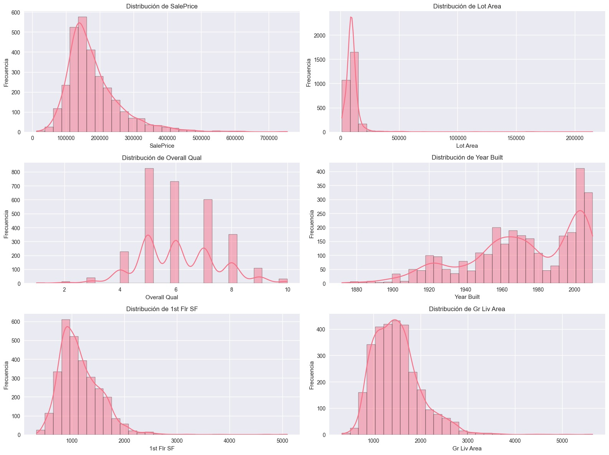
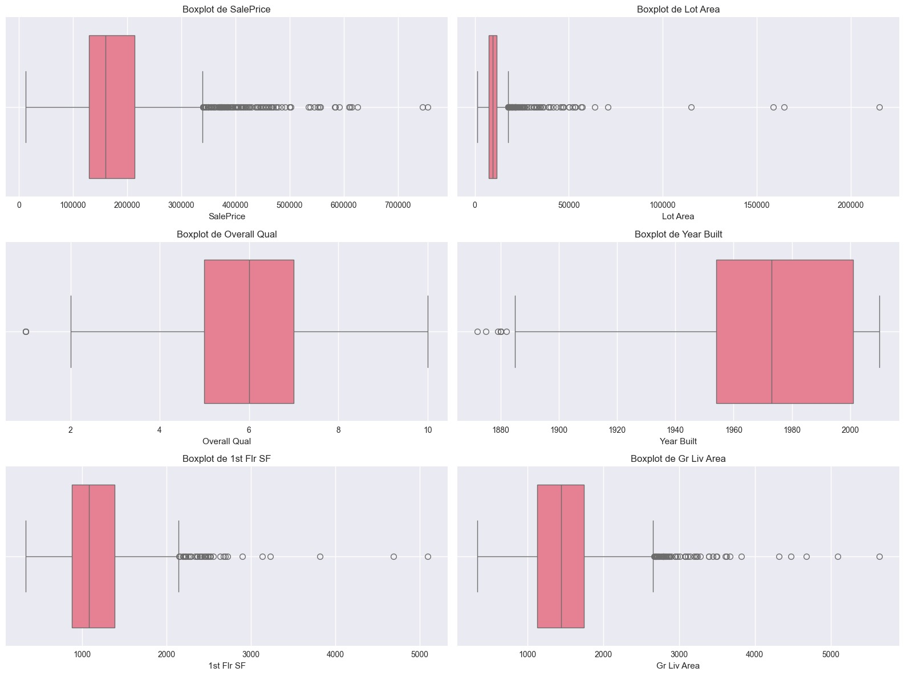
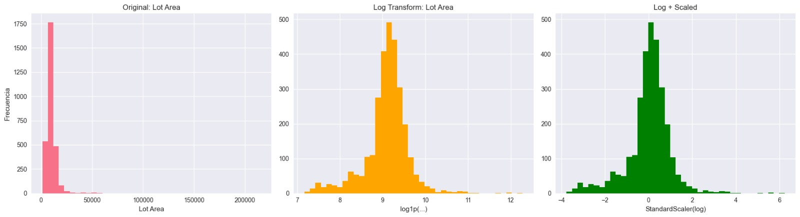
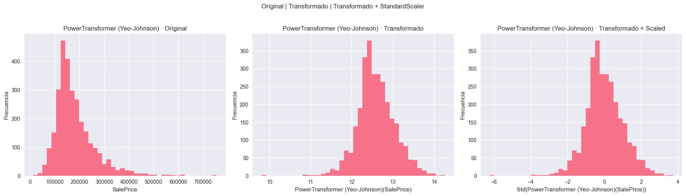
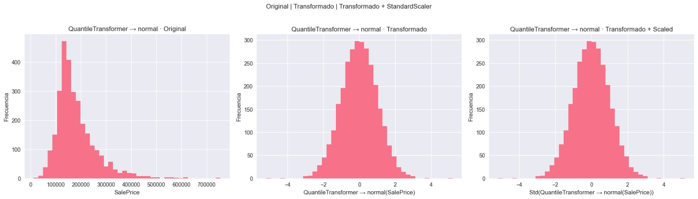
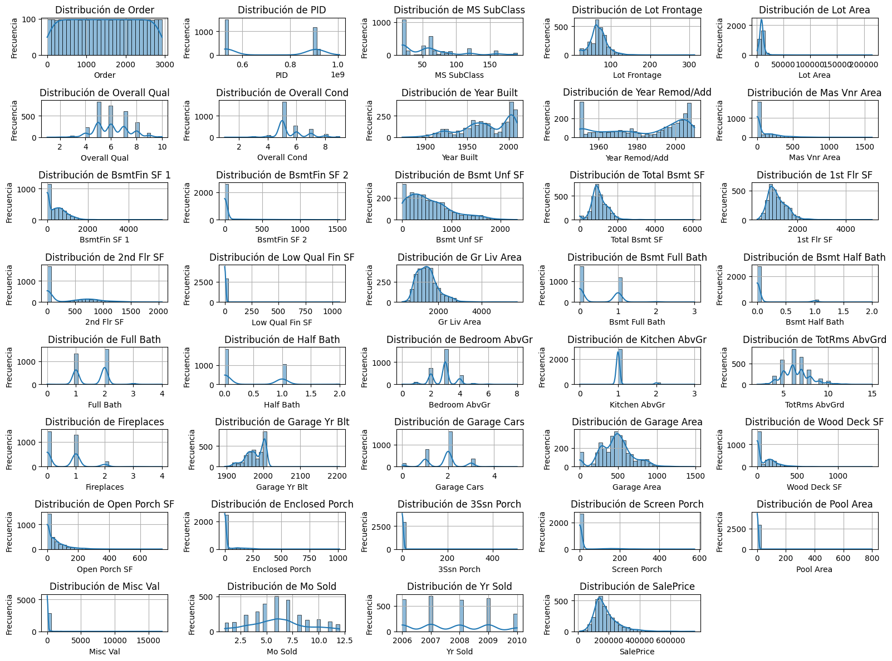
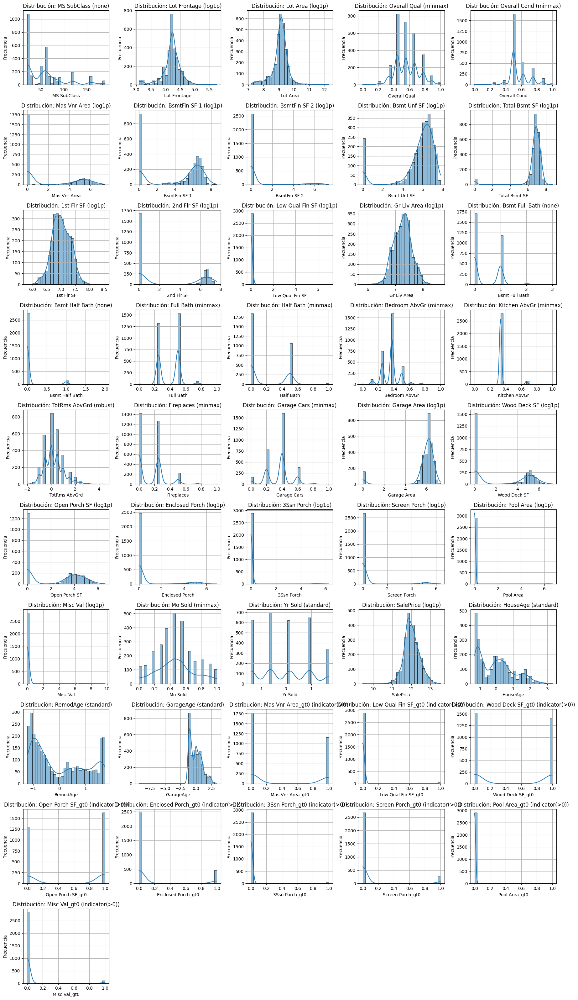
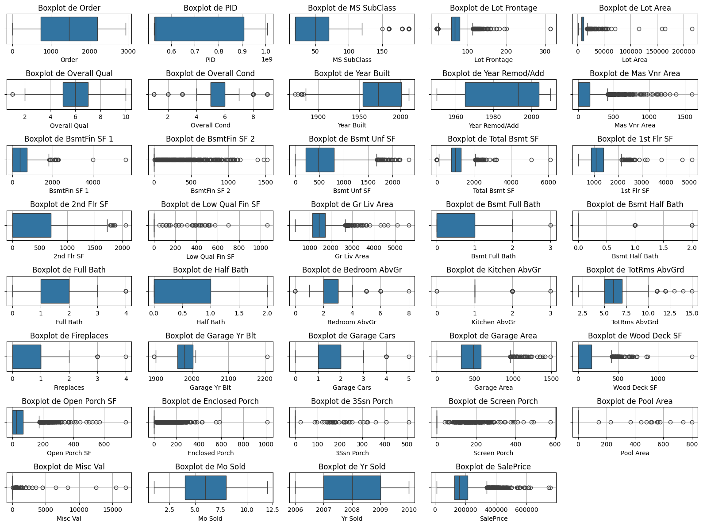
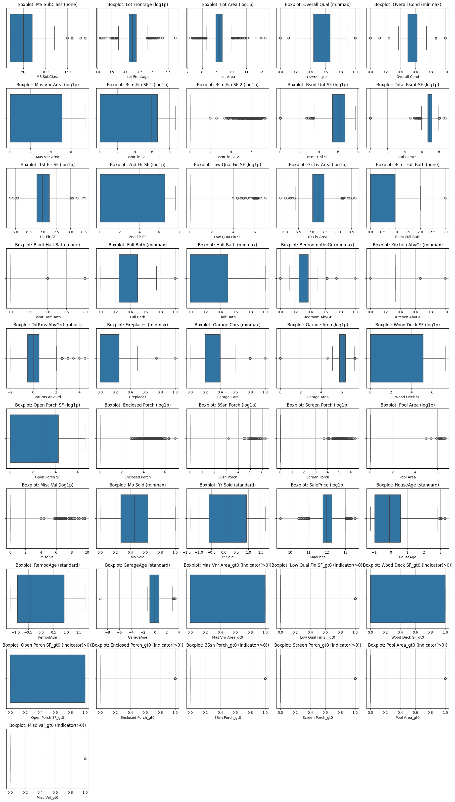

# Transformando datos inmobiliarios: pipeline anti-leakage para predicciones justas
{{ reading_time() }}
---
- **Autores**: Joaquín Batista, Milagros Cancela, Valentín Rodríguez, Alexia Aurrecoechea, Nahuel López (G1)
- **Fecha**: Agosto 2025
- **Unidad Temática**: UT2 - Calidad & Ética
- **Tipo**: Práctica Guiada
- **Entorno**: Python + Pandas + Scikit-learn + Seaborn
- **Dataset**: Ames Housing Dataset (2930 registros, 82 variables)

---

## 📋 Descripción General

Esta práctica se enfoca en uno de los aspectos más críticos del preprocessing en Machine Learning: **Feature Scaling** y la prevención de **Data Leakage**. A través de una exploración práctica con el dataset Ames Housing, investigamos diferentes técnicas de escalado, transformaciones avanzadas, y la implementación de pipelines robustos.

## 🎯 Objetivos Principales

- **Identificar features** del dataset Ames que requieren escalado y entender por qué
- **Experimentar** con MinMaxScaler, StandardScaler y RobustScaler en datos reales
- **Descubrir el impacto** del escalado en diferentes algoritmos de ML
- **Comparar pipelines** con y sin data leakage para evidenciar las diferencias
- **Implementar transformadores avanzados** y evaluar su efectividad

## 🔧 Tecnologías y Herramientas

- **Python** con bibliotecas especializadas:
  - `scikit-learn`: Preprocessing, pipelines, y validación cruzada
  - `pandas` y `numpy`: Manipulación y análisis de datos
  - `matplotlib` y `seaborn`: Visualización de distribuciones y transformaciones
  - `scipy.stats`: Análisis estadístico de asimetría

## 📊 Dataset y Metodología

**Dataset:** Ames Housing (continuación de prácticas anteriores)

- **Dimensiones:** 2,930 registros × 82 columnas

- **Variables numéricas:** 39 columnas con escalas muy diferentes

- **Target:** SalePrice (predicción de precios de casas)


**Acceso al notebook completo:** [Práctica 6 - Feature Scaling & Anti-Leakage Pipeline](../assets/Practica_6_Feature_Scaling_Anti-Leakage_Pipeline.ipynb)


### Análisis de Algunas Escalas Problemáticas

| Variable | Rango (min–max) | Ratio | ¿Problemática? |
|----------|-----------------|-------|----------------|
| **Lot Area** | 1,300 – 215,245 | 165.57 | ✅ Muy sesgada, outliers extremos |
| **SalePrice** | 12,789 – 755,000 | 59.04 | ✅ Rango amplio, afecta distancias |
| **Gr Liv Area** | 334 – 5,642 | 16.89 | ⚠️ Moderadamente problemática |
| **Overall Qual** | 1 – 10 | 10.00 | ❌ Escala controlada |

## 🧪 Experimentos Realizados

### 1. Comparación de Scalers Tradicionales

**StandardScaler vs MinMaxScaler vs RobustScaler**

- Análisis de impacto en detección de outliers

- Evaluación con diferentes algoritmos (KNN, SVM, Linear Regression)

- **Resultado:** StandardScaler mostró mejor consistencia para modelos lineales


### 2. Transformaciones Avanzadas

#### PowerTransformer (Yeo-Johnson)
- **Objetivo:** Reducir asimetría y estabilizar varianza
- **Resultado en SalePrice:** Skew 1.74 → 0.002, Outliers IQR 137 → 59
- **Conclusión:** Excelente para variables con fuerte sesgo

#### QuantileTransformer
- **Objetivo:** Mapear a distribución normal por cuantiles
- **Ventaja:** Muy robusto a outliers extremos
- **Limitación:** Puede "aplastar" extremos con pocos datos

#### Log Transform (log1p seguro)
- **Aplicado a:** Lot Area (skew = 12.814)
- **Resultado:** Skew 12.814 → -0.498
- **Implementación:** Manejo seguro de valores ≤ 0 con shift automático

### 3. Orden de Operaciones: Outliers vs Escalado

**Hallazgo clave:** El escalado modifica la detección de outliers

- **Antes del escalado:** IQR detecta 137 outliers

- **Después del escalado:** IQR detecta 107 outliers

- **Recomendación:** Tratar outliers antes del escalado


## ⚠️ Data Leakage: El Experimento Crítico

### Comparación de 3 Métodos

| Método | RMSE | Descripción |
|--------|------|-------------|
| **Con Leakage** | 32,185 | Escalar todo → Split (INCORRECTO) |
| **Sin Leakage Manual** | 32,287 | Split → Escalar (CORRECTO) |
| **Pipeline + CV** | 30,651 | Anti-leakage automático (ÓPTIMO) |

**Impacto del Leakage:** ΔRMSE ≈ -1,534 (mejora significativa con pipeline)

### ¿Por qué Pipeline es Superior?

```python
# Pipeline Anti-Leakage
pipeline = Pipeline([
    ('scaler', StandardScaler()),
    ('model', KNeighborsRegressor())
])

# En cada fold de CV:
# 1. Scaler se ajusta SOLO con datos de training
# 2. Se evalúa en datos completamente no vistos
# 3. Evita fuga sutil de información estadística
```

## 🏆 Pipeline Recomendado Final

```python
mi_mejor_pipeline = Pipeline([
    ('preprocessor', FunctionTransformer(func=safe_log1p)),  # Para variables sesgadas
    ('scaler', StandardScaler()),                            # Escalado estándar
    ('model', LinearRegression())                            # Modelo baseline
])
```

**Validación:** R² = 0.776 ± 0.033 (5-fold CV) - Estable y robusto

## 📊 Análisis Visual de Transformaciones

### Distribuciones y Outliers

*Distribuciones de variables clave: SalePrice y Lot Area muestran fuerte asimetría, mientras Overall Qual es aproximadamente normal.*


*Boxplots revelan outliers extremos en precios y áreas, confirmando la necesidad de transformaciones.*

### Efectividad de Transformadores


*Log transform en Lot Area: reduce skew de 12.8 a -0.5, normalizando la distribución.*


*PowerTransformer (Yeo-Johnson): transforma SalePrice a distribución casi perfectamente normal (skew ≈ 0.002).*


*QuantileTransformer: fuerza normalidad perfecta mapeando cuantiles empíricos a distribución normal.*

## 📈 Resultados y Conclusiones

### Principales Hallazgos

1. **StandardScaler** fue el más consistente para el dataset Ames Housing
2. **PowerTransformer (Yeo-Johnson)** superó significativamente a scalers básicos en variables sesgadas
3. **Log transform** es altamente efectivo para variables como precios y áreas
4. **Data leakage** tiene impacto medible y significativo en el rendimiento
5. **Pipeline** es esencial para validación honesta y deployment robusto

### Recomendaciones Prácticas

- **Para variables sesgadas:** Aplicar log transform antes del escalado
- **Para outliers:** Detectar y tratar antes de cualquier transformación
- **Para validación:** Usar siempre Pipeline con cross-validation
- **Para producción:** Nunca aplicar transformaciones antes del split

## 🔍 Reflexiones Técnicas

**¿Cuándo usar cada transformador?**
- **StandardScaler:** Modelos lineales, datos aproximadamente normales

- **RobustScaler:** Presencia moderada de outliers

- **PowerTransformer:** Fuerte asimetría, necesidad de normalidad

- **QuantileTransformer:** Distribuciones multimodales o colas extremas


**Orden óptimo de operaciones:**
1. Detección/tratamiento de outliers

2. Transformaciones de forma (log, Yeo-Johnson)

3. Escalado (Standard, MinMax, Robust)

4. Validación con Pipeline


## 🎓 Aprendizajes Clave

Esta práctica consolidó conceptos fundamentales sobre:
- La criticidad del **orden de operaciones** en preprocessing

- El impacto real del **data leakage** en métricas de evaluación

- La superioridad de **transformadores avanzados** para datos no ideales

- La importancia de **Pipeline** para workflows reproducibles y robustos

## 🎁 Bonus

En esta sección adicional, exploramos técnicas avanzadas de feature engineering y análisis comparativo más profundo de las transformaciones. Se implementan visualizaciones detalladas que muestran el impacto específico de cada transformador en las distribuciones de datos, análisis de correlaciones antes y después de las transformaciones, y comparaciones lado a lado de múltiples técnicas de escalado.

**Descarga el notebook completo del bonus:** [Práctica 6 Bonus - Análisis Avanzado](../assets/Practica6Bonus.ipynb)

### Análisis Exhaustivo de Distribuciones: Se analizan todos los atributos.


*Histogramas de todas las variables numéricas del dataset Ames Housing mostrando la diversidad de formas y escalas presentes en los datos originales.*

### Distribuciones Normalizadas por Variable


*Análisis detallado de las distribuciones de variables clave, destacando patrones de asimetría, multimodalidad y presencia de valores extremos.*

### Análisis Completo de Outliers por Boxplots


*Visualización completa mediante boxplots de todas las variables numéricas, revelando la extensión y naturaleza de los valores atípicos en cada feature.*

### Comparación Detallada de Boxplots


*Análisis individualizado de boxplots para cada variable, permitiendo identificar patrones específicos de outliers y rangos intercuartílicos.*


### 📑 Reporte de Transformaciones Numéricas

| Variable                | Transformación | Notas / Justificación |
|--------------------------|----------------|------------------------|
| **Order**               | Drop           | ID / índice, sin valor analítico |
| **PID**                 | Drop           | Identificador único |
| **MS SubClass**         | none / categ.  | Mejor tratar como categórica (clase de vivienda) |
| **Lot Frontage**        | log1p          | Positivos, cola larga, valores atípicos |
| **Lot Area**            | log1p          | Distribución muy sesgada a derecha |
| **Overall Qual**        | minmax         | Escala ordinal 1–10 |
| **Overall Cond**        | minmax         | Escala ordinal 1–9 |
| **Year Built**          | → HouseAge std | Convertido a edad (Yr Sold - Built), escalado estándar |
| **Year Remod/Add**      | → RemodAge std | Convertido a edad de remodelación, escalado estándar |
| **BsmtFin SF 1**        | log1p          | Sesgo fuerte, valores extremos |
| **BsmtFin SF 2**        | log1p          | Muchos ceros, sesgo a derecha |
| **Bsmt Unf SF**         | log1p          | Sesgo fuerte, gran dispersión |
| **Total Bsmt SF**       | log1p          | Colas largas, magnitudes muy grandes |
| **1st Flr SF**          | log1p          | Sesgo fuerte, outliers |
| **2nd Flr SF**          | log1p          | Sesgo fuerte, muchos ceros |
| **Low Qual Fin SF**     | log1p + gt0    | Cero-inflada, indicador + transformación |
| **Gr Liv Area**         | log1p          | Muy sesgada, valores grandes |
| **Bsmt Full Bath**      | none           | Valores pequeños enteros, discreta |
| **Bsmt Half Bath**      | none           | Muy pocos valores distintos, discreta |
| **Full Bath**           | minmax         | Ordinal con pocos valores enteros |
| **Half Bath**           | minmax         | Ordinal con pocos valores enteros |
| **Bedroom AbvGr**       | minmax         | Ordinal discreta |
| **Kitchen AbvGr**       | minmax         | Muy pocos valores distintos (casi constante) |
| **TotRms AbvGrd**       | robust         | Simétrica con outliers, robust scaler adecuado |
| **Fireplaces**          | minmax         | Discreta con rango pequeño |
| **Garage Yr Blt**       | → GarageAge std| Convertido a edad, estandarizado |
| **Garage Cars**         | minmax         | Discreta, 0–4 autos |
| **Garage Area**         | log1p          | Sesgada a derecha |
| **Wood Deck SF**        | log1p + gt0    | Cero-inflada |
| **Open Porch SF**       | log1p + gt0    | Cero-inflada |
| **Enclosed Porch**      | log1p + gt0    | Cero-inflada |
| **3Ssn Porch**          | log1p + gt0    | Cero-inflada |
| **Screen Porch**        | log1p + gt0    | Cero-inflada |
| **Pool Area**           | log1p + gt0    | Cero-inflada |
| **Misc Val**            | log1p + gt0    | Mayormente ceros, pocos valores grandes |
| **Mo Sold**             | minmax         | Mes (1–12), ordinal circular |
| **Yr Sold**             | standard       | Año de venta, centrado y escalado |
| **SalePrice (target)**  | log1p          | Muy sesgado, transformación clásica en Kaggle |

---

📌 **Indicadores `*_gt0`**: columnas adicionales que marcan la **presencia (>0)** en variables cero-infladas, para complementar el valor transformado.  

📌 **Años**: `Year Built`, `Year Remod/Add`, `Garage Yr Blt` se convirtieron en **edades relativas a `Yr Sold`**, lo que tiene más sentido analítico.  

---