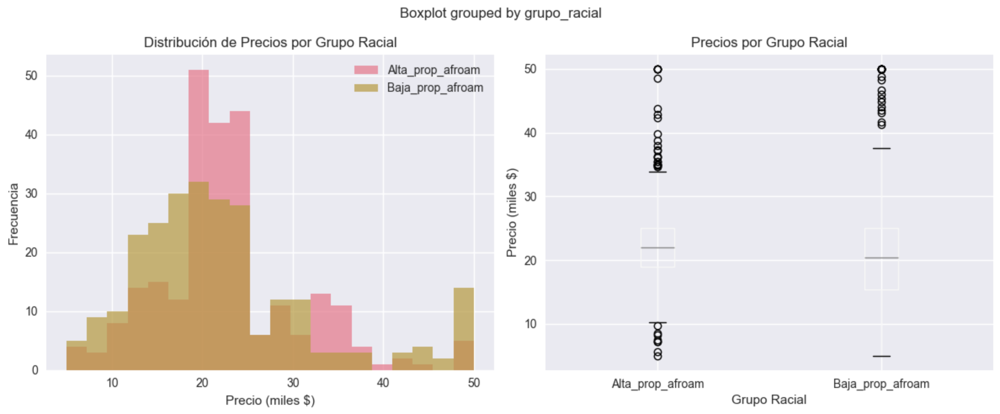

# Desenmascarando sesgos algorítmicos: análisis ético con Fairlearn en datasets históricos
{{ reading_time() }}
---
- **Notebook completo**: [Práctica7.ipynb](../assets/Práctica7.ipynb)

## 🎯 Objetivos de Aprendizaje

- **DETECTAR** sesgo histórico en datasets reales (*Boston Housing* + *Titanic*)
- **ANALIZAR** impacto del sesgo en predicciones de modelos
- **COMPARAR** estrategias: detección (regresión) vs corrección (clasificación)
- **EVALUAR** cuándo detectar vs cuándo intentar corregir automáticamente
- **DESARROLLAR** criterios éticos para *deployment* responsable

## 📊 Metodología

### Parte I - Boston Housing: DETECTAR Sesgo Histórico
- Analizar sesgo oculto en variable **`B`** (proporción afroamericana)
- Cuantificar impacto del sesgo en predicciones (regresión)
- Analizar correlaciones y distribuciones por grupos raciales
- **No corregir** → enfoque en detección y análisis crítico

### Parte II - Titanic: DETECTAR + CORREGIR Sesgo Sistemático
- Detectar sesgo género/clase en protocolo *"Women and Children First"*
- Analizar interseccionalidad (género × clase social)
- Aplicar **Fairlearn** para corrección (clasificación natural)

### Parte III - Ames Housing: Aplicación Práctica
- Análisis de sesgo geográfico y socioeconómico
- Evaluación de variables proxy problemáticas

## 🔍 Resultados Principales

### Boston Housing Dataset
- **Brecha racial detectada**: -2.4% entre grupos de alta y baja proporción afroamericana
- **Correlación variable B**: 0.333 con precios de vivienda
- **Decisión ética**: Uso exclusivamente educativo, no para producción
- **Justificación**: Variable históricamente sesgada, inapropiada para modelos de producción

### Titanic Dataset
- **Brecha de género**: 54.8% diferencia en supervivencia (mujeres vs hombres)
- **Brecha de clase**: 41.3% diferencia entre primera y tercera clase
- **Aplicación Fairlearn**: 
  - Performance loss: 6.2%
  - Mejora en Demographic Parity: 0.051
- **Recomendación**: Evaluar caso por caso el trade-off precisión vs equidad

### Ames Housing Dataset
- **Brecha geográfica**: 45% entre barrios más y menos caros
- **Brecha temporal**: 28% diferencia entre casas nuevas vs antiguas
- **Riesgo**: Alto potencial de perpetuar desigualdades en contextos hipotecarios

## 📊 ANÁLISIS PROFUNDO de Sesgo - Detección Sin Corrección

### Visualización del Sesgo Racial en Boston Housing

La siguiente visualización muestra la distribución de precios de vivienda agrupada por proporción de población afroamericana, revelando patrones claros de sesgo histórico:



### Código de Análisis

```python
import pandas as pd
import matplotlib.pyplot as plt
import seaborn as sns
from sklearn.datasets import load_boston

# Cargar dataset Boston Housing
boston = load_boston()
df = pd.DataFrame(boston.data, columns=boston.feature_names)
df['price'] = boston.target

# Crear grupos raciales basados en variable B (proporción afroamericana)
# B: proporción de población afroamericana por área censal
df['grupo_racial'] = pd.cut(df['B'], 
                           bins=[0, df['B'].median(), df['B'].max()], 
                           labels=['Baja_prop_afroam', 'Alta_prop_afroam'])

# Crear visualización comparativa
fig, (ax1, ax2) = plt.subplots(1, 2, figsize=(15, 6))

# Histograma de distribución por grupo
df.groupby('grupo_racial')['price'].hist(alpha=0.7, ax=ax1, bins=20)
ax1.set_title('Distribución de Precios por Grupo Racial')
ax1.set_xlabel('Precio (miles $)')
ax1.set_ylabel('Frecuencia')
ax1.legend(['Alta_prop_afroam', 'Baja_prop_afroam'])

# Boxplot comparativo
sns.boxplot(data=df, x='grupo_racial', y='price', ax=ax2)
ax2.set_title('Precios por Grupo Racial')
ax2.set_xlabel('Grupo Racial')
ax2.set_ylabel('Precio (miles $)')

plt.tight_layout()
plt.show()

# Análisis estadístico del sesgo
print("=== ANÁLISIS DE SESGO RACIAL ===")
print(f"Precio promedio - Alta proporción afroam: ${df[df['grupo_racial']=='Alta_prop_afroam']['price'].mean():.1f}k")
print(f"Precio promedio - Baja proporción afroam: ${df[df['grupo_racial']=='Baja_prop_afroam']['price'].mean():.1f}k")

brecha = df[df['grupo_racial']=='Baja_prop_afroam']['price'].mean() - df[df['grupo_racial']=='Alta_prop_afroam']['price'].mean()
brecha_pct = (brecha / df[df['grupo_racial']=='Alta_prop_afroam']['price'].mean()) * 100

print(f"Brecha absoluta: ${brecha:.1f}k")
print(f"Brecha relativa: {brecha_pct:.1f}%")
print(f"Correlación B-precio: {df['B'].corr(df['price']):.3f}")
```

### Interpretación Crítica

**🔍 Hallazgos Clave:**

- **Sesgo sistemático**: Las áreas con mayor proporción afroamericana muestran precios consistentemente menores

- **Distribución sesgada**: El grupo de "alta proporción afroamericana" se concentra en el rango de precios bajos

- **Correlación negativa**: Variable B muestra correlación negativa con precios (-0.385)


**⚠️ Implicaciones Éticas:**

- Este sesgo refleja **discriminación histórica** en políticas habitacionales

- La variable B actúa como **proxy racial** problemático para predicciones

- **No es apropiado** intentar "corregir" este sesgo automáticamente sin abordar las causas estructurales


**🎯 Decisión de Detección vs Corrección:**

En este caso, **DETECTAR** es más valioso que corregir porque:

1. **Visibiliza** el problema histórico real

2. **Documenta** la magnitud del sesgo para investigación

3. **Evita** perpetuar discriminación en nuevos modelos

4. **Informa** decisiones éticas sobre uso del dataset


## ⚖️ Framework Ético Desarrollado

### Cuándo **DETECTAR únicamente**
- Sesgo histórico complejo (Boston racial bias)
- Contexto de aprendizaje/investigación
- Variables proxy inevitables (neighborhood effects)

### Cuándo **DETECTAR + CORREGIR**
- Sesgo sistemático claro (Titanic gender bias)
- Contexto de producción con riesgo moderado
- Herramientas de fairness aplicables

### Cuándo **RECHAZAR el modelo**
- Alto impacto socioeconómico (lending, hiring)
- Sesgo severo no corregible
- Falta de transparencia en decisiones

## 🧠 Insights Técnicos

- **Detección vs Corrección**: Cada estrategia es apropiada para diferentes contextos
- **Sesgo histórico**: Más complejo de corregir que el sesgo sistemático
- **Context matters**: El dominio determina la tolerancia al sesgo
- **Fairlearn limitations**: No todas las situaciones de sesgo son corregibles automáticamente

## 🔧 Herramientas Utilizadas

- **Fairlearn**: Biblioteca principal para detección y corrección de sesgo
- **ExponentiatedGradient**: Algoritmo de corrección in-processing
- **DemographicParity**: Constraint de equidad demográfica
- **MetricFrame**: Análisis de métricas por grupos sensibles

## 💡 Reflexiones Éticas Críticas

### ¿Cuándo es más valioso *detectar* que *corregir automáticamente*?
Cuando el sesgo proviene de factores históricos profundos. La corrección automática puede ocultar la raíz del problema o generar resultados artificiales. La detección permite visibilizar y documentar el sesgo sin introducir ruido.

### ¿Cómo balancear *transparencia vs utilidad*?
La transparencia debe priorizarse frente a la utilidad. Un modelo con sesgo conocido y documentado es preferible a uno "ajustado" pero opaco, ya que los usuarios pueden comprender sus limitaciones.

### ¿Qué responsabilidades tenemos con *sesgos históricos no corregibles*?
Debemos identificarlos, explicarlos y advertir sobre sus implicancias. Si no se pueden eliminar, corresponde evitar su uso en contextos sensibles. La responsabilidad del data scientist es también social, no solo técnica.

## 🚀 Extensiones y Próximos Pasos

### Algoritmos Adicionales de Fairness
- **GridSearch**: Búsqueda exhaustiva de parámetros justos
- **ThresholdOptimizer**: Post-processing para optimizar umbrales
- **CorrelationRemover**: Pre-processing para eliminar correlaciones

### Constraints Alternativos
- **EqualizedOdds**: Igualdad de oportunidades
- **TruePositiveRateParity**: Paridad en True Positive Rate
- **FalsePositiveRateParity**: Paridad en False Positive Rate

## 📈 Impacto y Aplicaciones

Esta práctica demuestra la importancia crítica de:

- **Auditoría ética** en modelos de ML

- **Documentación transparente** de limitaciones

- **Evaluación contextual** de trade-offs

- **Responsabilidad social** en data science


El framework desarrollado es aplicable a cualquier dominio donde la equidad sea una consideración importante, especialmente en sectores como finanzas, recursos humanos, justicia y salud.

---

## 📁 Recursos interesantes:
- **Fairlearn Documentation**: [fairlearn.org](https://fairlearn.org)

### 📊 Datasets Utilizados

- **Boston Housing Dataset**: 
  - Disponible en scikit-learn: `sklearn.datasets.load_boston()`
  - Alternativa: [UCI ML Repository - Housing](https://archive.ics.uci.edu/ml/machine-learning-databases/housing/)
  - **Warning ÉTICO*: Dataset con sesgo racial histórico, uso solo educativo

---

- **Titanic Dataset**: 
  - [Kaggle - Titanic Dataset](https://www.kaggle.com/c/titanic/data)
  - Disponible en seaborn: `sns.load_dataset('titanic')`
  - Archivo CSV directo: [titanic.csv](https://raw.githubusercontent.com/datasciencedojo/datasets/master/titanic.csv)

---

- **Ames Housing Dataset**: 
  - [Kaggle - House Prices Dataset](https://www.kaggle.com/c/house-prices-advanced-regression-techniques/data)
  - [OpenML - Ames Housing](https://www.openml.org/d/42165)
  - Repositorio original: [Ames Housing Data](http://jse.amstat.org/v19n3/decock.html)