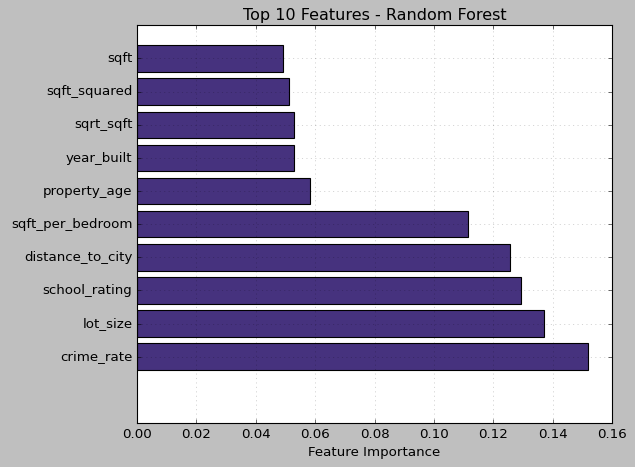

# Análisis de importancia de features: explorando distribuciones y selección de variables

<a href="../../assets/Practica8.ipynb" download="Practica8.ipynb">

📓 **Descargar Jupyter Notebook Completo**

</a>

{{ reading_time() }}
---
- **Autores**: Joaquín Batista, Milagros Cancela, Valentín Rodríguez, Alexia Aurrecoechea, Nahuel López (G1)
- **Fecha**: Octubre 2025
- **Unidad Temática**: UT3: Feature Engineering
- **Tipo**: Práctica Guiada
- **Entorno**: Python + Pandas + Scikit-learn + Matplotlib + Seaborn + Numpy
- **Dataset**: Dataset inmobiliario con análisis de importancia de variables

---

---

## 📋 Descripción General

Este proyecto se centra en el **análisis de importancia de features** utilizando múltiples metodologías para identificar las variables más relevantes en un dataset inmobiliario. A través de técnicas como Mutual Information y Random Forest, exploramos las distribuciones de las variables y su impacto en modelos predictivos.

## 🎯 Objetivos Principales

- **Evaluar importancia de features** usando diferentes metodologías (Mutual Information vs Random Forest)
- **Analizar distribuciones** de variables transformadas y derivadas
- **Identificar patrones** en las relaciones entre variables
- **Comparar efectividad** de diferentes técnicas de selección de variables
- **Visualizar insights** sobre el dataset inmobiliario

## 🔧 Tecnologías y Herramientas

- **Python** con bibliotecas especializadas:
  - `scikit-learn`: Feature selection, Mutual Information, Random Forest
  - `pandas` y `numpy`: Manipulación y análisis de datos
  - `matplotlib` y `seaborn`: Visualización avanzada
  - `scipy.stats`: Análisis estadístico

## 📊 Dataset y Metodología

**Dataset:** Dataset inmobiliario personalizado

- **Dimensiones:** Dataset con múltiples variables inmobiliarias
- **Variables analizadas:** 10+ features incluyendo transformaciones y variables derivadas
- **Target:** Variable objetivo para predicción de precios

### Variables Principales Analizadas

| Variable | Tipo | Descripción |
|----------|------|-------------|
| `bedrooms` | Original | Número de dormitorios |
| `sqft` | Original | Pies cuadrados |
| `sqrt_sqft` | Transformada | Raíz cuadrada de pies cuadrados |
| `sqft_squared` | Transformada | Pies cuadrados al cuadrado |
| `sqft_per_bedroom` | Derivada | Pies cuadrados por dormitorio |
| `year_built` | Original | Año de construcción |
| `bathrooms` | Original | Número de baños |
| `garage_spaces` | Original | Espacios de garaje |
| `lot_size` | Original | Tamaño del lote |
| `distance_to_city` | Original | Distancia a la ciudad |

## 🔍 Análisis de Importancia de Features

### Comparación Mutual Information vs Random Forest

#### Top 10 Features - Mutual Information


**Hallazgos clave:**

- **`bedrooms`** domina con ~0.018 de información mutua
- **Variables transformadas** (`sqrt_sqft`, `sqft_squared`) muestran importancia moderada
- **Variables espaciales** (`distance_to_city`, `lot_size`) presentan baja importancia
- **`year_built`** y **`sqft_per_bedroom`** muestran valores intermedios

#### Top 10 Features - Random Forest


**Insights comparativos:**

- **`crime_rate`** emerge como la variable más importante (0.15)
- **`lot_size`** y **`school_rating`** muestran alta relevancia
- **`distance_to_city`** adquiere mayor importancia que en Mutual Information
- **Variables transformadas** mantienen importancia consistente

### Análisis de Distribuciones

#### Distribuciones de Variables Transformadas


**Características observadas:**

- **`price_per_sqft`**: Distribución sesgada a la derecha (pico en 1200-1800)
- **`sqft_per_bedroom`**: Distribución altamente sesgada (pico en 20-50)
- **`property_age`**: Distribución relativamente uniforme
- **`log_price`**: Distribución aproximadamente normal (transformación exitosa)
- **`sqrt_sqft`**: Distribución normal con pico en 10.5-12.5
- **`sqft_squared`**: Distribución sesgada con cola larga

#### Distribuciones de Variables Derivadas


**Variables derivadas analizadas:**

- **`space_efficiency`**: Distribución muy sesgada (pico en 0.01-0.02)
- **`crowded_property`**: Distribución similar a space_efficiency
- **`location_score`**: Distribución aproximadamente normal (pico en 0.5-0.6)

## 📈 Insights y Conclusiones

### 1. **Divergencia en Metodologías**
- **Mutual Information** prioriza variables estructurales (`bedrooms`, transformaciones de `sqft`)
- **Random Forest** enfatiza variables contextuales (`crime_rate`, `school_rating`, `lot_size`)

### 2. **Efectividad de Transformaciones**
- **Transformaciones logarítmicas** (`log_price`) logran distribuciones normales
- **Transformaciones cuadráticas** (`sqft_squared`) pueden introducir sesgo
- **Variables derivadas** muestran distribuciones interesantes pero sesgadas

### 3. **Variables Clave Identificadas**
- **Estructurales**: `bedrooms`, `sqft` (y sus transformaciones)
- **Contextuales**: `crime_rate`, `school_rating`, `lot_size`
- **Derivadas**: `sqft_per_bedroom`, `space_efficiency`

### 4. **Recomendaciones**
- **Combinar metodologías** para selección robusta de features
- **Aplicar transformaciones** para normalizar distribuciones sesgadas
- **Considerar variables derivadas** como features adicionales
- **Validar importancia** con diferentes algoritmos

## 🛠️ Implementación Técnica

### Pipeline de Análisis

```python
# Análisis de Importancia con Mutual Information
from sklearn.feature_selection import mutual_info_regression

mi_scores = mutual_info_regression(X, y)
feature_importance_mi = pd.DataFrame({
    'feature': feature_names,
    'importance': mi_scores
}).sort_values('importance', ascending=False)

# Análisis con Random Forest
from sklearn.ensemble import RandomForestRegressor

rf = RandomForestRegressor(n_estimators=100, random_state=42)
rf.fit(X, y)
feature_importance_rf = pd.DataFrame({
    'feature': feature_names,
    'importance': rf.feature_importances_
}).sort_values('importance', ascending=False)
```

### Visualizaciones Implementadas

- **Gráficos de barras horizontales** para comparar importancia
- **Histogramas** para análisis de distribuciones
- **Subplots** para visualización comparativa
- **Paletas de colores** consistentes para mejor interpretación

## 📚 Aprendizajes Adquiridos

1. **Metodologías Complementarias**: Mutual Information y Random Forest ofrecen perspectivas diferentes pero valiosas
2. **Importancia de Transformaciones**: Las transformaciones pueden cambiar significativamente la importancia relativa
3. **Análisis de Distribuciones**: Las distribuciones sesgadas requieren atención especial en el preprocessing
4. **Variables Derivadas**: Pueden capturar relaciones complejas no evidentes en variables originales
5. **Validación Cruzada**: Es crucial validar la importancia con diferentes metodologías

## 🤔 Preguntas para reflexionar

### **1. ¿Cuáles fueron las features más importantes según tu análisis?**

Las variables más relevantes fueron **`price_per_sqft`** y **`property_age`**, ya que mostraron una relación clara con el precio de venta.  
El **precio por unidad de superficie** realza las diferencias de valor entre propiedades, mientras que la **antigüedad** reflejó la bajada de precio esperada a lo largo del tiempo.

---

### **2. ¿Qué sorpresas encontraste en los datos?**

En los datos reales, algunas propiedades presentaban valores que no seguían las tendencias esperadas.

---

### **3. ¿Cómo podrías mejorar el proceso de feature engineering?**

Podría mejorarse incorporando **transformaciones no lineales** (logarítmicas o polinomiales), **normalización de escalas**, y la creación de **variables interactivas** que combinen aspectos estructurales y de ubicación.

---

### **4. ¿Qué otras técnicas de feature engineering conoces?**

- **Codificación categórica** (One-Hot, Target Encoding, Ordinal)
- **Escalado y normalización** (MinMaxScaler, StandardScaler)
- **Transformaciones matemáticas** (log, raíz cuadrada, Box-Cox)
- **Binning y discretización** de variables continuas
- **Generación automática de interacciones** con *PolynomialFeatures*
- **Selección de variables** mediante *Lasso*, *Random Forest*, o *Recursive Feature Elimination (RFE)*

---

### **5. ¿Qué diferencias notaste entre datos sintéticos y reales?**

Los datos sintéticos presentan relaciones **más limpias, predecibles y controladas**, lo que facilita detectar patrones.  
En cambio, los datos reales incluyen **ruido, valores atípicos y correlaciones espurias**, lo que hace el análisis más desafiante pero también más representativo del comportamiento real del mercado.  
Además, los datos reales requieren mayor atención en limpieza, imputación y validación de supuestos.

## 🔗 Recursos y Referencias

- **Scikit-learn Documentation**: Feature Selection
- **Seaborn Gallery**: Statistical Data Visualization
- **Pandas Documentation**: Data Manipulation
- **Matplotlib Tutorials**: Advanced Plotting

---

*Este proyecto demuestra la importancia de utilizar múltiples metodologías para el análisis de importancia de features, proporcionando una visión más completa y robusta del dataset.*
