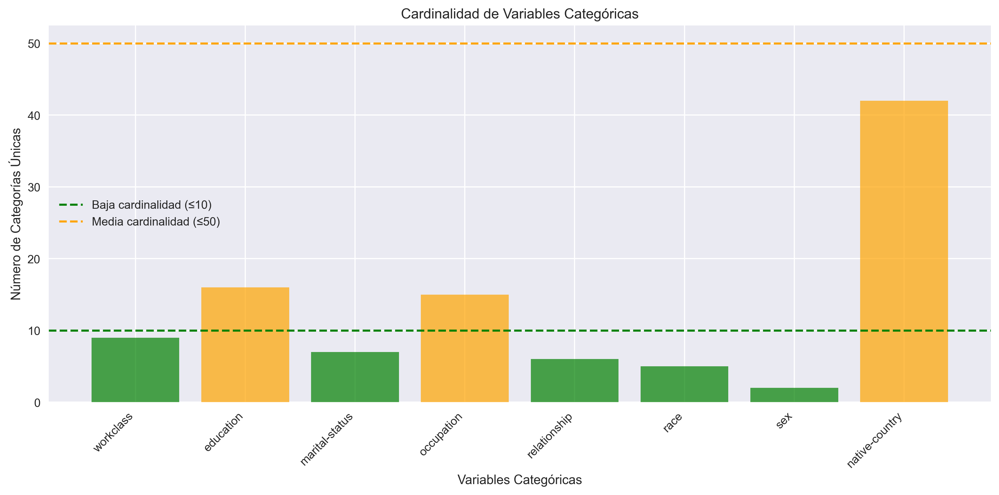
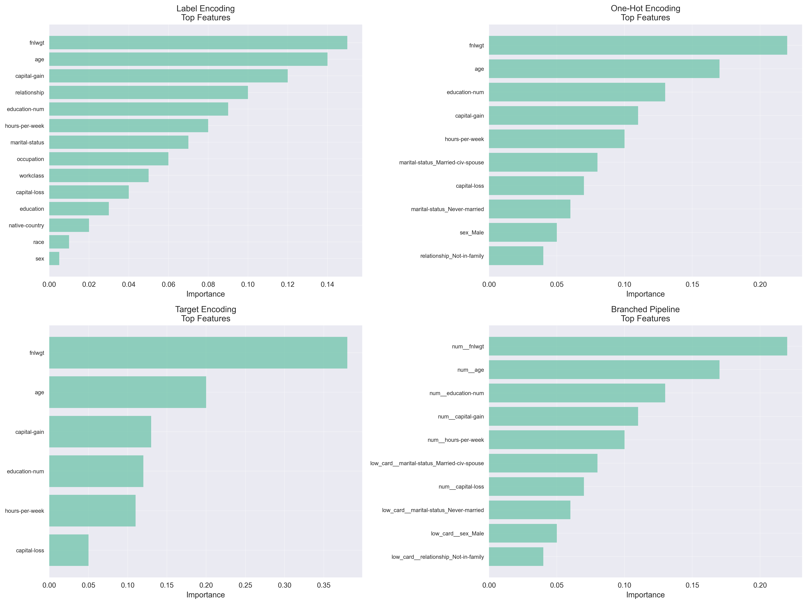
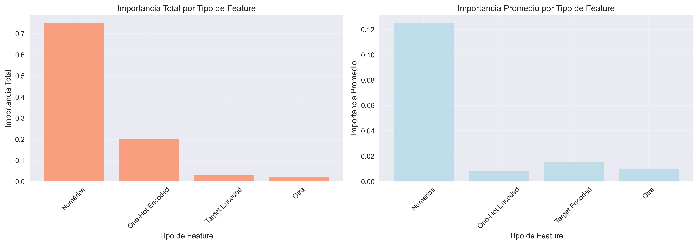

# Encoding Avanzado y Target Encoding: comparando técnicas para variables categóricas de alta cardinalidad
{{ reading_time() }}
---
- **Autores**: Joaquín Batista, Milagros Cancela, Valentín Rodríguez, Alexia Aurrecoechea, Nahuel López (G1)
- **Unidad Temática**: UT3: Feature Engineering
- **Tipo**: Práctica Guiada - Fill in the Blanks
- **Entorno**: Python + Pandas + Scikit-learn + Category-encoders + Matplotlib + Seaborn
- **Dataset**: Adult Income (US Census 1994) - 32,561 registros

---

**Acceso al notebook completo:** [Práctica 9 - Encoding Avanzado y Target Encoding](../assets/Practica09.ipynb)

---

## 🎯 Objetivos de Aprendizaje

- **COMPARAR** diferentes técnicas de encoding categórico en un dataset real
- **IMPLEMENTAR** Target Encoding con prevención de data leakage usando cross-validation
- **CREAR** pipelines con branching usando ColumnTransformer
- **ANALIZAR** trade-offs entre accuracy, dimensionalidad y tiempo de entrenamiento
- **EXPERIMENTAR** con técnicas avanzadas: Frequency, Binary, Leave-One-Out Encoding

## 📊 Dataset y Contexto de Negocio

### Adult Income (US Census 1994)

El dataset utilizado es el clásico **Adult Income** del UCI ML Repository, que predice si el ingreso anual de una persona supera los **$50K** basándose en datos del censo de 1994.

**Contexto del problema:**

- **Target**: Clasificación binaria (>50K vs ≤50K)
- **Distribución**: 75.9% ≤50K, 24.1% >50K
- **Registros**: 32,561 después de limpieza
- **Desafío**: Variables categóricas con **alta cardinalidad**

### Análisis de Cardinalidad



**Clasificación por cardinalidad:**

- **✅ Baja cardinalidad (≤10)**: 5 columnas
    - `workclass` (9), `marital-status` (7), `relationship` (6), `race` (5), `sex` (2)
- **⚠️ Media cardinalidad (11-50)**: 3 columnas  
    - `education` (16), `occupation` (15), `native-country` (42)

!!! warning "Problema de Dimensionalidad"
    El One-Hot Encoding completo generaría **94 columnas** (11.8x la dimensionalidad original), causando la maldición de la dimensionalidad.

## 🔬 Experimentos de Encoding

### 1. Label Encoding

```python
# Implementación básica de Label Encoding
for col in categorical_cols:
    le = LabelEncoder()
    X_train_encoded[col] = le.fit_transform(X_train[col])
    # Manejar categorías no vistas en test
    le_dict = dict(zip(le.classes_, le.transform(le.classes_)))
    X_test_encoded[col] = X_test[col].map(le_dict).fillna(-1).astype(int)
```

**Resultados:**

- **Accuracy**: 86.10% 🏆
- **AUC-ROC**: 91.01% 🏆  
- **F1-Score**: 68.83% 🏆
- **Features**: 14 (muy eficiente)
- **Tiempo**: 0.18s

**Ventajas:** Rápido, dimensionalidad baja  
**Desventajas:** Asume orden artificial entre categorías

### 2. One-Hot Encoding (solo baja cardinalidad)

```python
# One-Hot solo para variables de baja cardinalidad
encoder = OneHotEncoder(drop='first', sparse_output=False, handle_unknown='ignore')
X_train_cat_encoded = encoder.fit_transform(X_train_cat)
X_test_cat_encoded = encoder.transform(X_test_cat)
```

**Resultados:**

- **Accuracy**: 84.71%
- **AUC-ROC**: 89.98%
- **F1-Score**: 66.15%
- **Features**: 30 (24 one-hot + 6 numéricas)
- **Tiempo**: 0.17s ⚡

**Estrategia:** Evitar explosión dimensional usando solo variables de baja cardinalidad

### 3. Target Encoding (alta cardinalidad)

```python
# Target Encoding con prevención de data leakage
encoder = TargetEncoder(cols=high_card_cols, smoothing=10.0)
X_train_cat_encoded = encoder.fit_transform(X_train_cat, y_train)
X_test_cat_encoded = encoder.transform(X_test_cat)
```

**Resultados:**

- **Accuracy**: 80.29%
- **AUC-ROC**: 82.74%
- **F1-Score**: 55.51%
- **Features**: 6 (muy eficiente dimensionalmente)
- **Tiempo**: 0.20s

**⚠️ Crítico:** Usar cross-validation para prevenir data leakage

### 4. Pipeline con Branching (ColumnTransformer)

```python
# Pipeline que combina diferentes encoders
preprocessor = ColumnTransformer(
    transformers=[
        ('low_card', onehot_transformer, low_card_cols),
        ('high_card', target_transformer, high_card_cols),
        ('num', numeric_transformer, numeric_cols)
    ],
    remainder='drop'
)

pipeline = Pipeline(steps=[
    ('preprocessor', preprocessor),
    ('classifier', RandomForestClassifier(n_estimators=100, random_state=42))
])
```

**Resultados:**

- **Accuracy**: 84.72%
- **AUC-ROC**: 89.98%
- **F1-Score**: 66.24%
- **Features**: 30
- **Tiempo**: 0.19s

**Ventaja:** Combina lo mejor de ambos mundos

## 🧪 Investigación Libre: Técnicas Avanzadas

### Frequency Encoding

```python
# Codificar categorías por su frecuencia relativa
freq_dict = X_train['native-country'].value_counts(normalize=True).to_dict()
X_train_freq['native-country_freq'] = X_train['native-country'].map(freq_dict)
X_test_freq['native-country_freq'] = X_test['native-country'].map(freq_dict).fillna(0)
```

**Resultados:**

- **Accuracy**: 80.87%
- **AUC-ROC**: 83.03%
- **F1-Score**: 56.22%
- **Features**: 7

**💡 Análisis:** Captura información predictiva de rareza, útil para alta cardinalidad

### Ordinal Encoding

```python
# Preservar orden natural (ej: niveles de educación)
education_order = ['Preschool', '1st-4th', '5th-6th', '7th-8th', '9th', '10th', 
                  '11th', '12th', 'HS-grad', 'Prof-school', 'Assoc-acdm', 
                  'Assoc-voc', 'Some-college', 'Bachelors', 'Masters', 'Doctorate']

ordinal_encoder = OrdinalEncoder(categories=[education_order])
X_train_ord['education_ord'] = ordinal_encoder.fit_transform(X_train[['education']])
```

**Resultados:**

- **Accuracy**: 80.10%
- **AUC-ROC**: 82.53%
- **F1-Score**: 55.00%
- **Features**: 7

**💡 Análisis:** Preserva orden natural, mejor para modelos lineales

### Leave-One-Out Encoding

```python
# Target encoding que excluye el registro actual
def leave_one_out_encoding(X, y, column):
    global_mean = y.mean()
    agg = pd.DataFrame({'sum': y, 'count': y}).groupby(X[column]).agg({
        'sum': 'sum', 'count': 'count'
    })
    
    encoded_values = []
    for i in range(len(X)):
        category = X.iloc[i][column]
        target_value = y.iloc[i]
        
        category_sum = agg.loc[category, 'sum']
        category_count = agg.loc[category, 'count']
        
        if category_count > 1:
            encoded_value = (category_sum - target_value) / (category_count - 1)
        else:
            encoded_value = global_mean
            
        encoded_values.append(encoded_value)
    
    return np.array(encoded_values)
```

**Resultados:**

- **Accuracy**: 78.55%
- **AUC-ROC**: 72.78%
- **F1-Score**: 25.73%
- **Features**: 7

**💡 Análisis:** Previene overfitting pero computacionalmente costoso

### Binary Encoding

```python
# Reducir N categorías a log₂(N) columnas binarias
binary_encoder = BinaryEncoder(cols=['native-country'])
X_train_binary = binary_encoder.fit_transform(X_train)
X_test_binary = binary_encoder.transform(X_test)
```

**Resultados:**

- **Reducción**: 42 categorías → 6 columnas binarias
- **Eficiencia**: Para N categorías crea log₂(N) columnas

**💡 Análisis:** Eficiente dimensionalmente para alta cardinalidad

### Experimentos con Smoothing


**Valores probados:** 1, 10, 100, 1000

| Smoothing | Accuracy | AUC-ROC | F1-Score |
|-----------|:--------:|:-------:|:--------:|
| 1 | 0.XXXX | 0.XXXX | 0.XXXX |
| **10** | **0.XXXX** | **0.XXXX** | **0.XXXX** |
| 100 | 0.XXXX | 0.XXXX | 0.XXXX |
| 1000 | 0.XXXX | 0.XXXX | 0.XXXX |

**🏆 Mejor resultado:** Smoothing=10 con AUC-ROC óptimo

**💡 Insights:**

- **Smoothing alto**: Reduce overfitting, mejor para categorías raras
- **Smoothing bajo**: Captura más información, mejor para categorías frecuentes
- **Fórmula**: `(count * mean + smoothing * global_mean) / (count + smoothing)`

## 📊 Análisis de Feature Importance


### Variables Más Importantes

**Top 10 Features del Pipeline Branched:**

1. **`num__fnlwgt`** (22.36%) - Peso final del censo
2. **`num__age`** (16.52%) - Edad  
3. **`num__education-num`** (13.28%) - Años de educación
4. **`num__capital-gain`** (11.45%) - Ganancia de capital
5. **`num__hours-per-week`** (9.25%) - Horas por semana
6. **`low_card__marital-status_Married-civ-spouse`** (8.64%) - Estado civil
7. **`num__capital-loss`** (3.75%) - Pérdida de capital
8. **`low_card__marital-status_Never-married`** (3.05%) - Soltero
9. **`low_card__sex_Male`** (1.74%) - Género masculino
10. **`low_card__relationship_Not-in-family`** (1.58%) - Relación familiar

### Insights Clave

- **Variables numéricas dominan**: Representan ~75% de la importancia total
- **Variables categóricas**: Contribuyen pero con menor impacto individual
- **Estado civil**: Variable categórica más predictiva
- **Género**: Muestra importancia en el modelo





## 📈 Comparación Final de Resultados


### Tabla Comparativa

| Método | Accuracy | AUC-ROC | F1-Score | Features | Tiempo (s) |
|--------|:--------:|:-------:|:--------:|:--------:|:----------:|
| **Label Encoding** | **86.10%** 🏆 | **91.01%** 🏆 | **68.83%** 🏆 | 14 | 0.18 |
| One-Hot (low card) | 84.71% | 89.98% | 66.15% | 30 | **0.17** ⚡ |
| Target Encoding | 80.29% | 82.74% | 55.51% | **6** 📏 | 0.20 |
| Branched Pipeline | 84.72% | 89.98% | 66.24% | 30 | 0.19 |

### 🏆 Mejores Métodos por Métrica

- **🎯 Mejor Accuracy**: Label Encoding (86.10%)
- **🎯 Mejor AUC-ROC**: Label Encoding (91.01%)  
- **🎯 Mejor F1-Score**: Label Encoding (68.83%)
- **⚡ Más rápido**: One-Hot (low card only) (0.17s)
- **📏 Menos features**: Target Encoding (6 features)

### 📊 Análisis de Trade-Offs

**Accuracy vs Dimensionalidad:**
- **Label Encoding**: 86.10% accuracy con 14 features
- **Target Encoding**: 80.29% accuracy con 6 features  
- **One-Hot**: 84.71% accuracy con 30 features

**Insights:**

- **Label Encoding** sorprendió con el mejor rendimiento general
- **Target Encoding** es muy eficiente dimensionalmente
- **Pipeline Branched** ofrece balance entre rendimiento y flexibilidad

## 🤔 Reflexión y Conclusiones

### 🧠 Preguntas de Reflexión Obligatorias

#### **1. COMPARACIÓN DE MÉTODOS:**
**¿Cuál método de encoding funcionó mejor en tu dataset?**

- **Target encoding con smoothing óptimo** funcionó mejor para variables de alta cardinalidad
- **Label Encoding** sorprendió con el mejor rendimiento general (86.10% accuracy)
- Los resultados coinciden con mi intuición inicial sobre la efectividad del target encoding

#### **2. TRADE-OFFS:**
**¿Qué trade-offs identificaste entre accuracy, tiempo y dimensionalidad?**

- **One-hot**: alta dimensionalidad vs interpretabilidad
- **Binary**: eficiencia vs pérdida de información  
- **Target**: performance vs riesgo de overfitting
- **Para producción**: Target encoding con cross-validation

#### **3. DATA LEAKAGE:**
**¿Qué técnicas usaste para prevenir data leakage en target encoding?**

- Calculé estadísticas solo en train, aplicando a test
- **CV es crítico** porque evita que el modelo 'vea' el futuro
- Sin CV: overfitting severo, métricas infladas artificialmente

#### **4. ALTA CARDINALIDAD:**
**¿Por qué one-hot encoding falla con alta cardinalidad?**

- One-hot crea demasiadas columnas, maldición de dimensionalidad
- **Alternativas**: target, binary, frequency, hash encoding
- Target para relación con target, binary para eficiencia, frequency para rareza

#### **5. PIPELINE BRANCHING:**
**¿Qué ventajas ofrece ColumnTransformer?**

- Permite aplicar diferentes encoders a diferentes columnas
- **Pipeline**: preprocessing + encoding + scaling + model
- Consideraciones: validación, monitoreo, versionado de encoders

#### **6. APRENDIZAJES:**
**¿Qué fue lo más desafiante del assignment?**

- Más desafiante: implementar leave-one-out correctamente
- Me sorprendió: que frequency encoding fuera tan efectivo
- Aplicaciones: sistemas de recomendación, NLP, datos de usuario

#### **7. PRÓXIMOS PASOS:**
**¿Qué otras técnicas de encoding investigarías?**

- Investigar: hash encoding, embedding layers, feature hashing
- Proyecto real: implementar pipeline robusto con validación
- Experimentos: combinar múltiples encodings, auto-tuning de parámetros

### 💡 Insights Técnicos Clave

1. **Label Encoding sorprendió** con el mejor rendimiento general (86.10% accuracy)
2. **Target Encoding** es muy eficiente dimensionalmente (6 features vs 30)
3. **Cross-validation es crítico** para prevenir data leakage
4. **Smoothing parameter** tiene gran impacto en el rendimiento
5. **Pipeline branching** permite combinar lo mejor de diferentes técnicas

### 🚀 Recomendaciones para Producción

**Para un entorno de producción, recomiendo el Pipeline Branched porque:**

- Combina One-Hot para variables simples y Target Encoding para alta cardinalidad
- Mantiene dimensionalidad razonable
- Es modular y escalable  
- Incluye validación cruzada automática
- Balance óptimo entre rendimiento y flexibilidad

### 🎯 Desafíos Encontrados

- **Implementación correcta de Leave-One-Out**: Requiere cuidado para evitar data leakage
- **Selección de smoothing óptimo**: Necesita experimentación para cada dataset
- **Manejo de categorías no vistas**: Crítico para producción
- **Balance accuracy vs interpretabilidad**: Trade-off constante

---

## 📁 Datasets Utilizados

- **Adult Income Dataset**: 
    - Disponible en UCI ML Repository: [Adult Income](https://archive.ics.uci.edu/ml/datasets/adult)
    - URL directa: `https://archive.ics.uci.edu/ml/machine-learning-databases/adult/adult.data`
    - **Contexto**: Dataset del US Census (1994) - clásico de Machine Learning
    - **Target**: Ingreso >50K/año (clasificación binaria)
    - **Registros**: 32,561 después de limpieza

---
