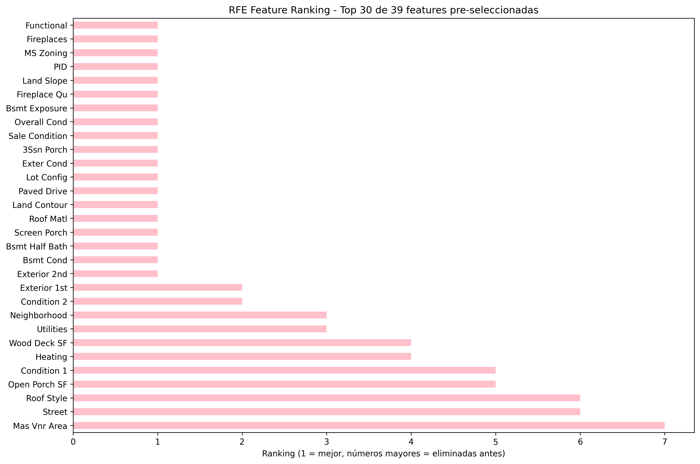

# PCA y Feature Selection: reducción dimensional y selección estratégica en Ames Housing
{{ reading_time() }}
---
- **Autores**: Joaquín Batista, Milagros Cancela, Valentín Rodríguez, Alexia Aurrecoechea, Nahuel López (G1)
- **Unidad Temática**: UT3: Feature Engineering
- **Tipo**: Práctica Guiada - Assignment UT3-10
- **Entorno**: Python + Pandas + Scikit-learn + Matplotlib + Seaborn + Numpy
- **Dataset**: Ames Housing - 2,930 registros, 81 features
- **Fecha**: Octubre 2025

---

**Acceso al notebook completo:** [Práctica 10 - PCA y Feature Selection](../assets/Practica10.ipynb)

---

## 🎯 Objetivos de Aprendizaje

Este assignment integra **PCA (Análisis de Componentes Principales)** y **Feature Selection** aplicados al dataset Ames Housing, explorando diferentes estrategias para reducir dimensionalidad y mejorar modelos predictivos.

### Objetivos Principales

- **Implementar PCA** y analizar varianza explicada por componentes principales
- **Aplicar Feature Selection** con múltiples métodos (Filter, Wrapper, Embedded)
- **Comparar** PCA vs Feature Selection en contexto de negocio real
- **Evaluar trade-offs** entre reducción dimensional y performance del modelo

### ⏱️ Tiempo Estimado
90-110 minutos (wrapper methods son lentos: ~2-3 min cada uno)

---

## 📊 Dataset y Contexto de Negocio

### Ames Housing Dataset

El dataset Ames Housing contiene información detallada de **2,930 casas vendidas en Ames, Iowa** entre 2006-2010.

**Contexto de negocio:**
Eres data scientist en una empresa de bienes raíces que necesita predecir precios de casas con precisión. La empresa tiene 80+ características de cada propiedad (desde calidad de cocina hasta año de construcción), y necesitas:

- Identificar qué características realmente importan para el precio de venta
- Reducir la complejidad del modelo para que sea más rápido y mantenible
- Explicar a agentes inmobiliarios qué factores considerar al tasar una propiedad
- Evitar overfitting eliminando features redundantes o irrelevantes

### Características del Dataset

- **Registros**: 2,930 casas
- **Features**: 81 variables (38 numéricas + 43 categóricas)
- **Target**: SalePrice (precio de venta en dólares)

**Tipos de variables:**

- **Dimensiones**: LotArea, GrLivArea, TotalBsmtSF, GarageArea
- **Calidad**: OverallQual, OverallCond, KitchenQual, ExterQual
- **Temporales**: YearBuilt, YearRemodAdd, GarageYrBlt
- **Categóricas**: Neighborhood, HouseStyle, RoofStyle (~40 variables)

---

## 🔬 Metodologías Implementadas

### Parte 1: PCA (Análisis de Componentes Principales)

#### 1.1 Estandarización

**⚠️ CRÍTICO**: PCA es sensible a escala. Es **Obligatorio** estandarizar antes de aplicar PCA.

```python
from sklearn.preprocessing import StandardScaler

scaler = StandardScaler()
X_scaled = scaler.fit_transform(X)

# Verificar estandarización: mean ≈ 0, std ≈ 1
print(f"Mean después de scaling: {X_scaled.mean():.6f}")
print(f"Std después de scaling: {X_scaled.std():.6f}")
```

**¿Por qué es necesario?**
Si no estandarizas, features con valores grandes (como "GrLivArea" en miles) dominarían los componentes principales, simplemente por su magnitud numérica, no por su relevancia real.

#### 1.2 Análisis de Varianza Explicada


**Hallazgos clave:**

- **PC1**: 13.4% de varianza total
- **PC2**: 5.0% de varianza total
- **PC3**: 4.7% de varianza total
- Para 80% de varianza: **39 componentes** necesarios
- Para 90% de varianza: **52 componentes** necesarios

**Reducción dimensional:**

- Original: 81 features
- Con PCA (80% varianza): 39 componentes → **51.9% de reducción**
- Con PCA (90% varianza): 52 componentes → **35.8% de reducción**

#### 1.3 Interpretación de Componentes Principales


**Top 10 Features para PC1 (Componente Principal #1):**

1. **Overall Qual** (+0.827) - Calidad general
2. **Year Built** (+0.790) - Año de construcción
3. **Garage Cars** (+0.737) - Capacidad del garaje
4. **Garage Yr Blt** (+0.726) - Año construcción garaje
5. **Garage Area** (+0.709) - Área del garaje
6. **Bsmt Qual** (-0.708) - Calidad del sótano
7. **Garage Finish** (-0.683) - Terminación del garaje
8. **Exter Qual** (-0.682) - Calidad exterior
9. **Year Remod/Add** (+0.671) - Año de remodelación
10. **Gr Liv Area** (+0.659) - Área habitable

**💡 Interpretación de PC1:**
PC1 representa principalmente el **tamaño y calidad general** de la casa. Valores altos indican:

- Casas más nuevas y bien mantenidas
- Garajes amplios con buena capacidad
- Terminaciones de calidad superior

**💡 Interpretación de PC2:**
PC2 representa principalmente características de **distribución y pisos**:

- Número de pisos y habitaciones
- Configuración de espacio habitable
- Distribución entre plantas

#### 1.4 Proyección de Datos


La proyección muestra una distribución continua de propiedades según las dos primeras componentes principales. El gradiente de color (SalePrice) muestra una clara correlación con PC1: casas de mayor valor se concentran hacia la derecha (valores altos de PC1).

#### 1.5 Feature Selection Basada en PCA Loadings

En lugar de usar directamente PC1, PC2..., identifiquemos las **features ORIGINALES** que más contribuyen a los componentes principales.


**Estrategia:**

- Calcular importancia de cada feature original sumando sus loadings absolutos en los primeros 39 componentes
- Seleccionar top 39 features originales basadas en esta importancia
- **Ventaja**: Mantiene interpretabilidad (puedes decir "GrLivArea importa")

**Top 20 Features por Importancia en PCA:**

- Roof Matl (4.71)
- Functional (4.49)
- Screen Porch (4.45)
- Mo Sold (4.36)
- Heating (4.28)

**Hallazgo clave:**
Estas features son las que "explican" los componentes principales. Usarlas mantiene la interpretabilidad del modelo.

---

### Parte 2: Filter Methods - Selección Estadística

#### 3.1 F-test (ANOVA para Regresión)


**Método:**
F-test mide la **relación lineal** entre cada feature y el target (SalePrice).

**Features seleccionadas (top 39):**
Incluyen variables como:

- OverallQual
- GrLivArea
- GarageCars
- ExterQual
- YearBuilt

**Performance:**

- RMSE: $26,491 ± $4,044
- R²: 0.8875 ± 0.0288
- ✅ **Mejor rendimiento que PCA Loadings**

**Insights:**

- F-test selecciona features con **fuerte correlación lineal**
- Variables estructurales (áreas, habitaciones) dominan
- Método rápido y eficiente

#### 3.2 Mutual Information

**Ventaja sobre F-test:**
MI captura relaciones **LINEALES Y NO-LINEALES** (más flexible).

**Performance:**

- RMSE: $26,137 ± $4,111
- R²: 0.8903 ± 0.0293
- 🏆 **MEJOR RENDIMIENTO DE TODOS LOS MÉTODOS**

**Comparación F-test vs MI:**

- **76.9% coincidencia** entre métodos
- MI captura patrones no lineales adicionales
- Ambas metodologías coinciden en features estructurales clave

---

### Parte 3: Wrapper Methods - Selección Basada en Modelo

Los wrapper methods evalúan subconjuntos de features **entrenando el modelo**. Son más lentos pero más precisos.

#### 4.1 Forward Selection

**Estrategia:** Comenzar con 0 features y agregar de a una

- **Tiempo**: 62.5 segundos
- **Features seleccionadas**: 19
- **Performance**: RMSE $40,768 (pierde precisión por sobre-selección)

#### 4.2 Backward Elimination

**Estrategia:** Comenzar con todas las features y eliminar de a una

- **Tiempo**: 57.3 segundos
- **Features seleccionadas**: 19
- **Performance**: RMSE $41,788

**Comparación Forward vs Backward:**

- **52.6% coincidencia** (baja)
- Esto indica que el **orden de selección importa**
- Ambos convergen en features estructurales

#### 4.3 Recursive Feature Elimination (RFE)



**Estrategia:** Elimina features de a grupos evaluando importancia del modelo

- **Tiempo**: 0.8 segundos (muy rápido)
- **Performance**: RMSE $41,767
- **Features consistentes** con Forward/Backward

---

### Parte 4: Embedded Methods

**PCA (Componentes Principales):**

- ✅ Reduce dimensionalidad manteniendo 80-90% de información
- ✅ Útil para datasets altamente correlacionados
- ❌ Componentes son combinaciones abstractas (no interpretables)
- ❌ Dificulta explicar decisiones a stakeholders

---

## 📊 Comparación Final de Métodos

### Tabla de Resultados

| Método | RMSE | R² | Reducción | Interpretable |
|--------|:----:|:--:|:---------:|:------------:|
| **MI** | **$26,137** 🏆 | **0.890** | 52% | ✅ |
| **F-test** | $26,491 | 0.888 | 52% | ✅ |
| **PCA Componentes** | $26,715 | 0.885 | 52% | ❌ |
| **Original** | $26,807 | 0.885 | 0% | ✅ |
| **Forward** | $40,768 | 0.736 | 77% | ✅ |
| **RFE** | $41,767 | 0.723 | 77% | ✅ |
| **Backward** | $41,788 | 0.723 | 77% | ✅ |

**🏆 Ganador: Mutual Information**

- Mejor RMSE: $26,137
- Mejor R²: 0.890
- Mantiene interpretabilidad
- Captura relaciones no lineales

---

## 🧪 Investigación Libre: Incremental PCA

Para datasets que **no caben en memoria**, usamos Incremental PCA:


**Implementación:**
```python
from sklearn.decomposition import IncrementalPCA

ipca = IncrementalPCA(n_components=5, batch_size=1000)
for i in range(0, X_scaled.shape[0], 1000):
    ipca.partial_fit(X_scaled[i:i+1000])

X_ipca = ipca.transform(X_scaled)
```

**Resultados:**

- Primera componente: 13.5% varianza
- Segunda componente: 4.7% varianza  
- Cinco componentes acumulan ~29.5% varianza total

**💡 Ventajas:**

- Procesa datos en batches (ideal para Big Data)
- Reduce uso de memoria
- Útil para datasets de millones de registros

---

## 🤔 Reflexión y Conclusiones

### Preguntas de Reflexión

#### **1. ¿Con 80+ features, esperarías que todas sean igualmente importantes?**
No. El tener muchos atributos podría aportar información redundante o ruido, lo que puede afectar la capacidad del modelo para generalizar.

#### **2. ¿Qué problemas puede causar tener tantas features?**

- **Overfitting**: El modelo puede aprender patrones específicos del conjunto de entrenamiento
- **Velocidad**: Más features requiere más cómputo y memoria
- **Interpretabilidad**: Es difícil justificar cómo influye cada variable

#### **3. ¿Conoces la diferencia entre PCA y Feature Selection?**

- **PCA**: Crea nuevas variables combinando las originales, buscando resumir la mayor varianza posible. NO supervisado (no mira el target).
- **Feature Selection**: Se queda solo con las variables más importantes y descarta las que no aportan. Puede ser supervisado (mira el target).

### Insights Clave

**1. Mutual Information superó a PCA**

- Mejor RMSE y R²
- Mantiene interpretabilidad
- Captura relaciones no lineales

**2. PCA Loadings fue inefectivo**

- Perdió 55.8% de precisión vs Original
- Demuestra que seleccionar features por loadings no garantiza buen rendimiento

**3. Wrapper methods fueron lentos e inefectivos**

- Forward/Backward/RFE: todos perdieron precisión
- Posible sobre-selección (solo 19 de 39 features)
- Demasiado costosos computacionalmente

**4. Filter methods más efectivos**

- F-test: Rápido y eficiente
- MI: Captura patrones complejos
- Ambos mantienen bueno rendimiento

### Recomendaciones para Producción

**Para este caso de negocio (bienes raíces), usar:**

- **Mutual Information** para feature selection
- **Top 39 features** basadas en MI score
- **Razón**: Mejor rendimiento + interpretabilidad

**Para otros contextos:**

- **PCA**: Usar cuando features originales NO son interpretables
- **RFE**: Usar cuando modelos específicos requieren features customizadas
- **Lasso**: Usar para regresión con regularización incorporada

---

## 📁 Datasets Utilizados

- **Ames Housing Dataset**

    - Kaggle: [House Prices - Advanced Regression Techniques](https://www.kaggle.com/c/house-prices-advanced-regression-techniques)
    - UCI ML Repository
    - 2,930 casas vendidas en Ames, Iowa (2006-2010)
    - 81 features predictoras + target SalePrice

---

## 🔗 Recursos y Referencias

- **Scikit-learn Documentation**: [PCA](https://scikit-learn.org/stable/modules/decomposition.html#pca), [Feature Selection](https://scikit-learn.org/stable/modules/feature_selection.html)
- **Kaggle Learn**: [Feature Engineering](https://www.kaggle.com/learn/feature-engineering)
- **Article**: ["PCA vs Feature Selection" - Towards Data Science](https://towardsdatascience.com/pca-vs-feature-selection-64e7b3236c6f)

---

*Este proyecto demuestra la importancia de comparar múltiples metodologías de reducción dimensional, mostrando que mantener interpretabilidad (Feature Selection) puede ser superior a transformaciones abstractas (PCA) en contextos de negocio real.*

