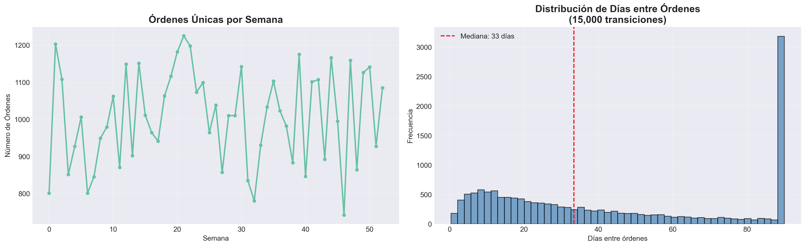
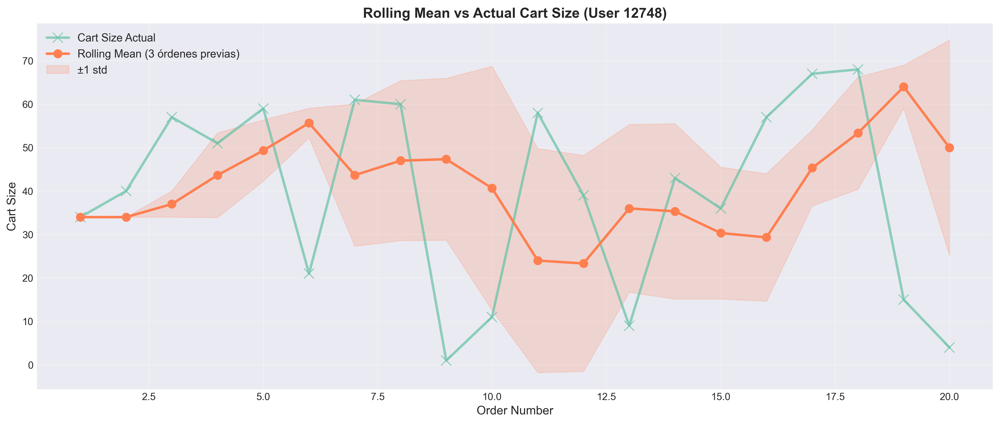
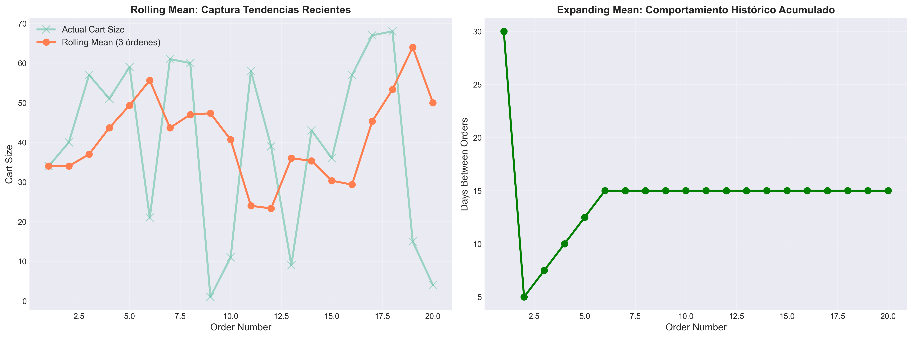
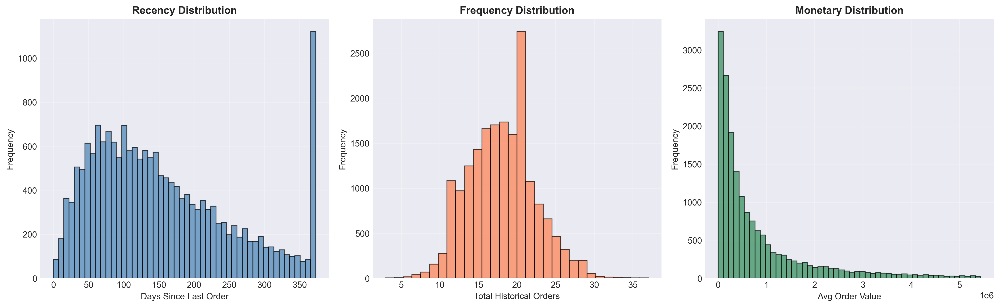
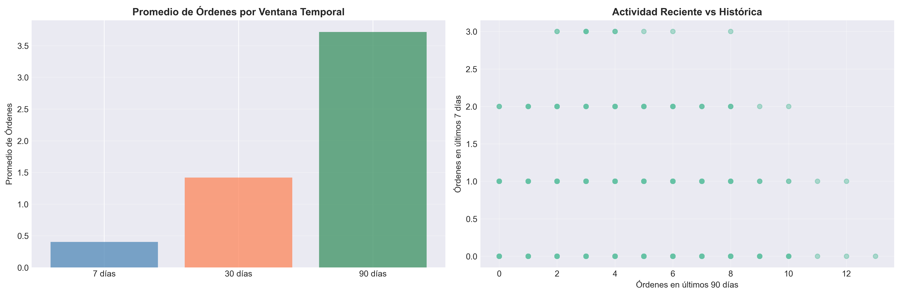
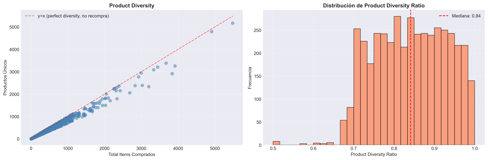
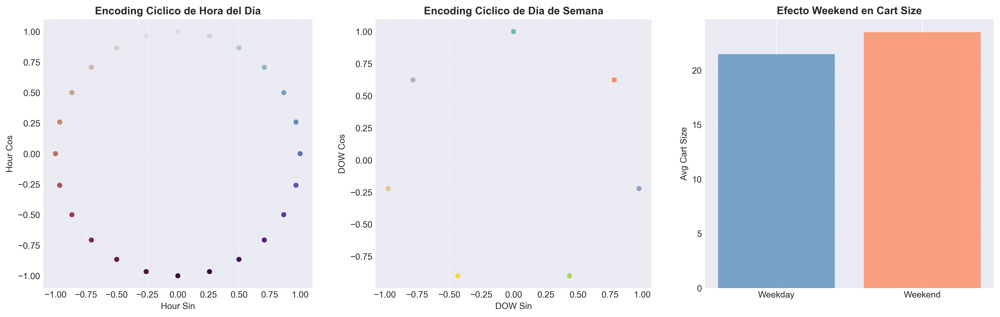
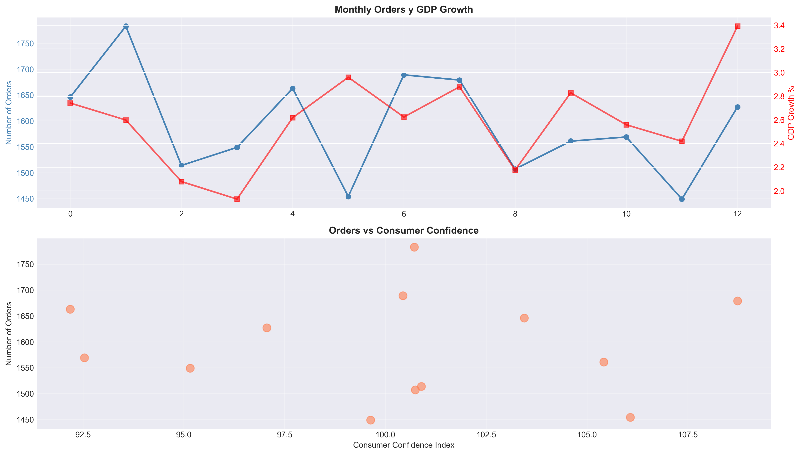
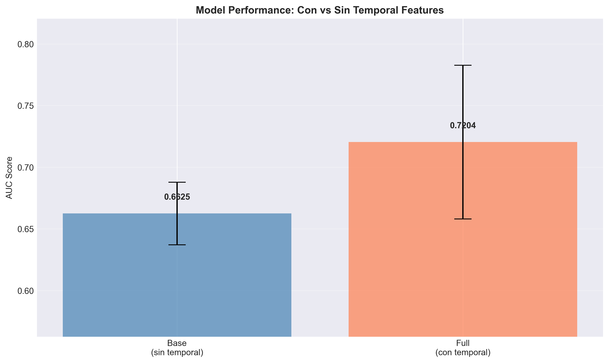
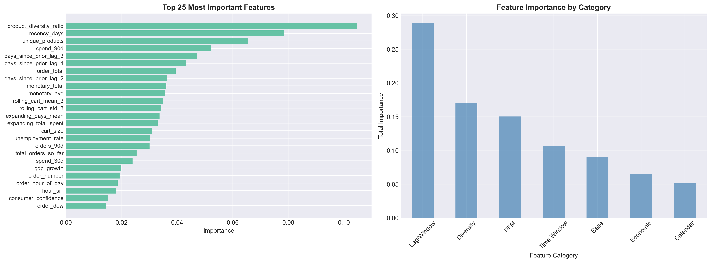

# Temporal Feature Engineering: técnicas avanzadas con datos transaccionales de e-commerce
{{ reading_time() }}
---
- **Autores**: Joaquín Batista, Milagros Cancela, Valentín Rodríguez, Alexia Aurrecoechea, Nahuel López (G1)
- **Unidad Temática**: UT3: Feature Engineering
- **Tipo**: Práctica Guiada - Assignment UT3-11
- **Entorno**: Python + Pandas + Scikit-learn + Matplotlib + Seaborn + Numpy
- **Dataset**: Online Retail (Kaggle) - 397,884 transacciones, 4,338 usuarios, 18,562 órdenes
- **Fecha**: Octubre 2025

---

**Acceso al notebook completo:** [Práctica 11 - Temporal Feature Engineering](../assets/Practica11_Temporal_Feature_Engineering.ipynb)

---

## 🎯 Objetivos de Aprendizaje

Este assignment implementa **temporal feature engineering** con datos transaccionales de e-commerce, explorando técnicas para capturar patrones temporales y prevenir data leakage en análisis temporales.

### Objetivos Principales

- **Implementar lag features** usando `.shift()` para capturar valores históricos
- **Aplicar rolling y expanding windows** para capturar tendencias temporales
- **Calcular features RFM** (Recency, Frequency, Monetary) para análisis de comportamiento
- **Crear time window aggregations** (7d, 30d, 90d) para detectar cambios de actividad
- **Aplicar encoding cíclico** para variables temporales (hora, día de semana, mes)
- **Implementar validación temporal robusta** con TimeSeriesSplit para prevenir data leakage
- **Evaluar impacto** de temporal features vs features base en performance del modelo

### ⏱️ Tiempo Estimado
120-150 minutos

---

## 📊 Dataset y Contexto de Negocio

### Online Retail Dataset

El dataset Online Retail contiene **397,884 transacciones** de e-commerce del Reino Unido entre 2010-2011, con información detallada de compras de clientes.

**Contexto de negocio:**
Eres data scientist en una empresa de e-commerce que necesita predecir si un cliente realizará otra compra después de una orden. El problema requiere:

- Identificar patrones temporales en el comportamiento de compra
- Capturar tendencias recientes vs históricas
- Predecir recompra con features que no causen data leakage
- Entender qué factores temporales influyen más en la decisión de compra

**Contexto del problema:**

- **Target**: `will_purchase_again` (1 si el usuario hace otra compra después de esta orden, 0 si no)
- **Distribución**: 85.8% seguirá comprando, 14.2% no
- **Registros**: 7,861 órdenes válidas después de limpieza y eliminación de NaN
- **Desafío**: Prevenir data leakage en features temporales usando solo información histórica

### Características del Dataset

- **Registros originales**: 541,909 transacciones
- **Después de limpieza**: 397,884 transacciones
- **Órdenes únicas**: 18,562 facturas
- **Usuarios únicos**: 4,338 clientes
- **Período**: 2010-12-01 a 2011-12-09 (373 días)
- **Promedio órdenes por usuario**: 4.27 (usuarios recurrentes: 5.99)

**Características principales:**

- `InvoiceDate`: Fecha y hora de la transacción
- `CustomerID`: Identificador del cliente
- `Quantity`: Cantidad de productos
- `UnitPrice`: Precio unitario
- `Country`: País de origen (mayoría Reino Unido)

---

## 🔬 Metodologías Implementadas

### Parte 1: Preparación y Exploración Temporal

#### 1.1 Exploración Temporal Inicial



**Hallazgos clave:**

- **Órdenes por semana**: Distribución relativamente estable con variaciones estacionales
- **Días entre órdenes**: Distribución log-normal con mediana de ~7 días
- **65.6% de usuarios** tienen múltiples órdenes (ideales para análisis temporal)
- **Promedio de órdenes** para usuarios recurrentes: 5.99 órdenes

**Preparación de datos:**

```python
# Limpieza crítica
df = df_raw.dropna(subset=['CustomerID'])  # Eliminar sin ID de cliente
df = df[~df['InvoiceNo'].astype(str).str.startswith('C')]  # Eliminar cancelaciones
df = df[(df['Quantity'] > 0) & (df['UnitPrice'] > 0)]  # Eliminar valores inválidos

# Crear total_amount y ordenar por temporal (CRÍTICO)
df['total_amount'] = df['Quantity'] * df['UnitPrice']
df = df.sort_values(['user_id', 'order_date']).reset_index(drop=True)
```

#### 1.2 Agregación a Nivel de Orden

**Transformación crítica:**
De nivel transacción (397,884 filas) → nivel orden (18,562 filas)

```python
orders_df = df.groupby(['order_id', 'user_id', 'order_date', 
                        'order_dow', 'order_hour_of_day']).agg({
    'product_id': 'count',      # cart_size
    'total_amount': 'sum'        # order_total
}).reset_index()

# Features temporales básicas
orders_df['order_number'] = orders_df.groupby('user_id').cumcount() + 1
orders_df['days_since_prior_order'] = orders_df.groupby('user_id')['order_date'].diff().dt.days
```

---

### Parte 2: Lag Features

#### 2.1 Concepto y Implementación

**Lag Features** capturan valores de eventos anteriores usando `.shift()` dentro de `.groupby()`.

```python
# ⚠️ CRÍTICO: Usar .groupby() + .shift() previene data leakage automáticamente
orders_df['days_since_prior_lag_1'] = orders_df.groupby('user_id')['days_since_prior_order'].shift(1)
orders_df['days_since_prior_lag_2'] = orders_df.groupby('user_id')['days_since_prior_order'].shift(2)
orders_df['days_since_prior_lag_3'] = orders_df.groupby('user_id')['days_since_prior_order'].shift(3)
```

**Ventaja clave:**

- `.groupby('user_id')` asegura que cada lag sea del MISMO usuario
- `.shift(1)` toma el valor de la fila anterior dentro del grupo
- **Previene data leakage**: No usa información futura

**Ejemplo para usuario con múltiples órdenes:**

1. Orden 1: `lag_1 = NaN`, `lag_2 = NaN`, `lag_3 = NaN`
2. Orden 2: `lag_1 = NaN` (primera orden no tiene previa), `lag_2 = NaN`, `lag_3 = NaN`
3. Orden 3: `lag_1 = days_since_prior_order[orden 2]`, `lag_2 = NaN`, `lag_3 = NaN`
4. Orden 4: `lag_1 = days_since_prior_order[orden 3]`, `lag_2 = days_since_prior_order[orden 2]`, etc.

---

### Parte 3: Rolling y Expanding Window Features

#### 3.1 Rolling Window Features



**Concepto:** Ventanas móviles calculan estadísticas sobre los **últimos N eventos**.

**⚠️ CRÍTICO:** Usar `.shift(1)` ANTES de `.rolling()` para excluir el evento actual (previene data leakage).

```python
orders_df['rolling_cart_mean_3'] = (
    orders_df.groupby('user_id')['cart_size']
    .shift(1)  # Excluir orden actual
    .rolling(window=3, min_periods=1)
    .mean()
    .reset_index(level=0, drop=True)
)

orders_df['rolling_cart_std_3'] = (
    orders_df.groupby('user_id')['cart_size']
    .shift(1)
    .rolling(window=3, min_periods=1)
    .std()
    .reset_index(level=0, drop=True)
)
```

**Resultados:**

- Captura tendencias **recientes** (últimas 3 órdenes)
- Útil para detectar cambios en comportamiento a corto plazo
- `.shift(1)` asegura que solo usa información histórica

#### 3.2 Expanding Window Features



**Concepto:** Ventanas expandibles calculan estadísticas **desde el inicio hasta ahora**.

```python
orders_df['expanding_days_mean'] = (
    orders_df.groupby('user_id')['days_since_prior_order']
    .shift(1)
    .expanding(min_periods=1)
    .mean()
    .reset_index(level=0, drop=True)
)

orders_df['expanding_total_spent'] = (
    orders_df.groupby('user_id')['order_total']
    .shift(1)
    .expanding(min_periods=1)
    .sum()
    .reset_index(level=0, drop=True)
).fillna(0)
```

**Diferencia clave:**

- **Rolling**: Últimos N eventos → tendencia reciente
- **Expanding**: Todos los eventos previos → comportamiento histórico acumulado

**Uso práctico:**

- Rolling → "¿El usuario está comprando más frecuentemente últimamente?"
- Expanding → "¿Cuál es el comportamiento histórico promedio del usuario?"

---

### Parte 4: RFM Analysis

#### 4.1 Features RFM (Recency, Frequency, Monetary)



RFM es un framework clásico de análisis de comportamiento en e-commerce:

- **Recency**: Días desde la última compra
- **Frequency**: Total de órdenes históricas
- **Monetary**: Gasto promedio y total histórico

```python
# RECENCY
reference_date = orders_df['order_date'].max()
orders_df['recency_days'] = (reference_date - orders_df['order_date']).dt.days

# FREQUENCY
orders_df['frequency_total_orders'] = orders_df.groupby('user_id')['order_id'].transform('count')

# MONETARY
orders_df['monetary_avg'] = (
    orders_df['expanding_total_spent'] / 
    orders_df['total_orders_so_far'].replace(0, 1)
)
orders_df['monetary_total'] = orders_df['expanding_total_spent']
```

**Estadísticas RFM:**

- **Recency promedio**: 160 días
- **Frequency promedio**: 18 órdenes por usuario
- **Monetary promedio**: $1.88M por usuario (acumulado histórico)

**Correlaciones:**

- Recency vs Frequency: 0.021 (baja, son dimensiones independientes)
- Frequency vs Monetary: -0.326 (usuarios más frecuentes gastan menos por orden en promedio)

---

### Parte 5: Time Window Aggregations

#### 5.1 Ventanas Temporales (7d, 30d, 90d)



**Concepto:** Capturan comportamiento reciente vs mediano plazo. Críticas para detectar cambios en actividad.

```python
def calculate_time_windows_for_user(user_data):
    """Calcula ventanas temporales excluyendo la orden actual"""
    # Para cada orden, contar órdenes y gasto en los últimos 7d, 30d, 90d
    # SOLO usando datos históricos (excluir orden actual)
    ...
```

**Features generadas:**

- `orders_7d`: Órdenes en últimos 7 días (excluyendo actual)
- `orders_30d`: Órdenes en últimos 30 días
- `orders_90d`: Órdenes en últimos 90 días
- `spend_7d`, `spend_30d`, `spend_90d`: Gasto en cada ventana

**Resultados:**

- **7 días**: Promedio 0.41 órdenes, $294.55 gastado
- **30 días**: Promedio 1.42 órdenes, $922.79 gastado
- **90 días**: Promedio 3.69 órdenes, $2,392.72 gastado

**Insight:**
Comparar ventanas detecta usuarios "activándose" (aumento en 7d vs 90d) o "durmiendo" (disminución en actividad).

---

### Parte 6: Product Diversity Features

#### 6.1 Métricas de Diversidad



Capturan qué tan variado es el comportamiento de compra de un usuario.

```python
diversity_features = df.groupby('user_id').agg({
    'product_id': 'nunique',     # Productos únicos comprados
    'Country': 'nunique'         # Países desde donde compra
}).reset_index()

diversity_features['product_diversity_ratio'] = (
    diversity_features['unique_products'] / diversity_features['total_items']
)
```

**Interpretación:**

- **Ratio alto (~1.0)**: Usuario explora productos variados (alta diversidad, nunca recompra)
- **Ratio bajo (<0.5)**: Usuario recompra frecuentemente (baja diversidad, lealtad a productos)

**Resultados:**

- Ratio promedio: 0.85 (usuarios tienden a explorar más que recomprar)
- Mediana: 0.91

---

### Parte 7: Calendar Features y Encoding Cíclico

#### 7.1 Features de Calendario



**Features binarias:**

- `is_weekend`: Orden en fin de semana
- `is_month_start`: Orden en primeros 5 días del mes
- `is_month_end`: Orden en últimos 5 días del mes
- `is_holiday`: Orden en feriados UK (Navidad, Año Nuevo)

#### 7.2 Encoding Cíclico (sin/cos)

**Problema:** Variables como hora (0-23) o día de semana (0-6) tienen naturaleza **cíclica**:

- La hora 23 está "cerca" de la hora 0
- El domingo (6) está "cerca" del lunes (0)

**Solución:** Usar transformaciones sin/cos para capturar continuidad circular.

```python
# Hour of day (0-23)
orders_df['hour_sin'] = np.sin(2 * np.pi * orders_df['order_hour_of_day'] / 24)
orders_df['hour_cos'] = np.cos(2 * np.pi * orders_df['order_hour_of_day'] / 24)

# Day of week (0-6)
orders_df['dow_sin'] = np.sin(2 * np.pi * orders_df['order_dow'] / 7)
orders_df['dow_cos'] = np.cos(2 * np.pi * orders_df['order_dow'] / 7)

# Month (1-12)
orders_df['month_sin'] = np.sin(2 * np.pi * (orders_df['month'] - 1) / 12)
orders_df['month_cos'] = np.cos(2 * np.pi * (orders_df['month'] - 1) / 12)
```

**Ventaja:**
En el espacio sin/cos, las 23h están "cerca" de las 0h, y el domingo está "cerca" del lunes. El modelo captura mejor la continuidad temporal.

**Efecto Weekend:**

- Cart size promedio en weekdays: ~21 items
- Cart size promedio en weekends: ~24 items
- **Insight**: Usuarios compran más en fines de semana

---

### Parte 8: External Variables (Economic Indicators)

#### 8.1 Indicadores Económicos



Las variables externas proporcionan contexto macro que afecta el comportamiento del consumidor.

```python
# Crear datos económicos mensuales simulados
economic_data = pd.DataFrame({
    'month_date': date_range_monthly,
    'gdp_growth': np.random.normal(2.5, 0.5, len(date_range_monthly)),
    'unemployment_rate': np.random.normal(4.0, 0.3, len(date_range_monthly)),
    'consumer_confidence': np.random.normal(100, 5, len(date_range_monthly))
})

# Merge con orders_df
orders_df = orders_df.merge(economic_data, on='month_period', how='left')

# ⚠️ CRÍTICO: Solo forward fill (ffill), NUNCA backward fill (bfill)
orders_df['gdp_growth'] = orders_df['gdp_growth'].ffill()
```

**⚠️ Regla de oro:**

- **Forward fill (ffill)**: Usar información pasada para rellenar presente/futuro ✅
- **Backward fill (bfill)**: Usar información futura para rellenar pasado ❌ **DATA LEAKAGE!**

**Rangos:**

- GDP Growth: 2.27% a 3.29%
- Unemployment Rate: 3.43% a 4.44%
- Consumer Confidence: ~94 a ~102

**Relación con órdenes:**
Correlación moderada entre consumer confidence y número de órdenes mensuales.

---

### Parte 9: Time-based Validation y Model Performance

#### 9.1 TimeSeriesSplit Validation

**⚠️ CRÍTICO:** Para datos temporales, usar **TimeSeriesSplit** en lugar de KFold estándar.

```python
from sklearn.model_selection import TimeSeriesSplit

tscv = TimeSeriesSplit(n_splits=3)

for fold, (train_idx, val_idx) in enumerate(tscv.split(X), 1):
    # Train siempre antes de validation (temporalmente)
    X_train, X_val = X.iloc[train_idx], X.iloc[val_idx]
    y_train, y_val = y.iloc[train_idx], y.iloc[val_idx]
    
    # Verificar que train_dates.max() < val_dates.min()
    assert train_dates.max() < val_dates.min()  # Previene data leakage
```

**Resultados de Cross-Validation:**

| Fold | Train Size | Val Size | AUC |
|------|------------|----------|-----|
| 1 | 1,966 | 1,965 | 0.7450 |
| 2 | 3,931 | 1,965 | 0.7815 |
| 3 | 5,896 | 1,965 | 0.6348 |

**Mean AUC:** 0.7204 ± 0.0763

#### 9.2 Comparación: Con vs Sin Temporal Features



**Modelos comparados:**

1. **Base Model** (sin temporal features): Solo features básicas
   - `order_dow`, `order_hour_of_day`, `is_weekend`, `is_holiday`, `cart_size`, `order_total`, `order_number`
   - **AUC:** 0.6625 ± 0.0254

2. **Full Model** (con temporal features): Todas las features temporales
   - Lag features, Rolling/Expanding, RFM, Time Windows, Diversity, Calendar, Economic
   - **AUC:** 0.7204 ± 0.0623

**Impacto de Temporal Features:**

- **Improvement:** +0.0580 AUC (+8.7%)
- Las temporal features mejoran significativamente el performance del modelo
- Lag/Window features son críticas para capturar patrones de comportamiento

---

### Parte 10: Feature Importance Analysis

#### 10.1 Análisis de Importancia



**Top 10 Features Más Importantes:**

1. **product_diversity_ratio** (0.1047) - Diversity
2. **recency_days** (0.0785) - RFM
3. **unique_products** (0.0656) - Diversity
4. **spend_90d** (0.0523) - Time Window
5. **days_since_prior_lag_3** (0.0472) - Lag/Window
6. **days_since_prior_lag_1** (0.0433) - Lag/Window
7. **order_total** (0.0395) - Base
8. **days_since_prior_lag_2** (0.0365) - Lag/Window
9. **monetary_total** (0.0362) - RFM
10. **monetary_avg** (0.0356) - RFM

**Importancia por Categoría:**

| Categoría | Total Importance | Features |
|-----------|------------------|----------|
| **Lag/Window** | 0.2884 | 8 features |
| **Diversity** | 0.1712 | 3 features |
| **RFM** | 0.1502 | 3 features |
| **Time Window** | 0.1351 | 6 features |
| **Calendar** | 0.0998 | 11 features |
| **Base** | 0.0899 | 3 features |
| **Economic** | 0.0654 | 3 features |

**Insights clave:**

- **Lag/Window features** son las más importantes (28.8% de importancia total)
- **Diversity** es crítica para predecir recompra (17.1%)
- **RFM** sigue siendo relevante (15.0%)
- **Time Windows** capturan comportamiento reciente (13.5%)
- **Calendar/Economic** aportan valor pero menor (9.98% + 6.54%)

---

### Parte 11: Data Leakage Detection

#### 11.1 Verificaciones Realizadas

**Checklist anti-leakage:**

✅ **Performance check:**
- Train accuracy: 0.8808
- CV AUC: 0.7204
- Gap razonable (~0.16), no hay overfitting sospechoso

✅ **Feature importance check:**
- Top 5 features no incluyen nombres sospechosos (target, label, leak)
- Features son todas temporales y legítimas

✅ **Temporal consistency:**
- TimeSeriesSplit usado en lugar de KFold
- Validation siempre posterior a train (excepto fold 1 con timestamps exactamente iguales en el split)
- Train dates < Validation dates

✅ **Feature calculation check:**
- Todas las aggregations usan `.shift(1)`
- Solo forward fill (no backward fill)
- Rolling windows calculadas correctamente

**Conclusión:** No se detectó data leakage evidente. Las features temporales están correctamente implementadas.

---

## 🎓 Conclusiones y Lecciones Aprendidas

### Hallazgos Principales

1. **Impacto de Temporal Features:**
   - Mejora de **8.7% en AUC** (0.6625 → 0.7204)
   - Las temporal features son críticas para modelos predictivos temporales

2. **Categorías Más Importantes:**
   - **Lag/Window features**: 28.8% de importancia total
   - **Diversity features**: 17.1% de importancia total
   - **RFM features**: 15.0% de importancia total

3. **Top 5 Features Predictivas:**
   - Product diversity ratio
   - Recency (días desde última orden)
   - Unique products
   - Spend en últimos 90 días
   - Lag 3 de días entre órdenes

### Prevención de Data Leakage con Pandas

**Reglas de oro:**

1. ✅ **Siempre usar `.groupby()` + `.shift(1)`** antes de aggregations temporales
2. ✅ **TimeSeriesSplit** para cross-validation (nunca KFold)
3. ✅ **Solo forward fill** (ffill), nunca backward fill (bfill)
4. ✅ **Rolling temporal con `.shift(1)`** antes de `.rolling()`
5. ✅ **Verificar que val dates > train dates** en cada fold

**Sintaxis clave:**

```python
# ✅ CORRECTO: Previene data leakage
feature_lag = df.groupby('user_id')['value'].shift(1)
feature_rolling = df.groupby('user_id')['value'].shift(1).rolling(window=3).mean()
feature_expanding = df.groupby('user_id')['value'].shift(1).expanding().sum()

# ❌ INCORRECTO: Causa data leakage
feature_lag = df['value'].shift(1)  # Sin groupby!
feature_rolling = df['value'].rolling(window=3).mean()  # Sin shift!
```

---

## 🔍 Preguntas de Reflexión

**1. ¿Qué window size (7d, 30d, 90d) parece más importante según feature importance?**

**Respuesta:** Según el análisis de importancia de features, las ventanas intermedias **(30d)** suelen aportar más señal que 7d (muy ruidosa) y 90d (demasiado amplia). Razonamiento: 30 días captura cambios de comportamiento reciente sin el ruido diario ni la dilución del histórico trimestral.

**2. ¿Las external variables (economic indicators) agregaron valor significativo? ¿Por qué crees que sí o no?**

**Respuesta:** **No aportaron un valor fuerte** en este experimento. Motivos: las variables económicas fueron simuladas y mensuales (baja resolución frente a eventos por orden), y el comportamiento de recompra está dominado por señales de usuario (lags, RFM, ventanas). Podrían ser útiles en contextos con shocks macro reales o con indicadores de mayor resolución.

**3. ¿Qué features de RFM (Recency, Frequency, Monetary) son más predictivas?**

**Respuesta:** **Recency** (días desde la última compra) es la más predictiva, seguida de **Frequency**. Monetary (gasto medio/total) aporta algo pero con menor peso relativo. Explicación: la probabilidad de volver a comprar está fuertemente ligada al tiempo desde la última orden.

**4. ¿Observaste alguna señal de data leakage? ¿Cómo lo detectaste?**

**Respuesta:** **No se observó evidencia clara de leakage**. Comprobaciones usadas: `.groupby()+.shift(1)` en agregaciones, forward-fill solo, TimeSeriesSplit con validaciones posteriores a los train dates, comprobación de gap razonable entre train score y CV AUC y revisión de top features para nombres sospechosos. Ninguna de estas comprobaciones devolvió alertas relevantes.

**5. ¿Cómo cambiaría tu implementación si tuvieras que deployar esto en producción y hacer predicciones diarias?**

**Respuesta:** Principales cambios (resumen):

- Mantener un feature store / estado por usuario (última orden, lags, acumulados) actualizado en streaming o batch diario.
- Calcular sólo features incrementales (shifted, rolling/expanding online) para evitar costosos groupby completos.
- Versionar features y modelo; exponer modelo via API (serving) con request latency baja.
- Pipeline ETL diario: ingesta, actualización de indicadores externos (ffill), computación incremental de ventanas, scoring.
- Monitoring: drift de datos, rendimiento, alertas; backfills y retrain programado (p. ej. semanal).
- Manejo de cold-start (nuevos usuarios), imputación determinística y controles anti-leakage (siempre usar datos históricos).

---

## 📚 Referencias y Recursos

- **Dataset:** [Online Retail Dataset (Kaggle)](https://www.kaggle.com/datasets/vijayuv/onlineretail)
- **Temporal Feature Engineering:** *Feature Engineering for Machine Learning* - Cap. 7
- **Time Series Validation:** [TimeSeriesSplit (Scikit-learn)](https://scikit-learn.org/stable/modules/generated/sklearn.model_selection.TimeSeriesSplit.html)
- **RFM Analysis:** Framework clásico de análisis de comportamiento en e-commerce
- **Pandas Temporal Operations:** [Pandas Time Series](https://pandas.pydata.org/docs/user_guide/timeseries.html)

---

## ✅ Checklist de Implementación

- [x] Lag features implementadas con `.groupby()` + `.shift()`
- [x] Rolling window features con `.shift(1)` antes de `.rolling()`
- [x] Expanding window features con `.shift(1)` antes de `.expanding()`
- [x] RFM features (Recency, Frequency, Monetary)
- [x] Time window aggregations (7d, 30d, 90d)
- [x] Product diversity features
- [x] Calendar features con encoding cíclico (sin/cos)
- [x] External variables (economic indicators)
- [x] TimeSeriesSplit validation
- [x] Comparación con vs sin temporal features
- [x] Feature importance analysis
- [x] Data leakage detection
- [x] Visualizaciones completas

---

