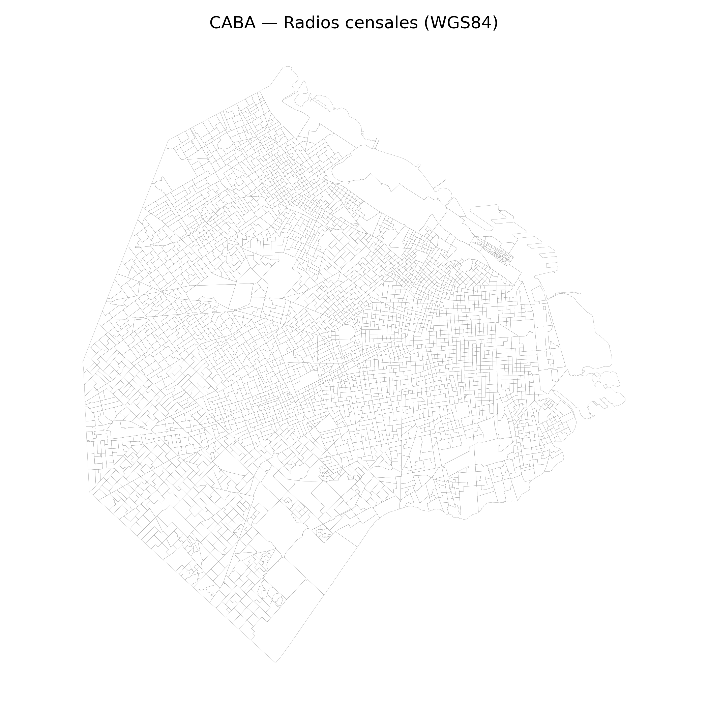
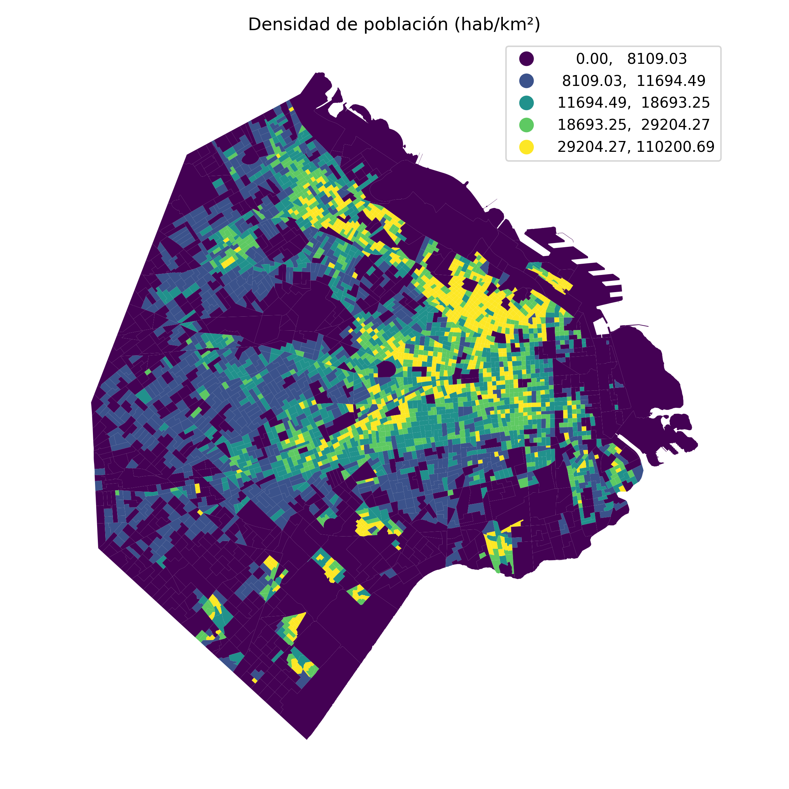

# Geoanálisis urbano con GeoPandas: densidad poblacional y servicio ciudadano en CABA
{{ reading_time() }}
---
- **Autores**: Joaquín Batista, Milagros Cancela, Valentín Rodríguez, Alexia Aurrecoechea, Nahuel López (G1)
- **Unidad Temática**: UT4: Datos Especiales
- **Tipo**: Práctica Guiada - Assignment UT4-12
- **Entorno**: Python + GeoPandas + Shapely + Contextily + Folium + MapClassify
- **Datasets**: Radios censales CABA (`CABA_rc.geojson`) + SUACI GCBA (`gcba_suaci_comunas.csv`)
- **Fecha**: Noviembre 2025

---

**Acceso al notebook completo:** [Práctica 12 - Datos Especiales (GeoPandas)](../assets/Practico_12.ipynb)

---

## 🎯 Objetivos de Aprendizaje

- Implementar un pipeline geoespacial end-to-end con GeoPandas/Shapely.
- Validar y estandarizar sistemas de referencia de coordenadas (CRS) para mediciones métricas.
- Construir visualizaciones coropléticas con normalizaciones densidad/km² y tiles de contexto.
- Realizar dissolves y joins atributivos para consolidar información por barrio.
- Calcular indicadores per cápita combinando fuentes demográficas y de servicio ciudadano.
- Elaborar reflexiones sobre patrones espaciales y decisiones de diseño cartográfico.

---

## 🗺️ Datasets y Preparación

### Radios censales (CABA)

- Fuente GeoJSON pública: radios censales con atributos poblacionales.
- CRS original: `EPSG:4326` (WGS84). Se reproyecta a `EPSG:3857` para trabajar en metros.
- Se calculan áreas en m² y densidad habitacional (`hab/km²`) como base para normalizaciones.

{ width="520" }

### Atenciones ciudadanas (SUACI)

- CSV con totales de contactos por barrio.
- Se agregan los registros por `BARRIO` y se vinculan a la geometría disuelta de radios censales.
- Se derivan métricas `contactos_pc` (per cápita) para comparar cargas de atención.

---

## 🔧 Metodologías Aplicadas

### 1. Limpieza geométrica y proyección

- Lectura de GeoJSON con `gpd.read_file`.
- Conversión a CRS proyectado (`.to_crs(epsg=3857)`) para garantizar áreas y distancias consistentes.
- Cálculo de área en m² y densidad por km² como indicadores derivados.

### 2. Visualización coroplética

- Mapas simples con `GeoDataFrame.plot` usando esquemas `quantiles`.
- Incorporación de tiles de contexto (`CartoDB.Positron`) vía `contextily`.
- Discusión sobre selección de esquemas de clasificación y zonas de mayor densidad.

{ width="520" }

### 3. Attribute join y agregaciones zonales

- Aggregación de radios a nivel barrio con `dissolve`, preservando totales demográficos.
- Unión (`merge`) con la tabla SUACI para enriquecer con métricas de servicio ciudadano.
- Cálculo de indicadores normalizados (`contactos_pc`) y ranking de barrios con mayor carga relativa.

{ width="520" }

### 4. Reflexión guiada

- Preguntas orientadas a justificar elecciones cartográficas (CRS, esquema de clasificación).
- Identificación de hotspots de densidad y de atención ciudadana para análisis urbano.

---

## 📌 Resultados Destacados

- **Densidad habitacional:** Se identifican radios altamente densos en zonas céntricas de CABA, facilitando la priorización de políticas urbanas.
- **Carga SUACI per cápita:** Los barrios con mayor proporción de contactos destacan necesidades específicas de servicio ciudadano.
- **Buenas prácticas geoespaciales:** Uso consistente de CRS proyectados y normalizaciones evita comparaciones sesgadas.
- **Mapas con contexto:** Los tiles de fondo mejoran la interpretación al ubicar hotspots en el tejido urbano.

---

## Tareas Extra - Implementación

### 1) Hexgrid/H3 para heatmaps comparables

Objetivo: discretizar el espacio y agregar métricas por celdas hexagonales. Para lograrlo se integró la librería `h3` con GeoPandas:

- Se generó una cobertura de celdas H3 (resolución 8) sobre la huella urbana de CABA usando `h3.geo_to_cells`.
- Cada hexágono se intersectó con los barrios para transferir métricas agregadas. Se asumió distribución uniforme dentro de cada barrio y se calculó:
  - `contactos_density = total / area_m2`
  - `poblacion_density = POBLACION / area_m2`
- Con las áreas de solape se estimaron contribuciones: `contactos_contrib = contactos_density * area_overlap` y `poblacion_contrib = poblacion_density * area_overlap`.
- Finalmente se obtuvo la tasa por hexágono `contactos_pc_hex = contactos_contrib / poblacion_contrib`, expresada por cada 1000 habitantes.
- El resultado se visualizó con Matplotlib sobre el contorno de barrios para comparar rápidamente hotspots frente a los agregados administrativos.

{ width="520" }

💡 *Hint:* normalizar por superficie de la celda permite comparar hexágonos independientemente de su posición. Ordenar los hex por percentiles (p. ej. P90 para identificar outliers) ayuda a priorizar zonas críticas frente al ranking por barrios tradicionales.

---

## 🧭 Reflexiones y Aprendizajes

- El reproyectado temprano (`EPSG:3857`) es clave para que áreas y densidades sean comparables.
- Las coropletas requieren esquemas de clasificación alineados al objetivo analítico; `quantiles` evitó clases vacías.
- Dissolver geometrías ayuda a sintetizar información multi-nivel (radio → barrio) y habilita indicadores per cápita más robustos.
- La combinación de datos demográficos con demandas ciudadanas permite priorizar intervenciones basadas en evidencia.

---

## ✅ Checklist de Implementación

- [x] Lectura de datos geoespaciales y verificación de geometrías.
- [x] Reproyección a CRS métrico y cálculo de áreas/densidades.
- [x] Coropletas con esquemas de clasificación apropiados.
- [x] Tiles de referencia vía Contextily.
- [x] Attribute join entre radios y SUACI con dissolves por barrio.
- [x] Cálculo de métricas per cápita y ranking de hotspots.
- [x] Reflexiones sobre decisiones cartográficas y hallazgos urbanos.

---

## 📚 Referencias

- Kaggle Learn — *Geospatial Analysis*.
- GeoPandas Documentation — *CRS y plotting*.
- GCBA Datos Abiertos — Radios censales y SUACI.

