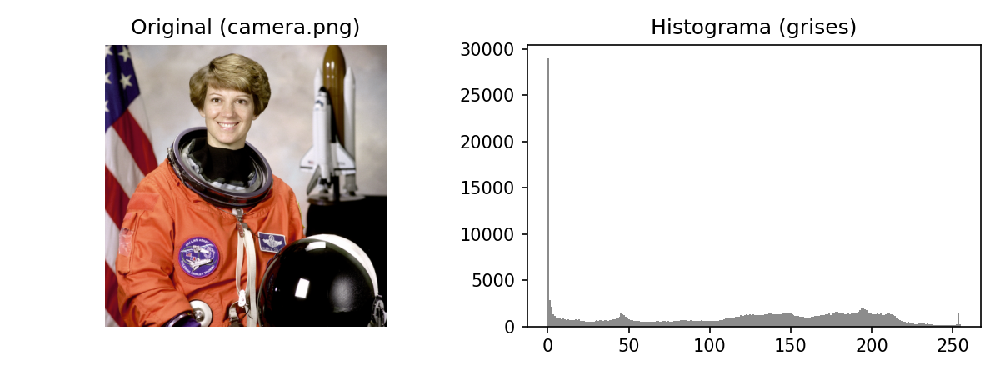
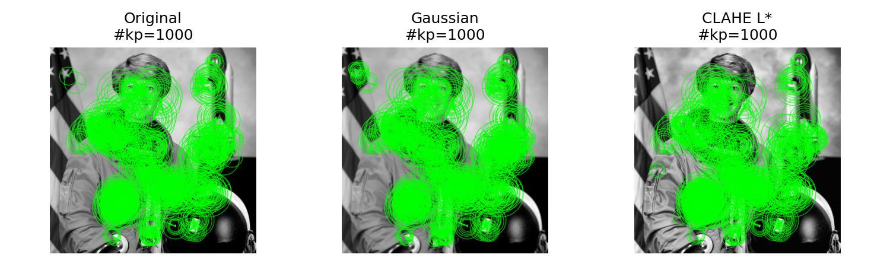
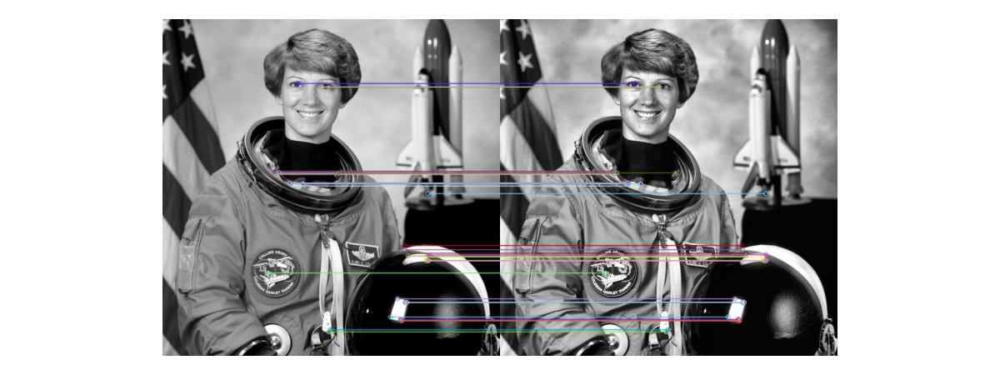
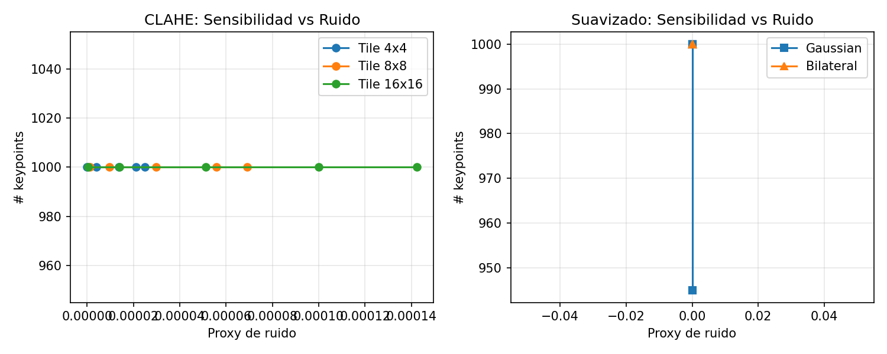
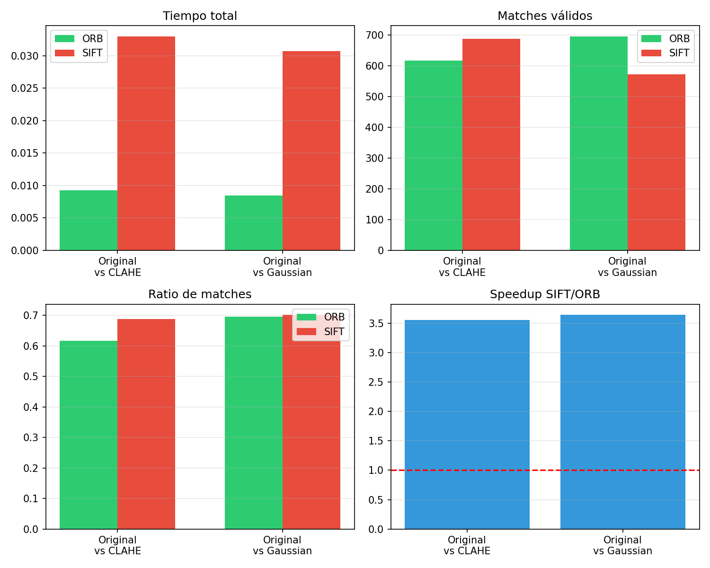

# Preprocesamiento avanzado de imágenes: contraste, suavizado y features locales
{{ reading_time() }}
---
- **Autores**: Joaquín Batista, Milagros Cancela, Valentín Rodríguez, Alexia Aurrecoechea, Nahuel López (G1)
- **Unidad Temática**: UT4: Datos Especiales
- **Tipo**: Práctica Guiada - Assignment UT4-13
- **Entorno**: Python + OpenCV + scikit-image + NumPy + Matplotlib + Pandas
- **Dataset**: Pack clásico de `skimage` (camera, astronaut, coffee, coins, checkerboard, rocket, page)
- **Fecha**: Noviembre 2025

---

**Acceso al notebook completo:** [Práctica 13 - Preprocesamiento de Imágenes](../assets/Practico_13.ipynb)

---

## 📸 Representación y diagnóstico inicial

El pipeline comienza con la caracterización de cada imagen: forma, tipo de dato y distribución tonal.

- El rango dinámico de `camera.png` cubre **0-255**, con media 115.41 → rango completo aprovechado.
- El histograma muestra un contraste alto, con valores repartidos en todo el espectro.
- En RGB el canal **R** domina, indicando un tinte cálido típico de escenas interiores o al atardecer.

## 🎨 Espacios de color y realce de contraste

Se evaluó ecualización global vs. adaptativa (CLAHE) sobre el canal de luminancia `L*`.

- **STD contraste**: original 75.12 → equalize 80.25 → CLAHE 75.87 (mejora local sin saturar).
- El canal `L*` en LAB resultó el más informativo para ajustes de luminancia sin alterar el color.
- CLAHE mejora zonas homogéneas al operar localmente, evitando artefactos de la ecualización global.

## 🔧 Suavizado y detección de bordes

Se aplicaron filtros gaussianos y bilaterales antes de Canny para controlar ruido y falsos bordes.

- **Varianza del gradiente**: original 10 788 → gauss 5 335 → bilateral 5 488 (reduce ruido).
- **Ratio de bordes**: 0.078 (original) frente a 0.038 (bilateral) → menos falsos positivos.
- El filtro bilateral conservó mejor los contornos al ponderar distancia e intensidad.

## ⭐ Puntos de interés y matching

El preprocesamiento impacta directamente en la densidad y repetibilidad de *keypoints* ORB.

- CLAHE generó la mayor densidad de *keypoints* sin introducir ruido adicional.
- Se obtuvo una **repetibilidad** de 0.62 entre la imagen original y la variante CLAHE.
- Ajustar `nfeatures=750` y `scaleFactor=1.1` es un buen balance entre cobertura y costo.

## 📊 Métricas de calidad y hallazgos

- `edges_ratio` entre 0.02 y 0.15 se usa como rango saludable. Valores fuera generan alertas.
- Checks automáticos propuestos:
  - `num_keypoints < 100` → alerta crítica (escena sin textura o con exceso de suavizado).
  - `edges_ratio ∉ [0.02, 0.15]` → bordes insuficientes o ruido excesivo.
  - `STD contraste < 20` → iluminación deficiente.

## 🎯 Tareas Extra (Opcional)

### 1. Curva sensibilidad vs. ruido

Se barrieron parámetros de CLAHE y suavizados; se graficó el trade-off `num_keypoints` vs. proxy de ruido (falsos bordes). Tile 4×4 con `clipLimit=1.0` maximizó *keypoints* sin ruido.

### 2. Benchmark ORB vs. SIFT

Comparativa de detectores binarios vs flotantes.

- ORB es **≈3.5× más rápido** que SIFT en ambos pares, con ratios de matches similares.
- SIFT entrega más matches absolutos pero con costo temporal mayor.

### 3. Dashboard QA

Se diseñó un tablero con KPIs por imagen (features, contraste, % bordes, repetibilidad) y sistema de alertas.

- 7 alertas críticas por baja repetibilidad; `page.png` también presenta exceso de bordes.
- Colorear filas por severidad facilita identificar lotes problemáticos.

---

## ✅ Checklist de implementación

- [x] Diagnóstico inicial (histogramas RGB + grises)
- [x] Comparación Equalize vs CLAHE en LAB
- [x] Suavizado (Gaussian/Bilateral) + Canny con métricas de gradiente
- [x] Detección y matching de features (ORB)
- [x] Barrido de parámetros y curva sensibilidad-ruido *(opcional)*
- [x] Benchmark ORB vs SIFT *(opcional)*
- [x] Dashboard QA con alertas *(opcional)*

---

## 📚 Referencias

- OpenCV Documentation – Feature Detection (SIFT y ORB)
- scikit-image User Guide – Contrast Enhancement & Edge Detection
- Documentación oficial de ORB/SIFT y estrategias de repetibilidad en visión por computadora
