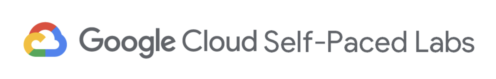
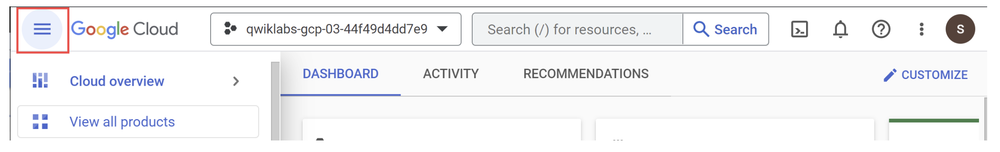

# Introducción a Google Cloud: primeros pasos con la consola y servicios
{{ reading_time() }}

---
- **Autor**: Valentín Rodríguez
- **Unidad Temática**: UT5: Pipelines ETL
- **Tipo**: Práctica Guiada - Google Cloud Skills Boost Lab
- **Entorno**: Google Cloud Console + Qwiklabs
- **Lab**: [A Tour of Google Cloud Hands-on Labs](https://www.skills.google/focuses/2794?catalog_rank=%7B%22rank%22%3A3%2C%22num_filters%22%3A2%2C%22has_search%22%3Atrue%7D&parent=catalog&search_id=60924676)
- **Fecha**: Noviembre 2025

---

*Vista de la Google Cloud Console mostrando el dashboard principal con el proyecto seleccionado y el menú de navegación*

*Resultado de la práctica de Google Cloud completada con 100% de evaluación*
---

## 🎯 Objetivos de Aprendizaje

Esta práctica introductoria proporciona una experiencia práctica con Google Cloud Platform (GCP), explorando la consola de Cloud, proyectos, IAM, roles, permisos y APIs. El lab está diseñado para familiarizarse con los conceptos fundamentales de la infraestructura en la nube y sentar las bases para construir pipelines ETL escalables.

### Objetivos Principales

- **Acceder a la Cloud Console** y explorar la interfaz de usuario de Google Cloud
- **Comprender el concepto de proyectos** y su rol como organizadores de recursos
- **Gestionar roles y permisos** usando Cloud IAM (Identity and Access Management)
- **Habilitar APIs y servicios** necesarios para diferentes funcionalidades
- **Familiarizarse con la plataforma Qwiklabs** y el entorno de labs temporales

---

## 📚 Lo que se Aprendió

### 1. **Conceptos Fundamentales de Google Cloud**

**Proyectos como Organizadores de Recursos:**

- Un proyecto de Google Cloud es una entidad organizadora que contiene recursos, servicios, configuraciones y permisos
- Cada proyecto tiene un **Project ID único** globalmente identificable (ej: `qwiklabs-gcp-xxx...`)
- Los proyectos permiten agrupar recursos relacionados (VMs, bases de datos, redes) y gestionar su acceso de forma centralizada
- Los proyectos también contienen configuraciones de facturación y seguridad

**Cloud Console como Hub Central:**

- La Cloud Console es la interfaz web principal para acceder y gestionar todos los servicios de Google Cloud
- Proporciona acceso a más de 200+ servicios y APIs desde una interfaz unificada
- Permite visualizar recursos, monitorear uso, gestionar permisos y configurar servicios sin necesidad de línea de comandos

### 2. **Identity and Access Management (IAM)**

**Roles Básicos:**

- **`roles/viewer`**: Permisos de solo lectura, no afectan el estado de los recursos
- **`roles/editor`**: Todos los permisos de viewer + capacidad de modificar recursos existentes
- **`roles/owner`**: Todos los permisos de editor + gestión de roles, permisos y configuración de facturación

**Principios de IAM:**

- Los roles básicos establecen permisos a nivel de proyecto
- A menos que se especifique lo contrario, controlan el acceso a todos los servicios de Google Cloud
- Los permisos son temporales en el entorno de labs (solo durante la duración del lab)
- La gestión de acceso es fundamental para la seguridad en la nube

### 3. **APIs y Servicios de Google Cloud**

**Biblioteca de APIs:**

- Google Cloud ofrece más de 200+ APIs que cubren áreas desde administración de negocios hasta machine learning
- Las APIs siguen principios de diseño orientado a recursos (resource-oriented design)
- Cada API proporciona información detallada sobre uso, niveles de tráfico, tasas de error y latencias

**Ejemplo Práctico - Dialogflow API:**

- Se exploró la API de Dialogflow para construir aplicaciones conversacionales
- Se habilitó la API y se exploró la documentación disponible
- Se comprendió cómo las APIs permiten integrar servicios de Google Cloud en aplicaciones

### 4. **Plataforma Qwiklabs y Entorno de Labs**

**Características del Entorno:**

- Los labs crean un entorno temporal de Google Cloud con servicios y credenciales habilitados
- Cada lab tiene un tiempo límite (countdown timer) que determina la duración del acceso
- Las credenciales son temporales y específicas del lab (`student-xx-xxxxxx@qwiklabs.net`)
- Al finalizar el tiempo, el entorno y recursos se eliminan automáticamente

---

## 🚧 Lo que Más Costó

### 1. **Gestión de Credenciales y Sesiones**

**Desafío:**

- La necesidad de usar credenciales temporales específicas del lab (`student-xx-xxxxxx@qwiklabs.net`)
- Confusión potencial al mezclar credenciales personales/corporativas con las del lab
- El riesgo de cerrar sesión accidentalmente si se usa la cuenta personal en el mismo navegador

**Solución Aprendida:**

- Usar ventanas de navegación privada (Incognito/Private) para evitar conflictos
- Asegurarse de hacer clic en "Use Another Account" cuando aparece la página de selección de cuenta
- Verificar siempre que se está usando la cuenta del lab, no la personal

### 2. **Comprensión de Roles y Permisos**

**Desafío:**

- Entender las diferencias sutiles entre los roles básicos (viewer, editor, owner)
- Comprender qué acciones están permitidas con cada rol
- Determinar qué rol asignar en diferentes escenarios

**Solución Aprendida:**

- Revisar la documentación de roles para entender permisos específicos
- Practicar otorgando diferentes roles y verificando qué acciones son posibles
- Comprender que los roles básicos son amplios y que existen roles más granulares disponibles

### 3. **Navegación en la Cloud Console**

**Desafío:**

- La Cloud Console tiene muchos menús y opciones que pueden ser abrumadores inicialmente
- Encontrar servicios específicos entre la gran cantidad de opciones disponibles
- Entender la organización jerárquica de servicios y recursos

**Solución Aprendida:**

- Usar el menú de navegación (hamburger menu) para explorar categorías de servicios
- Utilizar la barra de búsqueda para encontrar servicios específicos rápidamente
- Familiarizarse con las secciones principales: Compute, Storage, Big Data, Networking, etc.

---

## ✨ Lo Nuevo que se Descubrió

### 1. **Modelo de Precios Basado en Uso**

**Descubrimiento:**

- Google Cloud utiliza un modelo de precios basado en el consumo real de recursos
- Servicios como BigQuery cobran según el volumen de datos procesados por consulta
- Esto enfatiza la importancia de escribir consultas eficientes para minimizar costos
- El modelo "pay-as-you-go" permite escalar según necesidades sin compromisos a largo plazo

**Implicaciones:**

- La optimización de consultas y recursos no solo mejora el rendimiento, sino que también reduce costos
- Es crucial monitorear el uso de recursos para evitar cargos inesperados
- Los labs proporcionan créditos temporales, pero en proyectos reales es importante gestionar el presupuesto

### 2. **Integración con Herramientas de Visualización**

**Descubrimiento:**

- Google Cloud se integra nativamente con herramientas de visualización como Data Studio
- Los datos almacenados en BigQuery y Cloud SQL pueden conectarse directamente a dashboards
- Esta integración facilita la creación de informes interactivos sin necesidad de exportar datos manualmente

**Aplicaciones:**

- Crear dashboards en tiempo real basados en datos de Google Cloud
- Compartir visualizaciones con stakeholders sin acceso técnico a la consola
- Automatizar la generación de reportes basados en datos actualizados

### 3. **Activity Tracking y Gamificación**

**Descubrimiento:**

- El sistema de activity tracking en Qwiklabs verifica automáticamente la finalización de tareas
- Los labs pueden incluir checkpoints que validan el progreso antes de continuar
- El sistema de badges y credenciales motiva el aprendizaje continuo

**Beneficios:**

- Validación automática de conocimientos adquiridos
- Retroalimentación inmediata sobre el progreso
- Sistema de logros que incentiva completar más labs y profundizar en temas específicos

---

## 🎓 Reflexiones Finales

Esta práctica introductoria proporcionó una base sólida para trabajar con Google Cloud. Los conceptos aprendidos sobre proyectos, IAM, y APIs son fundamentales para cualquier trabajo posterior con pipelines ETL en la plataforma.

**Próximos Pasos:**

- Explorar servicios específicos de ETL como Cloud Dataflow, Cloud Dataprep, y BigQuery
- Aprender a construir pipelines automatizados usando Cloud Composer
- Experimentar con integración de datos entre diferentes servicios de Google Cloud

**Aplicaciones Prácticas:**

- Los conocimientos de IAM serán esenciales para gestionar acceso en proyectos de equipo
- La comprensión de proyectos ayudará a organizar recursos de forma lógica
- El conocimiento de APIs facilitará la automatización de tareas mediante código

---

## 📚 Recursos Adicionales

- [Google Cloud Documentation](https://cloud.google.com/docs)
- [Google Cloud Skills Boost](https://www.cloudskillsboost.google/)
- [IAM Best Practices](https://cloud.google.com/iam/docs/using-iam-securely)
- [Google Cloud APIs Explorer](https://developers.google.com/apis-explorer)

---

> 💡 **Nota**: Esta práctica fue realizada en el entorno temporal de Qwiklabs. Para proyectos reales, es importante considerar aspectos de seguridad, costos y mejores prácticas de arquitectura en la nube.

